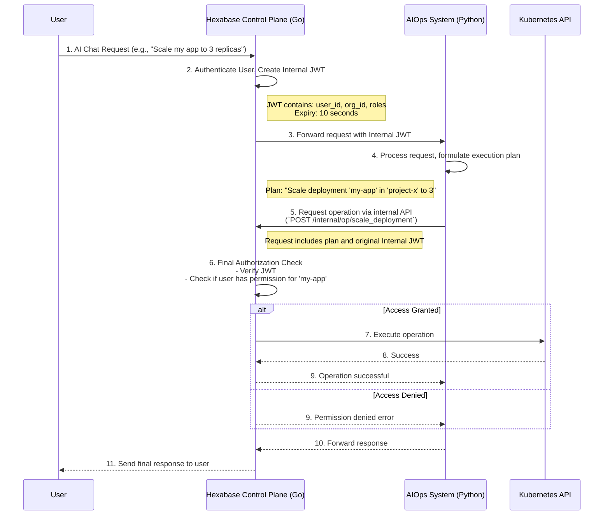
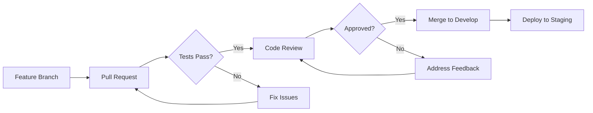
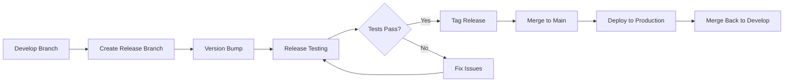
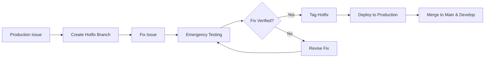
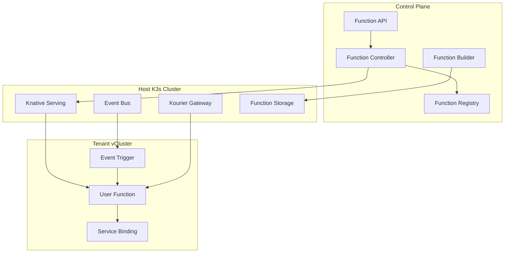
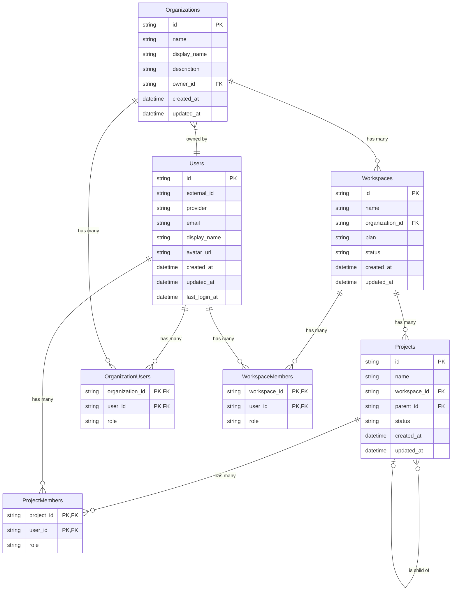
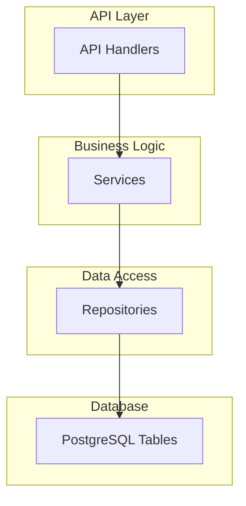

# Hexabase KaaS: OAuth Security Implementation Specification

## Table of Contents

1. [Overview](#1-overview)
2. [Security Architecture](#2-security-architecture)
3. [OAuth2/OIDC Implementation](#3-oauth2oidc-implementation)
4. [JWT Token Management](#4-jwt-token-management)
5. [Session Management](#5-session-management)
6. [Security Middleware](#6-security-middleware)
7. [Rate Limiting and DDoS Protection](#7-rate-limiting-and-ddos-protection)
8. [Audit Logging](#8-audit-logging)
9. [Testing Strategy](#9-testing-strategy)
10. [Security Best Practices](#10-security-best-practices)
11. [AIOps Security Sandbox Model](#11-aiops-security-sandbox-model)

## 1. Overview

The Hexabase KaaS platform implements a comprehensive OAuth2/OIDC-based authentication system with enhanced security features. This specification documents the security architecture, implementation details, and best practices for maintaining a secure multi-tenant Kubernetes platform.

### 1.1 Security Goals

- **Zero Trust Architecture**: No implicit trust; every request is authenticated and authorized
- **Defense in Depth**: Multiple layers of security controls
- **Least Privilege**: Users and services have minimal required permissions
- **Audit Trail**: Complete logging of all security-relevant events
- **Compliance**: OWASP Top 10, OAuth 2.0 RFC 6749, OIDC standards

### 1.2 Threat Model

Key threats addressed:

- **Token Theft**: JWT hijacking, session fixation
- **Man-in-the-Middle**: TLS enforcement, HSTS
- **Cross-Site Attacks**: CSRF, XSS, clickjacking
- **Brute Force**: Rate limiting, account lockout
- **Session Hijacking**: IP/device validation, concurrent session limits

## 2. Security Architecture

### 2.1 Component Overview

```
┌─────────────────┐     ┌─────────────────┐     ┌─────────────────┐
│                 │     │                 │     │                 │
│   Frontend UI   │────▶│   API Gateway   │────▶│  Auth Service   │
│   (Next.js)     │     │   (Security)    │     │   (OAuth/JWT)   │
│                 │     │                 │     │                 │
└─────────────────┘     └─────────────────┘     └─────────────────┘
         │                       │                       │
         │                       │                       │
         ▼                       ▼                       ▼
┌─────────────────┐     ┌─────────────────┐     ┌─────────────────┐
│                 │     │                 │     │                 │
│  Session Store  │     │  Rate Limiter   │     │  Audit Logger   │
│    (Redis)      │     │    (Redis)      │     │  (PostgreSQL)   │
│                 │     │                 │     │                 │
└─────────────────┘     └─────────────────┘     └─────────────────┘
```

### 2.2 Security Layers

1. **Network Layer**

   - TLS 1.3 minimum
   - HSTS enforcement
   - Certificate pinning for critical endpoints

2. **Application Layer**

   - OAuth2/OIDC authentication
   - JWT token validation
   - RBAC authorization

3. **Session Layer**

   - Secure session management
   - Device fingerprinting
   - Concurrent session control

4. **Data Layer**
   - Encryption at rest
   - Secure key management
   - Database access controls

## 3. OAuth2/OIDC Implementation

### 3.1 Supported Providers

```go
type OAuthProvider struct {
    ClientID     string
    ClientSecret string
    RedirectURL  string
    Scopes       []string
    AuthURL      string
    TokenURL     string
    UserInfoURL  string
}

// Configured providers
providers := map[string]OAuthProvider{
    "google": {...},
    "github": {...},
    "gitlab": {...},
}
```

### 3.2 OAuth Flow with PKCE

The implementation supports PKCE (Proof Key for Code Exchange) for enhanced security:

```go
// 1. Generate code verifier and challenge
verifier := GenerateCodeVerifier()  // 128 chars base64url
challenge := GenerateCodeChallenge(verifier)  // SHA256(verifier)

// 2. Authorization request
authURL := provider.AuthCodeURL(state,
    oauth2.SetAuthURLParam("code_challenge", challenge),
    oauth2.SetAuthURLParam("code_challenge_method", "S256"),
)

// 3. Token exchange with verifier
token := provider.Exchange(ctx, code,
    oauth2.SetAuthURLParam("code_verifier", verifier),
)
```

### 3.3 State Parameter Validation

CSRF protection using cryptographically secure state parameters:

```go
// State generation and storage
state := GenerateSecureState()  // 32 bytes random
redis.SetWithTTL("oauth_state:"+state, "valid", 10*time.Minute)

// State validation and consumption
func ValidateAndConsumeState(state string) error {
    _, err := redis.GetDel("oauth_state:"+state)
    return err  // State can only be used once
}
```

## 4. JWT Token Management

### 4.1 Token Structure

```go
type EnhancedClaims struct {
    jwt.RegisteredClaims
    UserID        string   `json:"uid"`
    Email         string   `json:"email"`
    Provider      string   `json:"provider"`
    Organizations []string `json:"orgs"`
    Permissions   []string `json:"perms"`
    Fingerprint   string   `json:"fp"`
    TokenType     string   `json:"typ"`
    SessionID     string   `json:"sid"`
}
```

### 4.2 Token Pair System

Access and refresh tokens with different lifetimes:

- **Access Token**: 15 minutes, contains user permissions
- **Refresh Token**: 7 days, used to obtain new access tokens

```go
type TokenPair struct {
    AccessToken  string    `json:"access_token"`
    RefreshToken string    `json:"refresh_token"`
    TokenType    string    `json:"token_type"`
    ExpiresIn    int       `json:"expires_in"`
    ExpiresAt    time.Time `json:"expires_at"`
}
```

### 4.3 Token Security Features

1. **RSA-256 Signing**: 2048-bit RSA keys
2. **Fingerprinting**: Device ID + IP address hash
3. **Revocation**: Redis-based revocation list
4. **Rotation**: Automatic token rotation on refresh

### 4.4 JWKS Endpoint

Public key exposure for token verification:

```json
{
  "keys": [
    {
      "kty": "RSA",
      "use": "sig",
      "kid": "2024-01-01",
      "alg": "RS256",
      "n": "0Z0VS5JJcds3xfNn...",
      "e": "AQAB"
    }
  ]
}
```

## 5. Session Management

### 5.1 Session Structure

```go
type SecureSession struct {
    ID           string    `json:"id"`
    UserID       string    `json:"user_id"`
    DeviceID     string    `json:"device_id"`
    IPAddress    string    `json:"ip_address"`
    UserAgent    string    `json:"user_agent"`
    Provider     string    `json:"provider"`
    CreatedAt    time.Time `json:"created_at"`
    LastActive   time.Time `json:"last_active"`
    ExpiresAt    time.Time `json:"expires_at"`
    RefreshToken string    `json:"refresh_token"`
}
```

### 5.2 Session Security

1. **Idle Timeout**: 30 minutes of inactivity
2. **Absolute Timeout**: 24 hours maximum
3. **Concurrent Sessions**: Maximum 3 per user
4. **Device Tracking**: Fingerprint validation
5. **IP Validation**: Session bound to IP address

### 5.3 Session Storage

Redis-based session storage with automatic expiration:

```go
// Session key pattern
key := fmt.Sprintf("session:%s", sessionID)

// User sessions index
userKey := fmt.Sprintf("user_sessions:%s", userID)
```

## 6. Security Middleware

### 6.1 Security Headers

```go
func SecurityHeadersMiddleware(next http.Handler) http.Handler {
    return http.HandlerFunc(func(w http.ResponseWriter, r *http.Request) {
        // HSTS - Enforce HTTPS
        w.Header().Set("Strict-Transport-Security",
            "max-age=31536000; includeSubDomains")

        // Prevent MIME type sniffing
        w.Header().Set("X-Content-Type-Options", "nosniff")

        // Prevent clickjacking
        w.Header().Set("X-Frame-Options", "DENY")

        // XSS Protection
        w.Header().Set("X-XSS-Protection", "1; mode=block")

        // Content Security Policy
        w.Header().Set("Content-Security-Policy",
            "default-src 'self'; " +
            "script-src 'self' 'unsafe-inline' 'unsafe-eval' https://accounts.google.com; " +
            "style-src 'self' 'unsafe-inline'; " +
            "img-src 'self' data: https:; " +
            "font-src 'self' data:; " +
            "connect-src 'self' https://api.github.com https://accounts.google.com")

        // Referrer Policy
        w.Header().Set("Referrer-Policy", "strict-origin-when-cross-origin")

        // Permissions Policy
        w.Header().Set("Permissions-Policy",
            "geolocation=(), microphone=(), camera=()")

        next.ServeHTTP(w, r)
    })
}
```

### 6.2 CORS Configuration

Strict CORS policy with allowed origins:

```go
func ConfigureCORS(allowedOrigins []string) func(http.Handler) http.Handler {
    return func(next http.Handler) http.Handler {
        return http.HandlerFunc(func(w http.ResponseWriter, r *http.Request) {
            origin := r.Header.Get("Origin")

            // Validate origin
            for _, allowed := range allowedOrigins {
                if origin == allowed {
                    w.Header().Set("Access-Control-Allow-Origin", origin)
                    w.Header().Set("Access-Control-Allow-Credentials", "true")
                    w.Header().Set("Access-Control-Allow-Methods",
                        "GET, POST, PUT, DELETE, OPTIONS")
                    w.Header().Set("Access-Control-Allow-Headers",
                        "Authorization, Content-Type, X-Requested-With, X-CSRF-Token")
                    w.Header().Set("Access-Control-Max-Age", "86400")
                    break
                }
            }

            if r.Method == "OPTIONS" {
                w.WriteHeader(http.StatusNoContent)
                return
            }

            next.ServeHTTP(w, r)
        })
    }
}
```

## 7. Rate Limiting and DDoS Protection

### 7.1 Rate Limiting Strategy

```go
type RateLimiter struct {
    redis    RedisClient
    limit    int
    window   time.Duration
}

// Different limits for different endpoints
rateLimits := map[string]RateLimit{
    "auth.login":    {10, time.Minute},    // 10 attempts per minute
    "auth.refresh":  {30, time.Minute},    // 30 refreshes per minute
    "api.write":     {100, time.Minute},   // 100 writes per minute
    "api.read":      {1000, time.Minute},  // 1000 reads per minute
}
```

### 7.2 DDoS Protection

1. **Connection Limits**: Per-IP connection limits
2. **Request Size Limits**: Maximum request body size
3. **Timeout Configuration**: Request timeout limits
4. **Geographic Restrictions**: Optional geo-blocking

## 8. Audit Logging

### 8.1 Audit Event Structure

```go
type AuditEvent struct {
    ID        string                 `json:"id"`
    Type      string                 `json:"type"`
    UserID    string                 `json:"user_id"`
    IP        string                 `json:"ip"`
    UserAgent string                 `json:"user_agent"`
    Provider  string                 `json:"provider"`
    Success   bool                   `json:"success"`
    Error     string                 `json:"error"`
    Metadata  map[string]interface{} `json:"metadata"`
    Timestamp time.Time              `json:"timestamp"`
}
```

### 8.2 Logged Events

- Authentication attempts (success/failure)
- Token generation and refresh
- Permission changes
- Resource access
- Configuration changes
- Security violations

### 8.3 Log Retention

- **Security Events**: 90 days minimum
- **Failed Attempts**: 30 days
- **Successful Operations**: 30 days
- **Compliance Logs**: As per requirements

## 9. Testing Strategy

### 9.1 Security Test Coverage

```go
// Test suite structure
type OAuthSecurityTestSuite struct {
    suite.Suite
    client      *SecureOAuthClient
    jwtManager  *EnhancedJWTManager
    redisClient *MockSecureRedisClient
}

// Test scenarios
- TestPKCEFlow
- TestJWTRefreshTokenFlow
- TestJWTFingerprinting
- TestSecureSessionManagement
- TestRateLimiting
- TestSecurityHeaders
- TestCORSConfiguration
- TestAuditLogging
- TestTokenRevocation
- TestMultiProviderOAuth
- TestSessionHijackingPrevention
```

### 9.2 Security Testing Tools

1. **Static Analysis**: gosec, staticcheck
2. **Dependency Scanning**: nancy, snyk
3. **Penetration Testing**: OWASP ZAP
4. **Load Testing**: k6, vegeta

## 10. Security Best Practices

### 10.1 Development Guidelines

1. **Input Validation**

   - Validate all user input
   - Use parameterized queries
   - Sanitize output

2. **Error Handling**

   - Don't expose internal errors
   - Log security events
   - Return generic error messages

3. **Cryptography**
   - Use standard libraries
   - Never roll your own crypto
   - Rotate keys regularly

### 10.2 Operational Security

1. **Monitoring**

   - Real-time security alerts
   - Anomaly detection
   - Failed login tracking

2. **Incident Response**

   - Security incident playbooks
   - Automated responses
   - Post-incident reviews

3. **Compliance**
   - Regular security audits
   - Vulnerability assessments
   - Compliance reporting

### 10.3 Future Enhancements

1. **Multi-Factor Authentication (MFA)**

   - TOTP support
   - SMS backup codes
   - Hardware token support

2. **WebAuthn/FIDO2**

   - Passwordless authentication
   - Biometric support
   - Platform authenticators

3. **Advanced Threat Detection**
   - ML-based anomaly detection
   - Behavioral analysis
   - Risk scoring

## 11. AIOps Security Sandbox Model

The introduction of AIOps, where AI agents can perform operations on behalf of users, requires a robust security model to prevent unintended actions and ensure all operations are auditable and authorized. The Hexabase KaaS platform implements a security sandbox model for the AIOps system based on the principle of least privilege and zero trust between internal systems.

### 11.1. Core Principles

- **Zero Trust**: The Go-based Control Plane does not inherently trust the Python-based AIOps system. Every request from AIOps must be independently authenticated and authorized.
- **User Context Impersonation**: AI agents do not have their own permissions. They temporarily "impersonate" the user who initiated the chat or request, and all actions are performed within that user's permission scope.
- **Final Authority**: The Control Plane is the single source of truth for authorization and the sole executor of privileged operations. The AIOps system can only _request_ actions; it cannot execute them directly.

### 11.2. Architecture and Flow



### 11.3. Implementation Details

- **Internal JWT**: A short-lived (e.g., 10-second) JSON Web Token signed by the Control Plane. It contains the user's identity, scope (organization, workspace), and roles. This token is only used for internal, server-to-server communication and is never exposed to the outside world.
- **Internal Operations API**: A dedicated set of internal API endpoints (e.g., `/internal/v1/operations/...`) on the Control Plane that the AIOps system can call. These endpoints are not exposed publicly.
- **Strict Validation**: When the Control Plane receives a request on the internal operations API, it performs the same rigorous permission checks it would if the user were making the API call directly. It validates the JWT, checks the user's RBAC permissions for the target resource, and only then executes the command.

This model ensures that even if the AIOps system were compromised or had a bug, it could not perform any action that the impersonated user wasn't already explicitly permitted to do, providing a strong security guarantee.

## Conclusion

The Hexabase KaaS OAuth security implementation provides a robust, scalable, and secure authentication system suitable for a multi-tenant Kubernetes platform. By following these specifications and best practices, the platform maintains a strong security posture while providing a seamless user experience.

For implementation details, refer to the source code in:

- `/api/internal/auth/oauth_security.go`
- `/api/internal/auth/oauth_security_test.go`
- `/api/internal/auth/oauth_client.go`
- `/api/internal/auth/jwt.go`
# Hexabase AI: Architecture Specification

## 1. Project Overview

### 1.1. Vision

This project aims to develop and provide an open-source, observable, and intuitive multi-tenant Kubernetes as a Service (KaaS) platform based on `K3s` and `vCluster`. While Kubernetes has become the de facto standard in modern application development, its high learning curve, complex operational management, and difficulty in securing resources for small teams and individual developers remain barriers to adoption. Hexabase AI is designed to solve these challenges.

Specifically, it provides the following value:

- **Ease of Deployment**: Based on `K3s`, a lightweight Kubernetes distribution, and utilizing `vCluster` virtualization technology, users are freed from the complexity of physical cluster management and can quickly start using isolated Kubernetes environments. This ease of use encourages developers and teams with limited Kubernetes expertise to embrace new technologies. Traditional Kubernetes cluster construction required extensive expertise in network configuration, security policy formulation, storage provisioning, and more. Hexabase AI automates and abstracts much of this, providing a ready-to-use state with just a few clicks.

- **Intuitive Operation**: Kubernetes' powerful features are abstracted through a sophisticated UI/UX, making them easily accessible to users without specialized knowledge. Resources can be managed using intuitive concepts such as Organization, Workspace, and Project. For example, common operations like application deployment, scaling, and monitoring can be performed from a graphical interface without directly editing YAML files. Error messages and logs are also displayed in an understandable way to support problem resolution.

- **Strong Tenant Isolation**: `vCluster` provides each tenant (Workspace) with dedicated API servers and control plane components, ensuring significantly higher security and independence than namespace-based isolation. This minimizes cross-tenant impact and allows resources to be used with confidence. For example, even if one tenant accidentally consumes excessive resources or causes security issues, other tenant environments are designed to remain unaffected. This is particularly crucial when hosting multiple customers or projects on the same physical infrastructure.

- **Cloud-Native Operations**: Equipped with a comprehensive monitoring stack using `Prometheus`, `Grafana`, and `Loki`, enabling real-time visibility into system health and tenant resource usage. Adopting a GitOps approach with `Flux` enables declarative configuration management and reproducible deployments. Policy management with `Kyverno` supports enhanced security compliance and governance. This ensures that infrastructure configuration changes, application deployments, and security policy applications are performed through version-controlled code, facilitating audit trails and rollbacks.

- **Open Source Transparency and Community**: By releasing this project as open source, we ensure technical transparency and actively welcome feedback and contributions from developers worldwide. We aim to build a reliable platform that grows with the community and can address more use cases. We also anticipate use in educational institutions and as a learning/validation platform for new cloud-native technologies. Open source code publication leads to early discovery and correction of security vulnerabilities. Additionally, incorporating diverse perspectives enables more innovative and practical feature development.

Hexabase AI envisions being a catalyst for delivering the power of Kubernetes to more people and accelerating innovation. Developers will be freed from infrastructure complexity and able to focus on the essential value creation of application development.

## 2. System Architecture

The Hexabase AI system architecture consists of the **Hexabase UI (Next.js)** that users directly interact with, the **Hexabase API (control plane, Go language)** that manages and controls the entire system, various supporting **middleware (PostgreSQL, Redis, NATS, etc.)**, and a new **AIOps System (Python)**. All these components are containerized and run on the operational foundation **Host K3s Cluster**. Per-tenant Kubernetes environments are virtually constructed within the Host K3s Cluster using **vCluster** technology, providing strong isolation and independence. This multi-layered architecture is designed with scalability, availability, maintainability, and intelligence in mind.

**Architectural Diagram:**

```mermaid
graph TD
    subgraph "User Interaction"
        direction LR
        User -- "Browser, Slack, etc." --> Frontend
        Frontend[Hexabase UI / Chat Client]
    end

    subgraph "Hexabase Control Plane (Go)"
        direction LR
        Frontend -- "REST/WebSocket" --> API_Server[API Server]
        API_Server -- "Publish Tasks" --> NATS[NATS Messaging]
        NATS -- "Consume Tasks" --> Workers[Async Workers]
    end

    subgraph "AIOps System (Python)"
        direction LR
        AIOps_API[AIOps API]
        AIOps_Orchestrator[Orchestrator]
        AIOps_Agents[Specialized Agents]
        Private_LLM[Private LLMs on Ollama]

        AIOps_API --> AIOps_Orchestrator
        AIOps_Orchestrator --> AIOps_Agents
        AIOps_Agents --> Private_LLM
        AIOps_Orchestrator -- "External LLM API" --> Internet
    end

    subgraph "Data & State"
        PostgreSQL
        Redis
        Central_Logging[Central Logging (ClickHouse)]
        LLMOps[LLMOps (Langfuse)]
    end

    subgraph "Host K3s Cluster"
        vClusters[vClusters per Tenant]
        Shared_Observability[Shared Observability Stack]
    end

    API_Server -- "Read/Write" --> PostgreSQL
    API_Server -- "Cache" --> Redis
    API_Server -- "Log" --> Central_Logging
    Workers -- "Read/Write" --> PostgreSQL

    API_Server -- "Internal JWT" --> AIOps_API
    AIOps_API -- "Log/Trace" --> LLMOps

    API_Server -- "Manage" --> vClusters
    Workers -- "Manage" --> vClusters

    style Frontend fill:#d4f0ff
    style AIOps_API fill:#e6ffc2
```

**Key Component Interactions and Data Flow:**

1. **User Operations and UI**: Users access the Hexabase UI through a web browser to perform operations such as creating Organizations, provisioning Workspaces (vClusters), managing Projects (Namespaces), inviting users, and setting permissions. The UI converts these operations into requests to the Hexabase API. The UI manages the user's authentication state and attaches authentication tokens to API requests. Real-time information updates (e.g., vCluster provisioning progress) will be implemented using technologies such as WebSocket or Server-Sent Events.

2. **API Request Processing**: The Hexabase API receives requests from the UI and first performs authentication and authorization processing. After confirming that the authenticated user has permission to perform the requested operation, it executes the business logic. This includes updating the PostgreSQL database state and issuing instructions to the vCluster orchestrator. Time-consuming processes (e.g., vCluster creation, large-scale configuration changes) are registered as tasks in the NATS message queue and delegated to asynchronous workers to maintain API server responsiveness. The API also strictly validates requests and returns appropriate error responses for invalid input.

3. **vCluster Orchestration**: The vCluster orchestrator interacts with the Host K3s cluster to manage the vCluster lifecycle (creation, configuration, deletion). Specifically, it uses `vcluster CLI` or Kubernetes API (`client-go`) to deploy vCluster Pods (typically as StatefulSets or Deployments), configure necessary network settings (Service, Ingress, etc.), and storage settings (PersistentVolumeClaim). It also handles applying OIDC settings to each vCluster, installing and configuring HNC (Hierarchical Namespace Controller), setting resource quotas according to tenant plans, and controlling Dedicated Node allocation (using Node Selectors and Taints/Tolerations). Additionally, this component executes configuration of Namespaces and RBAC (Role, RoleBinding, ClusterRole, ClusterRoleBinding) within vClusters based on user operations.

4. **Asynchronous Processing**: Asynchronous workers receive tasks from the NATS message queue and execute background processing such as vCluster provisioning, Stripe API integration (billing processing), HNC setup, and backup/restore processing (future feature). This allows the API server to return responses quickly without being blocked for long periods. Workers record processing progress in the database and will notify the API server or notification system of results through NATS upon completion or error.

5. **State Persistence**: The PostgreSQL database stores Organizations, Workspaces, Projects, Users, Groups, Roles, billing plans, subscription information, asynchronous task status, audit logs, and more. Transactions are used appropriately to maintain data consistency, and regular backup and restore strategies are planned. Schema changes are managed using migration tools (e.g., golang-migrate).

6. **Caching**: Redis caches user session information, frequently accessed configuration data, public keys (JWKS) required for OIDC token validation, rate limit counters, etc., reducing database load and improving system responsiveness and scalability. Cache expiration and invalidation strategies are also properly designed.

7. **Monitoring and Logging**:
   The monitoring architecture employs a hybrid model based on the tenant's plan.

   - **Shared Plan**: Each vCluster runs lightweight agents (`prometheus-agent`, `promtail`) that forward metrics and logs to a central, multi-tenant **Prometheus and Loki stack** on the host cluster. Tenant data is isolated using labels (`workspace_id`).
   - **Dedicated Plan**: A dedicated, fully independent observability stack (Prometheus, Grafana, Loki) can be deployed inside the tenant's vCluster for complete isolation.
   - **Central Logging**: All Hexabase control plane and AIOps system logs are aggregated into a central **ClickHouse** database for high-speed querying and analysis.

8. **GitOps Deployment**: Deployment and updates of the Hexabase control plane itself are managed through GitOps workflows using Flux. Infrastructure configuration (Kubernetes manifests, Helm Charts), application settings, security policies, etc., are all declaratively managed in Git repositories. Changes are made through Git commits and pull requests, and once approved, Flux automatically applies them to the Host K3s cluster. This improves deployment reproducibility, auditability, and reliability.

9. **Policy Application**: Kyverno operates as a Kubernetes Admission Controller, enforcing security and operational policies on the Host K3s cluster and within each vCluster (if configurable). For example, policies such as "all Namespaces must have an `owner` label," "prohibit launching privileged containers," or "block image pulls from untrusted registries" can be defined to maintain compliance. Policies should also be managed through GitOps.

10. **Serverless Backbone**: **Knative** is installed on the host cluster to provide the underlying infrastructure for the HKS Functions (FaaS) offering. It manages the entire lifecycle of serverless containers, including scaling to zero.

11. **AIOps System Interaction**: The AIOps system operates as a separate Python-based service. The Hexabase API server communicates with it via internal, RESTful APIs, passing a short-lived, scoped JWT for secure, context-aware operations. The AIOps system analyzes data from the observability stack and its own agents, and can request operational changes (e.g., scaling a deployment) by calling back to a secured internal API on the Hexabase control plane, which performs the final authorization and execution.

This architecture aims to realize a scalable, resilient, intelligent, and operationally friendly KaaS platform. By clarifying the division of responsibilities among components and utilizing standardized technologies and open-source products, we enhance development efficiency and system reliability.

## 3. Core Concepts and Entity Mapping

Hexabase AI provides unique abstracted concepts to allow users to use the service without being aware of Kubernetes complexity. These concepts are internally mapped to standard Kubernetes resources and features. Understanding this mapping is crucial for grasping system behavior and using it effectively.

| Hexabase Concept      | Kubernetes Equivalent                              | Scope              | Notes                                                                                |
| --------------------- | -------------------------------------------------- | ------------------ | ------------------------------------------------------------------------------------ |
| Organization          | (None)                                             | Hexabase           | Unit for billing, invoicing, and organizational user management. Business logic.     |
| Workspace             | vCluster                                           | Host K3s Cluster   | Strong tenant isolation boundary.                                                    |
| Workspace Plan        | ResourceQuota / Node Configuration                 | vCluster / Host    | Defines resource limits.                                                             |
| Organization User     | (None)                                             | Hexabase           | Organization administrators and billing managers.                                    |
| Workspace Member      | User (OIDC Subject)                                | vCluster           | Technical personnel operating vCluster. Authenticated via OIDC.                      |
| Workspace Group       | Group (OIDC Claim)                                 | vCluster           | Unit for permission assignment. Hierarchy resolved by Hexabase.                      |
| Workspace ClusterRole | ClusterRole                                        | vCluster           | Preset permissions spanning entire Workspace (e.g., Admin, Viewer).                  |
| Project               | Namespace                                          | vCluster           | Resource isolation unit within Workspace.                                            |
| Project Role          | Role                                               | vCluster Namespace | Custom permissions that users can create within a Project.                           |
| **CronJob**           | `batch/v1.CronJob`                                 | vCluster Namespace | A scheduled task, configured via the UI but maps to a native CronJob resource.       |
| **Function**          | Knative Service (`serving.knative.dev/v1.Service`) | vCluster Namespace | A serverless function deployed via the `hks-func` CLI or dynamically by an AI agent. |

# 4. Functional Specifications and User Flows

## 4.1. Signup and Organization Management

- **New User Registration**  
  Sign up via OpenID Connect with external IdPs (Google, GitHub, etc.). User is created in Hexabase DB.

- **Organization Creation**  
  Upon initial signup, a private Organization is automatically created for the user. The user becomes the first Organization User of this Org.

- **Organization Management**  
  Organization Users can manage billing information (Stripe integration) and invite other Organization Users.  
  \*Note: This permission does not allow direct manipulation of resources within subordinate Workspaces (vClusters).

## 4.2. Workspace (vCluster) Management

- **Creation**  
  Organization Users select a Plan (resource limits) to create a new Workspace.

- **Provisioning**  
  The Hexabase control plane provisions a vCluster on the Host cluster and configures itself as a trusted OIDC provider.

- **Initial Setup (within vCluster)**

  - Create preset ClusterRoles:  
    Automatically create two ClusterRoles: `hexabase:workspace-admin` and `hexabase:workspace-viewer`.  
    \*Note: Custom ClusterRole creation by users is prohibited.
  - Create default ClusterRoleBinding:  
    Automatically create a ClusterRoleBinding that binds the `hexabase:workspace-admin` ClusterRole to the `WSAdmins` group.

- **Initial Setup (within Hexabase DB)**
  - Create default groups:  
    Create three groups in a hierarchical structure: `WorkspaceMembers` (top level), `WSAdmins`, and `WSUsers`.
  - By assigning the Workspace creator to the `WSAdmins` group, they become the vCluster administrator.

## 4.3. Project (Namespace) Management

- **Creation**  
  Workspace Members (WSAdmins, etc., users with permissions) create new Projects within a Workspace.

- **Namespace Creation**  
  The Hexabase control plane creates corresponding Namespaces within the vCluster.

- **ResourceQuota Application**  
  Automatically create default ResourceQuota objects defined in the Workspace Plan in the Namespace.

- **Custom Role Creation**  
  Custom Roles valid within a Project (Namespace) can be created and edited from the UI.

## 4.4. Permission Management and Inheritance

- **Permission Assignment**  
  Assign Project Roles or preset ClusterRoles to Workspace Groups through the UI.  
  Hexabase creates and deletes RoleBindings and ClusterRoleBindings within the vCluster.

- **Permission Inheritance Resolution**
  - When a user accesses a vCluster, the OIDC provider performs the following:
    1. Recursively retrieve the user's groups and parent groups from the DB.
    2. Include a flattened group list in the `groups` claim of the OIDC token.
    3. The vCluster API server performs native RBAC authorization based on this information.

---

# 5. Technology Stack and Infrastructure

## 5.1. Applications

- **Frontend**: Next.js
- **Backend**: Go (Golang)

## 5.2. Data Stores

- **Primary DB**: PostgreSQL
- **Cache**: Redis

## 5.3. Messaging and Asynchronous Processing

- **Message Queue**: NATS

## 5.4. CI/CD (Continuous Integration/Delivery)

- **Pipeline Engine**: Tekton

  - **Reason**: Enables building Kubernetes-native declarative pipelines. Automates container builds, tests, and security scans.

- **Deployment (GitOps)**: ArgoCD or Flux
  - **Reason**:  
    Treats Git repositories as the single source of truth and declaratively manages cluster state.  
    ArgoCD has a powerful UI, while Flux excels in simplicity and extensibility. Choose based on project preferences.

## 5.5. Security and Policy Management

- **Container Vulnerability Scanning**: Trivy

  - **Role**:  
    Integrated into CI pipelines (Tekton) to scan for known vulnerabilities (CVE) in OS packages and language libraries during container image builds. Can also detect IaC misconfigurations.

- **Runtime Security Auditing**: Falco

  - **Role**:  
    Runtime threat detection tool (CNCF graduated project). Monitors system calls at the kernel level to detect and alert on events such as "unexpected shell launches within containers" or "access to sensitive files" in real-time.

- **Policy Management Engine**: Kyverno
  - **Kyverno**:  
    Low learning curve as policies can be written as Kubernetes resources (YAML), enabling intuitive management of policies like "prohibit Pod creation without specific labels" or "block use of untrusted image registries."

---

# 6. Installation and Deployment (IaC)

This project adopts **Helm** as Infrastructure as Code (IaC) to achieve "easy installation."

## 6.1. Helm Umbrella Chart

Provides a Helm Umbrella Chart that enables deployment of all Hexabase components and dependent middleware with a single command.

```yaml
apiVersion: v2
name: hexabase-ai
description: A Helm chart for deploying the Hexabase AI Control Plane
version: 0.1.0
appVersion: "0.1.0"

dependencies:
  # Define official/community Helm Chart dependencies
  - name: postgresql
    version: "14.x.x"
    repository: "https://charts.bitnami.com/bitnami"
    condition: postgresql.enabled # Can be disabled if needed
  - name: redis
    version: "18.x.x"
    repository: "https://charts.bitnami.com/bitnami"
    condition: redis.enabled
  - name: nats
    version: "1.x.x"
    repository: "https://nats-io.github.io/k8s/helm/charts/"
    condition: nats.enabled
```

**Template Examples within Chart (`templates/`)**:

- Hexabase API (Go) Deployment / Service
- Hexabase UI (Next.js) Deployment / Service
- Secrets for DB connection information (auto-generated on initial install)
- ConfigMaps for managing various settings

## 6.2. Installation Flow

End users can deploy Hexabase AI following these steps after preparing a K3s cluster:

### Add Helm Repository

```bash
helm repo add hexabase https://<your-chart-repository-url>
helm repo add bitnami https://charts.bitnami.com/bitnami
helm repo update
```

### Edit Configuration File (values.yaml) (Optional):

- Edit items requiring customization such as domain names and resource allocations.

### Install with Helm:

```bash
helm install hexabase-ai hexabase/hexabase-ai -f values.yaml
```

This single command sets up the entire Hexabase control plane on the K3s cluster along with dependent components like PostgreSQL, Redis, and NATS.

# 7. Conclusion

This specification is a conceptual design blueprint for Hexabase AI based on modern technology stacks and cloud-native best practices. By incorporating simple deployment with Helm, efficient CI/CD with Tekton and GitOps, robust security with Trivy and Falco, and flexible policy management with Kyverno, we build a strong foundation for an open-source project that can be trusted by users worldwide and grow with the community.
## **Hexabase KaaS: Addendum Specification for VM and Application Management**

- **Document Version:** 1.0 (Addendum)
- **Date:** June 7, 2025
- **Applies to:** Hexabase KaaS: Architecture Specification v2.0

### **1. Introduction**

This document serves as an addendum to the core Hexabase KaaS Architecture Specification. It details the new functional capabilities and underlying architectural enhancements required to empower users with direct management of Virtual Machines (Nodes) and a simplified, UI-driven workflow for basic container operations (Applications).

These features fulfill the vision of providing a seamless scalability path, allowing users to transition from a limited, shared trial environment to a robust, production-grade infrastructure with dedicated resources.

### **2. Core Concept Enhancements**

To support the new features, the following concepts are introduced and mapped to their underlying infrastructure equivalents. This table should be considered an extension of the primary Core Concepts mapping table.

| Hexabase Concept        | Kubernetes / Infrastructure Equivalent                | Scope                       | Notes                                                                                               |
| :---------------------- | :---------------------------------------------------- | :-------------------------- | :-------------------------------------------------------------------------------------------------- |
| **Shared Node Plan**    | `ResourceQuota` on Multi-Tenant Nodes                 | vCluster                    | Default trial plan on shared infrastructure with strict resource limits. Users do not manage Nodes. |
| **Dedicated Node Plan** | **Dedicated Proxmox VM** + `Node Taints/Tolerations`  | Host K3s Cluster / vCluster | Paid plan with user-provisioned, isolated VMs providing guaranteed resources and performance.       |
| **Application**         | `Deployment` or `StatefulSet` + `Service` + `Ingress` | vCluster                    | A user-deployed workload, managed as a single logical unit in the UI for simplified operations.     |

### **3. New and Enhanced Functional Specifications & User Flows**

#### 3.1. Workspace Lifecycle & Scaling Path

The user journey within a Workspace is enhanced to provide a clear upgrade path:

1.  **Initial State (Shared Node Plan):** A new Workspace is automatically provisioned on the Shared Node Plan. The user operates within a strict `ResourceQuota` on shared, multi-tenant infrastructure. This allows for immediate, low-cost experimentation.
2.  **Trigger for Upgrade:** As application needs grow, the UI will proactively notify the user when they approach their resource quota limits. This notification, along with prominent UI elements, will guide them to the Node Management section.
3.  **Transition to Dedicated Plan:** The user initiates the "Add New Dedicated Node" wizard. The successful creation of the _first_ dedicated node automatically transitions the Workspace's billing and operational model to the **Dedicated Node Plan**.

#### 3.2. Feature: Dedicated Node Management

This new feature set, accessible from within a Workspace, allows users to provision and manage the lifecycle of their dedicated compute resources.

##### 3.2.1. Node Overview Page

- **Purpose:** Provides a centralized dashboard for a Workspace's compute resources.
- **Specification:** The UI is conditional based on the Workspace plan.
  - **On Shared Plan:** It displays quota usage graphs (CPU, Memory, Pods) and features a prominent Call-to-Action (CTA) to launch the "Add New Dedicated Node" wizard, explicitly framing it as an upgrade.
  - **On Dedicated Plan:** It displays aggregate resource usage across all dedicated nodes and provides entry points to manage them.

##### 3.2.2. Dedicated Node List Page

- **Purpose:** To list and manage all dedicated nodes associated with the Workspace.
- **Specification:**
  - **UI:** A table view with columns for `Node Name`, `Status` (combined Proxmox/K3s status), `Specifications` (vCPU, RAM, Disk), `IP Address`, and `Created At`.
  - **Actions:** Each node has a menu for `Start`, `Stop`, `Reboot`, and `Delete` operations. These actions trigger orchestrated workflows in the backend that interact with both the Proxmox and K3s APIs.

##### 3.2.3. 'Add New Dedicated Node' Wizard

- **Purpose:** A guided, multi-step process for provisioning new Proxmox VMs and adding them to the user's vCluster.
- **Specification:**
  - **Step 1: Plan Selection & Billing Confirmation:**
    - Presents a clear notice of the plan upgrade and associated costs.
    - Users select from a list of predefined instance types (e.g., `S-Type`, `M-Type`) with transparent monthly pricing.
    - Displays a dynamic summary of the new estimated monthly cost.
    - Requires explicit user consent via a checkbox before proceeding.
  - **Step 2: Node Configuration:**
    - Users provide a `Node Name` prefix and select a `Region` (if applicable).
    - Optionally, they can add a public `SSH Key` for direct VM access.
  - **Step 3: Provisioning:**
    - The UI displays a real-time progress screen, providing feedback as the backend orchestrates the multi-stage provisioning process (`Creating VM in Proxmox...`, `Installing K3s agent...`, `Joining node to cluster...`).

#### 3.3. Feature: Application Lifecycle Management

This new feature set provides an intuitive, UI-driven interface for deploying and managing containerized workloads ("Applications").

##### 3.3.1. Application List View

- **Purpose:** A central dashboard within a Project to view all deployed applications.
- **Specification:** A table lists applications with their `Name`, `Status`, `Type` (Stateless/Stateful), and public `Endpoints`. A "+ Create New Application" button initiates the deployment wizard.

##### 3.3.2. "Create New Application" Wizard

- **Purpose:** A guided flow to deploy containers without requiring knowledge of Kubernetes YAML.
- **Specification:**
  - Users are guided through logical steps: Application Type, Source (Image or Git), Configuration (Replicas, Ports), Networking (optional Ingress creation), Storage (for Stateful types), and Environment Variables.
  - **New Scheduling Step:** For Workspaces on the Dedicated Node Plan, an additional step allows the user to select a target node pool. The UI translates this selection into the appropriate `nodeSelector` or `tolerations` in the underlying Kubernetes manifest, ensuring the application is scheduled onto the desired dedicated hardware.

##### 3.3.3. Application Detail View

- **Purpose:** A drill-down dashboard for a single application.
- **Specification:** A tabbed interface provides access to:
  - **Overview:** Key metrics and resource links.
  - **Instances (Pods):** A list of running pods with status and actions (`View Logs`, `Restart`).
  - **Logs:** A real-time, aggregated log stream.
  - **Settings:** An interface to modify application parameters like image version or replica count.

### **4. Architectural and Technology Stack Additions**

#### 4.1. Architectural Enhancements

To support these features, the **vCluster Orchestrator** component's responsibilities are expanded:

- **Amended Specification (from Section 2.3):**
  > The orchestrator ... handles applying OIDC settings, installing HNC, setting resource quotas, and controlling **Dedicated Node allocation**. This involves interacting with an underlying virtualization platform API (e.g., **Proxmox VE**) to provision or de-provision VMs, which are then configured using tools like `cloud-init` to securely install the K3s agent and join the specific Workspace's vCluster. The allocation is managed using Node Selectors and Taints/Tolerations to ensure workloads are scheduled on the correct dedicated resources.

#### 4.2. Technology Stack Additions

The following component is added to the official technology stack.

##### 4.2.1. Virtualization Layer

- **Technology**: Proxmox VE
- **Reason**: A robust, open-source virtualization platform with a comprehensive API. It allows HKS to programmatically manage the entire lifecycle of dedicated VMs (Nodes) for tenants, providing the strong resource isolation required for the Dedicated Node Plan.
# CI/CD Architecture

This document describes the continuous integration and continuous deployment (CI/CD) architecture for Hexabase KaaS, including pipeline stages, deployment workflows, and integration with GitOps tools.

## Architecture Overview

```
┌─────────────────────────────────────────────────────────────────────────────────┐
│                                 Developer Workflow                                │
├─────────────────────────────────────────────────────────────────────────────────┤
│                                                                                   │
│  Developer ──> Git Push ──> GitHub/GitLab ──> Webhook ──> CI Pipeline           │
│                                                                                   │
└─────────────────────────────────────────────────────────────────────────────────┘
                                        │
                                        ▼
┌─────────────────────────────────────────────────────────────────────────────────┐
│                              CI Pipeline (GitHub Actions/GitLab CI/Tekton)        │
├─────────────────────────────────────────────────────────────────────────────────┤
│                                                                                   │
│  ┌─────────┐  ┌─────────┐  ┌──────────┐  ┌────────────┐  ┌──────────────┐      │
│  │  Build  │──│  Test   │──│ Security │──│   Build    │──│    Push      │      │
│  │  Code   │  │  Suite  │  │   Scan   │  │  Container │  │  to Registry │      │
│  └─────────┘  └─────────┘  └──────────┘  └────────────┘  └──────────────┘      │
│                                                                                   │
└─────────────────────────────────────────────────────────────────────────────────┘
                                        │
                                        ▼
┌─────────────────────────────────────────────────────────────────────────────────┐
│                            Container Registry (Harbor/DockerHub/ECR)              │
├─────────────────────────────────────────────────────────────────────────────────┤
│                                                                                   │
│  ┌──────────────┐  ┌──────────────┐  ┌──────────────┐  ┌──────────────┐       │
│  │   API Image  │  │  UI Image    │  │ Worker Image │  │  Init Image  │       │
│  │  :latest     │  │  :latest     │  │  :latest     │  │  :latest     │       │
│  │  :v1.2.3     │  │  :v1.2.3     │  │  :v1.2.3     │  │  :v1.2.3     │       │
│  └──────────────┘  └──────────────┘  └──────────────┘  └──────────────┘       │
│                                                                                   │
└─────────────────────────────────────────────────────────────────────────────────┘
                                        │
                                        ▼
┌─────────────────────────────────────────────────────────────────────────────────┐
│                              GitOps (Flux/ArgoCD)                                │
├─────────────────────────────────────────────────────────────────────────────────┤
│                                                                                   │
│  Git Repository ──> Flux/ArgoCD ──> Kubernetes Clusters                         │
│       │                  │                    │                                  │
│       │                  │                    ├── Local (Kind)                   │
│       │                  │                    ├── Staging                        │
│       │                  └──────────────────> └── Production                     │
│       │                                                                          │
│       └── manifests/                                                            │
│           ├── base/                                                              │
│           ├── overlays/                                                          │
│           │   ├── local/                                                         │
│           │   ├── staging/                                                       │
│           │   └── production/                                                    │
│           └── kustomization.yaml                                                 │
│                                                                                   │
└─────────────────────────────────────────────────────────────────────────────────┘
```

## CI Pipeline Architecture

### Provider Model and Extensibility

The CI/CD functionality in Hexabase KaaS is designed with extensibility in mind, using a provider model based on Dependency Injection (DI). The system defines a common Go interface for CI/CD operations (e.g., `RunPipeline`, `GetStatus`). The Hexabase API server can be configured to use a specific implementation (e.g., Tekton, GitHub Actions), which will be injected at runtime. This allows for easily swapping or adding new CI/CD backends without changing the core business logic.

### Authentication and Credentials Management

The platform employs a simple and standard mechanism for managing CI/CD credentials securely at the project level.

1.  **UI Configuration**: Users configure Git repository SSH keys and container registry credentials through the Hexabase UI for each Project.
2.  **Secret Storage**: The Hexabase API server securely stores these credentials within the project's namespace as two distinct Kubernetes Secrets:
    - `[project-name]-git-creds` (type: `kubernetes.io/ssh-auth`)
    - `[project-name]-registry-creds` (type: `kubernetes.io/dockerconfigjson`)
3.  **Pipeline-Scoped Access**: A dedicated `ServiceAccount` is created for each project's pipeline runs. This ServiceAccount is granted permission to access only these specific secrets.
4.  **Secure Usage**: When a pipeline (e.g., a Tekton `PipelineRun`) is executed, it runs under this ServiceAccount, which automatically mounts the secrets for use by the pipeline tasks (e.g., for cloning the Git repository and pushing to the container registry).

This approach ensures that credentials are scoped to the specific project and are handled using standard, secure Kubernetes primitives.

### Pipeline Stages

#### 1. Code Quality Stage

The code quality stage ensures consistent code formatting and identifies potential issues early:

- **Linting**: Uses language-specific linters (golangci-lint for Go, eslint for JavaScript, hadolint for Dockerfiles)
- **Formatting**: Enforces code style with gofmt and prettier
- **Static Analysis**: Performs deep code analysis with staticcheck and security scanning with gosec

#### 2. Testing Stage

Comprehensive testing ensures code reliability and functionality:

- **Unit Tests**: Fast, isolated tests for individual components with minimum 80% coverage requirement
- **Integration Tests**: Tests component interactions using real services via testcontainers
- **End-to-End Tests**: Full system validation using Playwright for UI and k6 for load testing

#### 3. Security Scanning Stage

Multiple layers of security validation protect against vulnerabilities:

- **Dependency Scanning**: Identifies vulnerable dependencies using nancy/snyk for Go and npm audit for Node.js
- **Container Scanning**: Scans container images for CVEs using Trivy and validates against CIS benchmarks
- **Secret Detection**: Prevents accidental credential commits using gitleaks
- **SAST**: Performs static application security testing with SonarQube

#### 4. Build Stage

Optimized container building for multiple architectures:

- **Multi-stage Builds**: Creates minimal, secure container images
- **BuildKit**: Leverages advanced caching for faster builds
- **Multi-platform**: Supports both linux/amd64 and linux/arm64 architectures
- **Helm Charts**: Validates and packages Helm charts with digital signatures

#### 5. Publish Stage

Secure artifact distribution to registries:

- **Container Registry**: Tags images with semantic versioning, performs final security scan, and signs with cosign
- **Helm Repository**: Hosts charts in ChartMuseum with updated repository index

## CI/CD Tools

### GitHub Actions

Our primary CI/CD platform for projects hosted on GitHub. GitHub Actions provides:

- Native integration with GitHub repositories
- Extensive marketplace of pre-built actions
- Matrix builds for testing multiple versions
- Built-in secret management
- Deployment environments with approval gates

Configuration files are located in `/ci/github-actions/`

### GitLab CI

Alternative CI/CD platform for GitLab-hosted projects, offering:

- Deep GitLab integration
- Built-in container registry
- Dynamic environments
- Merge request pipelines
- Advanced caching mechanisms

Configuration files are located in `/ci/gitlab-ci/`

### Tekton

Cloud-native CI/CD solution running directly in Kubernetes:

- Kubernetes-native pipeline execution
- Reusable task definitions
- Resource-efficient with pod-based execution
- Extensible through custom tasks
- Event-driven pipeline triggers

Configuration files are located in `/ci/tekton/`

## GitOps Architecture

### Flux

Flux enables GitOps workflows by continuously reconciling cluster state with Git repositories:

- Automated synchronization from Git
- Multi-tenancy support
- Helm release management
- Automated image updates
- Progressive delivery with Flagger

Configuration files are located in `/deployments/gitops/flux/`

### ArgoCD

ArgoCD provides a UI-driven GitOps experience:

- Web UI for visualization and management
- Multi-cluster support
- SSO integration
- RBAC for fine-grained access control
- Application health monitoring

Configuration files are located in `/deployments/gitops/argocd/`

## Deployment Workflows

### Feature Branch Workflow



### Release Workflow



### Hotfix Workflow



## Security Integration

### Supply Chain Security

We implement comprehensive supply chain security measures:

- **SBOM Generation**: Creates Software Bill of Materials for all releases
- **Container Signing**: All production images are signed with cosign
- **Attestation**: SBOM and vulnerability scan results are attached to images
- **Policy Enforcement**: Kyverno policies ensure only signed images are deployed

Configuration files are located in:

- `/ci/github-actions/supply-chain.yml`
- `/deployments/policies/kyverno/`

### Policy Enforcement

Kyverno policies enforce security requirements at runtime:

- Image signature verification
- Resource quota enforcement
- Network policy requirements
- Pod security standards

## Monitoring and Observability

### Pipeline Metrics

We collect and visualize key CI/CD metrics:

- Build success rate
- Pipeline duration
- Test coverage trends
- Deployment frequency
- Mean time to recovery (MTTR)

Configuration files are located in `/deployments/monitoring/prometheus/`

### Deployment Tracking

Comprehensive deployment monitoring includes:

- Real-time deployment status
- Historical deployment data
- Rollback tracking
- Performance impact analysis

## Rollback Strategy

### Automated Rollback

Progressive delivery with automatic rollback capabilities:

- **Flagger Integration**: Automated canary deployments with metric-based promotion
- **Health Checks**: Continuous validation of application health
- **Metric Thresholds**: Automatic rollback on SLO violations
- **Notifications**: Instant alerts on rollback events

Configuration files are located in `/deployments/canary/flagger/`

### Manual Rollback

Multiple options for manual intervention:

- **Helm Rollback**: `helm rollback` for quick restoration
- **Flux Suspension**: Pause reconciliation for manual fixes
- **ArgoCD Rollback**: UI-driven rollback to previous versions
- **Git Revert**: Source-level rollback through version control

## Best Practices

### 1. Pipeline Design

- Keep pipelines fast (< 10 minutes)
- Run tests in parallel
- Use caching effectively
- Fail fast on critical issues

### 2. Security

- Scan at every stage
- Sign all artifacts
- Enforce policies
- Audit all deployments

### 3. Reliability

- Implement health checks
- Use progressive rollouts
- Monitor key metrics
- Maintain rollback capability

### 4. Efficiency

- Optimize build times
- Minimize image sizes
- Reuse common components
- Automate repetitive tasks

## Integration Points

### External Services

| Service       | Purpose                | Integration   |
| ------------- | ---------------------- | ------------- |
| GitHub/GitLab | Source control         | Webhooks, API |
| Harbor        | Container registry     | Docker API    |
| Vault         | Secret management      | CSI driver    |
| Slack         | Notifications          | Webhooks      |
| PagerDuty     | Incident management    | Events API    |
| SonarQube     | Code quality           | Scanner       |
| Snyk          | Vulnerability database | CLI/API       |

### Internal Services

| Service    | Purpose             | Integration    |
| ---------- | ------------------- | -------------- |
| Prometheus | Metrics collection  | ServiceMonitor |
| Grafana    | Visualization       | Dashboards     |
| Loki       | Log aggregation     | Promtail       |
| Jaeger     | Distributed tracing | OpenTelemetry  |

## Disaster Recovery

### Backup Strategy

- Git repositories: Mirrored to multiple locations
- Container images: Replicated across regions
- Helm charts: Stored in multiple repositories
- Secrets: Backed up in Vault

### Recovery Procedures

1. **Source Code Loss**: Restore from mirror repositories
2. **Registry Failure**: Failover to backup registry
3. **Pipeline Failure**: Use backup CI/CD system
4. **Deployment Failure**: Rollback using GitOps history

## Configuration Locations

All CI/CD configurations are organized in the following structure:

- `/ci/github-actions/` - GitHub Actions workflows
- `/ci/gitlab-ci/` - GitLab CI configurations
- `/ci/tekton/` - Tekton pipeline definitions
- `/deployments/gitops/flux/` - Flux GitOps configurations
- `/deployments/gitops/argocd/` - ArgoCD application definitions
- `/deployments/policies/kyverno/` - Security policies
- `/deployments/monitoring/prometheus/` - Monitoring configurations
- `/deployments/canary/flagger/` - Progressive delivery configurations

Each directory contains a README.md file with detailed usage instructions and examples.

## Future Enhancements

### Short Term (Q1 2024)

- [ ] Implement progressive delivery with Flagger
- [ ] Add automated performance testing
- [ ] Integrate chaos engineering tests
- [ ] Implement dependency updates automation

### Medium Term (Q2-Q3 2024)

- [ ] Multi-region deployment pipelines
- [ ] Advanced canary analysis
- [ ] Cost optimization in pipelines
- [ ] ML-based anomaly detection

### Long Term (Q4 2024+)

- [ ] Full GitOps automation
- [ ] Self-healing deployments
- [ ] Predictive scaling
- [ ] Zero-downtime database migrations
# Relationship between Hexabase KaaS and K3s

This document details the relationship between the Hexabase KaaS platform and the underlying K3s cluster, clarifying the role of each component, and the scope of resources and nodes that users can manage.

## 1. Role Model: Orchestrator and Execution Environment

The relationship between Hexabase KaaS and K3s can be understood as a separation between an "Orchestrator" (Hexabase KaaS) and an "Execution Environment" (K3s).

- **Hexabase KaaS (Orchestrator)**

  - Acts as the central **control plane** for users.
  - Provides a user-friendly UI (Next.js) and a management API (Go).
  - Abstracts complex Kubernetes concepts into `Organizations`, `Workspaces`, and `Projects`.
  - Manages the entire lifecycle of tenant environments (vClusters), including provisioning, configuration, user access (OIDC), and resource allocation.
  - Handles multi-tenant concerns such as billing, user management, and hierarchical permissions.
  - It does **not** run user workloads directly. It orchestrates the environment where workloads will run.

- **Host K3s Cluster (Execution Environment)**
  - Acts as the foundational **host cluster** where all components run.
  - Runs the Hexabase KaaS control plane components (API server, workers, etc.).
  - Hosts the virtualized tenant environments (`vClusters`). A `Workspace` in Hexabase KaaS maps directly to a `vCluster` instance running on the host K3s.
  - Manages the physical (or virtual) infrastructure, including nodes, networking, and storage.
  - User-deployed applications and pods run inside the `vClusters`, not directly on the host K3s cluster.

**In summary:** Users interact with the Hexabase KaaS platform. KaaS then translates user actions into technical operations on the host K3s cluster to manage the isolated `vCluster` environments provided to tenants.

## 2. Scope of Manageable K3s Resources

Tenant resource management is strictly confined within the boundaries of their assigned **Workspace (vCluster)**. This ensures strong isolation and prevents tenants from impacting each other or the host cluster.

| Scope                     | Manageable by Tenant? | Details                                                                                                                                                                     |
| ------------------------- | :-------------------: | --------------------------------------------------------------------------------------------------------------------------------------------------------------------------- |
| **Workspace (vCluster)**  |          Yes          | Tenants have near-full administrative access _within_ their vCluster. They can manage most standard Kubernetes resources inside it.                                         |
| ↳ **Project (Namespace)** |          Yes          | Tenants can create, manage, and isolate resources within `Projects`, which correspond to Kubernetes `Namespaces` inside their vCluster.                                     |
| ↳ **Standard Resources**  |          Yes          | `Deployments`, `Services`, `Pods`, `ConfigMaps`, `Secrets`, `Ingresses`, etc., within their Projects.                                                                       |
| ↳ **RBAC (Role-Based)**   |        Limited        | - Can create `Roles` and `RoleBindings` within a Project (Namespace).<br>- Cannot create `ClusterRoles`; must use pre-defined ones (`workspace-admin`, `workspace-viewer`). |
| **Host K3s Cluster**      |          No           | Tenants have no direct access to the host K3s cluster's API server or its resources.                                                                                        |
| ↳ **Host Resources**      |          No           | `Nodes`, host-level `PersistentVolumes`, `StorageClasses`, host `Namespaces`, and host cluster configurations are all managed by the platform and are inaccessible.         |
| ↳ **CRDs on Host**        |          No           | Installation of new Custom Resource Definitions (CRDs) on the host cluster is a platform-level administrative task.                                                         |

## 3. Scope of Manageable Nodes

Node management is a critical aspect of security and resource isolation. In Hexabase KaaS, direct node access is abstracted away from tenants, but resource allocation can be influenced by the selected plan.

- **Default Behavior (Shared Nodes)**

  - By default, all vClusters and their workloads run on a shared pool of nodes within the host K3s cluster.
  - Tenants cannot choose which node their pods run on. The K3s scheduler, managed by the host, handles pod placement.
  - Tenants have no `ssh` access or `kubectl debug` permissions for any nodes.

- **Dedicated Nodes (Premium Plans)**
  - Hexabase KaaS supports assigning **dedicated nodes** to specific Workspaces, typically offered under premium subscription plans.
  - This provides a higher level of isolation for performance and security.
  - The assignment is managed by the Hexabase KaaS control plane using Kubernetes taints and tolerations, and node selectors.
    - A specific `taint` (e.g., `dedicated=ws-xxxxx:NoSchedule`) is applied to the node.
    - The corresponding `toleration` and a `nodeSelector` (e.g., `hexabase.ai/node-pool: ws-xxxxx`) are automatically added to the pods within the tenant's vCluster.
  - Even with dedicated nodes, tenants **do not gain direct administrative access** to the node itself. The management remains the responsibility of the platform administrators. The benefit is guaranteed resource allocation and workload isolation at the hardware level.

This model allows Hexabase KaaS to provide the flexibility of dedicated resources while maintaining a secure, abstracted, and centrally managed infrastructure.
# Function Service Architecture with Fission Integration

## Overview

The Function Service has been enhanced to support multiple FaaS providers through a provider abstraction layer. Fission is now the default provider, offering superior cold start performance (50-200ms) compared to Knative (2-5s).

## Architecture Diagram

```
┌─────────────────────────────────────────────────────────────────┐
│                        API Gateway                               │
└─────────────────────┬───────────────────────────────────────────┘
                      │
┌─────────────────────▼───────────────────────────────────────────┐
│                   Function Service                               │
│  ┌─────────────────────────────────────────────────────────┐   │
│  │                  Service Layer                           │   │
│  │  • Function lifecycle management                         │   │
│  │  • Version control                                       │   │
│  │  • Trigger management                                    │   │
│  │  • Provider abstraction                                  │   │
│  └───────────────────┬─────────────────────────────────────┘   │
│                      │                                           │
│  ┌───────────────────▼─────────────────────────────────────┐   │
│  │              Provider Factory                            │   │
│  │  • Provider selection based on workspace config         │   │
│  │  • Provider instance caching                            │   │
│  │  • Capability discovery                                 │   │
│  └────────┬───────────────────────┬────────────────────────┘   │
│           │                       │                              │
│  ┌────────▼──────────┐  ┌────────▼──────────┐                 │
│  │ Fission Provider  │  │ Knative Provider  │                 │
│  │ (Default)         │  │ (Legacy)          │                 │
│  └───────────────────┘  └───────────────────┘                 │
└─────────────────────────────────────────────────────────────────┘
           │                       │
┌──────────▼──────────┐  ┌────────▼──────────┐
│   Fission Cluster   │  │  Knative Cluster  │
│  • Controller       │  │  • Serving        │
│  • Router           │  │  • Eventing       │
│  • Executor         │  │  • Build          │
│  • Builder          │  │                   │
└─────────────────────┘  └───────────────────┘
```

## Component Details

### 1. Provider Abstraction Layer

The provider interface ensures compatibility across different FaaS platforms:

```go
type Provider interface {
    // Function lifecycle
    CreateFunction(ctx context.Context, spec *FunctionSpec) (*FunctionDef, error)
    UpdateFunction(ctx context.Context, name string, spec *FunctionSpec) (*FunctionDef, error)
    DeleteFunction(ctx context.Context, name string) error
    
    // Version management
    CreateVersion(ctx context.Context, functionName string, version *FunctionVersionDef) error
    SetActiveVersion(ctx context.Context, functionName, versionID string) error
    
    // Trigger management
    CreateTrigger(ctx context.Context, functionName string, trigger *FunctionTrigger) error
    
    // Invocation
    InvokeFunction(ctx context.Context, functionName string, request *InvokeRequest) (*InvokeResponse, error)
    InvokeFunctionAsync(ctx context.Context, functionName string, request *InvokeRequest) (string, error)
    
    // Monitoring
    GetFunctionLogs(ctx context.Context, functionName string, opts *LogOptions) ([]*LogEntry, error)
    GetFunctionMetrics(ctx context.Context, functionName string, opts *MetricOptions) (*Metrics, error)
    
    // Capabilities
    GetCapabilities() *Capabilities
    HealthCheck(ctx context.Context) error
}
```

### 2. Fission Provider Implementation

The Fission provider leverages Fission's features for optimal performance:

#### Key Features

1. **Poolmgr Executor**: Pre-warmed containers eliminate cold starts
2. **Builder Service**: Automated function building from source
3. **Router**: HTTP request routing with load balancing
4. **Time Triggers**: Native cron-based scheduling
5. **Message Queue Triggers**: Integration with NATS, Kafka, etc.

#### Configuration

```yaml
fission:
  controller:
    endpoint: http://controller.fission.svc.cluster.local
  executor:
    type: poolmgr
    poolSize: 3
    minCpu: 100m
    minMemory: 128Mi
  builder:
    enabled: true
    registry: registry.hexabase.ai
  router:
    serviceType: ClusterIP
```

### 3. Provider Factory

The factory manages provider instances per workspace:

```go
type ProviderFactory struct {
    kubeClient    kubernetes.Interface
    dynamicClient dynamic.Interface
}

func (f *ProviderFactory) CreateProvider(ctx context.Context, config ProviderConfig) (Provider, error) {
    switch config.Type {
    case ProviderTypeFission:
        return fission.NewProvider(config.Config["endpoint"].(string), namespace), nil
    case ProviderTypeKnative:
        return knative.NewProvider(f.kubeClient, f.dynamicClient, namespace), nil
    default:
        return nil, fmt.Errorf("unsupported provider: %s", config.Type)
    }
}
```

### 4. Workspace Configuration

Each workspace can configure its preferred provider:

```sql
CREATE TABLE workspace_provider_configs (
    workspace_id TEXT PRIMARY KEY,
    provider_type TEXT NOT NULL,
    config JSONB NOT NULL DEFAULT '{}',
    created_at TIMESTAMP WITH TIME ZONE NOT NULL DEFAULT CURRENT_TIMESTAMP,
    updated_at TIMESTAMP WITH TIME ZONE NOT NULL DEFAULT CURRENT_TIMESTAMP
);
```

## Performance Characteristics

### Cold Start Comparison

| Provider | P50   | P95   | P99    | Warm Start |
|----------|-------|-------|--------|------------|
| Fission  | 80ms  | 150ms | 200ms  | 5-10ms     |
| Knative  | 2.1s  | 4.2s  | 5.5s   | 20-50ms    |

### Resource Usage

| Provider | Idle Memory | Active Memory | CPU Overhead |
|----------|-------------|---------------|--------------|
| Fission  | 50MB        | 128-256MB     | 10-20m       |
| Knative  | 150MB       | 256-512MB     | 50-100m      |

## Migration Path

### Phase 1: Provider Abstraction (Completed)
- Implemented provider interface
- Created Fission and Knative providers
- Added provider factory

### Phase 2: Workspace Configuration (Completed)
- Database schema for provider config
- API for provider selection
- Default to Fission for new workspaces

### Phase 3: Migration Tools (In Progress)
- Automated migration scripts
- Function compatibility checker
- Performance comparison tools

### Phase 4: Deprecation (Planned)
- Mark Knative as deprecated
- Provide migration deadline
- Remove Knative provider

## Security Considerations

### Function Isolation
- Each function runs in isolated containers
- Network policies restrict inter-function communication
- Resource limits prevent noisy neighbors

### Secret Management
- Secrets stored in Kubernetes secrets
- Injected as environment variables
- Encrypted at rest

### Authentication & Authorization
- Functions inherit workspace permissions
- JWT tokens for invocation auth
- API key support for external access

## Monitoring and Observability

### Metrics Collection
```yaml
metrics:
  prometheus:
    enabled: true
    endpoints:
      - /metrics/functions
      - /metrics/invocations
  
  grafana:
    dashboards:
      - function-performance
      - cold-start-analysis
      - resource-utilization
```

### Logging Architecture
```yaml
logging:
  aggregator: fluentd
  storage: elasticsearch
  retention: 30d
  
  streams:
    - function-logs
    - build-logs
    - router-access-logs
```

### Distributed Tracing
```yaml
tracing:
  provider: jaeger
  sampling: 0.1
  
  instrumentation:
    - http-triggers
    - async-invocations
    - builder-pipeline
```

## Scaling Strategy

### Horizontal Scaling
- Auto-scaling based on request rate
- Scale to zero after idle timeout
- Maximum replicas per function: 100

### Vertical Scaling
- Dynamic resource allocation
- Memory: 128MB - 4GB
- CPU: 100m - 2000m

### Multi-Region Support
- Function replication across regions
- Geo-routing for lowest latency
- Consistent state via CRDTs

## Disaster Recovery

### Backup Strategy
- Function code in git repositories
- Configuration in etcd backups
- Automated daily snapshots

### Recovery Procedures
1. Restore etcd state
2. Recreate function resources
3. Rebuild function images
4. Verify trigger configurations

## Future Enhancements

### Short Term (Q3 2025)
- WebAssembly runtime support
- GPU-enabled functions
- Enhanced debugging tools

### Medium Term (Q4 2025)
- Multi-cloud provider support
- Edge function deployment
- Native gRPC triggers

### Long Term (2026)
- Function composition workflows
- Stateful function support
- ML model serving integration

## Conclusion

The integration of Fission as the primary FaaS provider significantly improves function performance while maintaining compatibility through the provider abstraction layer. The architecture supports future extensibility while delivering immediate benefits in cold start latency and resource efficiency.# Architecture Documents

This directory contains high-level design documents that describe the "blueprints" of the HKS platform and its major components. These documents focus on:

- The overall system structure.
- The core components and their responsibilities.
- The primary interactions and data flows between components.
- Key architectural principles and patterns.

## In This Section

### [System Architecture](./system-architecture.md)

High-level overview of the platform architecture, including:

- Component interactions
- Data flow
- Integration points
- Scalability considerations

### [Technical Design](./technical-design.md)

Detailed technical specifications covering:

- API design patterns
- Domain-driven design implementation
- Service layer architecture
- Repository patterns

### [Security Architecture](./security-architecture.md)

Comprehensive security documentation:

- OAuth2/OIDC implementation
- JWT token management
- PKCE flow details
- Security best practices
- Threat model

### [Database Schema](./database-schema.md)

Database design and data models:

- Entity relationships
- Migration strategies
- Performance considerations
- Data integrity

## Architecture Principles

### 1. **Domain-Driven Design**

- Clear separation of business logic
- Rich domain models
- Bounded contexts for each domain

### 2. **Layered Architecture**

```
┌─────────────────────────────────┐
│      API Layer (Handlers)       │
├─────────────────────────────────┤
│     Service Layer (Logic)       │
├─────────────────────────────────┤
│    Domain Layer (Models)        │
├─────────────────────────────────┤
│   Repository Layer (Data)       │
└─────────────────────────────────┘
```

### 3. **Microservices-Ready**

- Loosely coupled components
- Message-based communication
- Independent scalability

### 4. **Cloud-Native**

- Kubernetes-first design
- Stateless services
- Configuration through environment
- Health checks and observability

## Key Design Decisions

### Multi-Tenancy Strategy

- **vCluster** for complete Kubernetes isolation
- **Namespace** separation within vClusters
- **Network policies** for security
- **Resource quotas** for fair usage

### Authentication & Authorization

- **OAuth2/OIDC** for external identity providers
- **JWT tokens** with fingerprinting
- **RBAC** integration with Kubernetes
- **Audit logging** for compliance

### Data Architecture

- **PostgreSQL** for transactional data
- **Redis** for caching and sessions
- **NATS JetStream** for event streaming
- **Object storage** for backups

### Scalability Approach

- **Horizontal scaling** of API servers
- **Read replicas** for database
- **Caching layers** for performance
- **Async processing** for heavy operations

## Technology Choices

### Backend Stack

- **Go**: Performance, simplicity, cloud-native
- **Gin**: Lightweight HTTP framework
- **GORM**: Type-safe ORM with migrations
- **Wire**: Compile-time dependency injection

### Frontend Stack

- **Next.js**: Server-side rendering, SEO
- **TypeScript**: Type safety
- **Tailwind CSS**: Utility-first styling
- **SWR/React Query**: Data fetching

### Infrastructure

- **Kubernetes**: Container orchestration
- **vCluster**: Multi-tenancy solution
- **Helm**: Package management
- **Prometheus/Grafana**: Monitoring

## Security Considerations

1. **Defense in Depth**

   - Multiple security layers
   - Principle of least privilege
   - Regular security audits

2. **Data Protection**

   - Encryption at rest and in transit
   - Secure key management
   - Data isolation between tenants

3. **Compliance**
   - Audit logging
   - Data residency options
   - GDPR compliance features

## Performance Goals

- **API Response Time**: < 100ms (p95)
- **vCluster Provisioning**: < 2 minutes
- **Dashboard Load Time**: < 1 second
- **Availability**: 99.9% uptime

## Future Considerations

- **Federation**: Multi-region support
- **GitOps**: Flux/ArgoCD integration
- **Service Mesh**: Istio/Linkerd support
- **Edge Computing**: Edge cluster support
# AIOps Architecture and Implementation Summary

This document provides a detailed overview of the Hexabase KaaS AIOps system, covering its architecture, technology stack, integration with the main control plane, and security model.

## 1. Architectural Vision

The AIOps system is designed as a distinct, Python-based subsystem that operates alongside the Go-based Hexabase Control Plane. This separation allows for leveraging the rich Python AI/ML ecosystem while maintaining a clear boundary between the core KaaS operations and the AI-driven intelligence layer.

**Core Principles:**

- **Decoupled Systems**: The AIOps system is a separate deployment, communicating with the Control Plane via internal, secured APIs.
- **Optimized Tech Stack**: Utilizes Python, FastAPI, LangChain/LlamaIndex, and Ollama for rapid development and access to state-of-the-art AI tooling.
- **Hierarchical Agents**: Employs a multi-layered agent architecture, from a user-facing chat agent to a central orchestrator and specialized worker agents, to efficiently manage tasks and analysis.
- **Secure by Design**: Inherits user permissions via a short-lived JWT model, with all actions ultimately authorized and executed by the Control Plane.
- **Extensible LLM Support**: Provides a flexible model for using both internally-hosted open-source LLMs and external commercial LLM APIs, with configuration available at both the organization and workspace levels.
- **Observable and Traceable**: All agent interactions are designed to be logged and traced, providing clear visibility into the system's reasoning and actions for debugging and analysis.

## 2. System Components and Deployment

```mermaid
graph TD
    subgraph "Hexabase Namespace"
        direction LR
        HKS_Control_Plane[HKS Control Plane (Go)]
        HKS_Service[hks-control-plane-svc]
        HKS_Control_Plane -- exposes --> HKS_Service
    end

    subgraph "AIOps Namespace"
        direction LR
        AIOps_System[AIOps API (Python/FastAPI)]
        AIOps_Service[ai-ops-svc]
        AIOps_System -- exposes --> AIOps_Service
    end

    subgraph "AIOps LLM Namespace"
        direction LR
        Ollama_DaemonSet[Ollama DaemonSet]
        Ollama_Service[ollama-svc]
        OLLAMA_NODE[GPU/CPU Node<br/>(label: node-role=private-llm)]
        Ollama_DaemonSet -- runs on --> OLLAMA_NODE
        Ollama_DaemonSet -- exposes --> Ollama_Service
    end

    HKS_Control_Plane -- "Internal API Call w/ JWT" --> AIOps_Service
    AIOps_System -- "Internal Ops API Call w/ JWT" --> HKS_Service
    AIOps_System -- "LLM Inference" --> Ollama_Service
```

### 2.1 Agent-based Architecture

The AIOps system employs a hierarchical, multi-agent architecture to manage user requests and interact with the HKS platform. This separation of concerns allows for specialized agents, better maintainability, and more complex reasoning capabilities.

```mermaid
graph TD
    subgraph "User Interaction Layer"
        User[HKS User]
        ChatClient[Chat Client <br/> (UI, Slack, Teams, etc.)]
        User -- Interacts with --> ChatClient
    end

    subgraph "AIOps System (Python)"
        direction LR
        UserChatAgent[UserChatAgent]
        OrchestrationAgent[Orchestration Agent]
        WorkerAgents[Worker Agents <br/> - Kubernetes Agent <br/> - Prometheus Agent <br/> - ClickHouse Agent <br/> - Storage Agent <br/> - Helm Agent <br/> - etc.]

        UserChatAgent -- "User Query" --> OrchestrationAgent
        OrchestrationAgent -- "Sub-task" --> WorkerAgents
        WorkerAgents -- "Tool Output" --> OrchestrationAgent
        OrchestrationAgent -- "Synthesized Response" --> UserChatAgent
    end

    subgraph "HKS Control Plane (Go)"
        HKS_InternalAPI[HKS Internal Ops API]
        HKS_DB[HKS Database]
        HKS_InternalAPI -- Accesses --> HKS_DB
    end

    subgraph "LLM Services"
        Ollama[Private LLM (Ollama)]
        LLM_APIs[External LLM APIs <br/> (OpenAI, Anthropic, etc.)]
    end

    ChatClient -- "API Call w/ User Auth" --> HKS_Control_Plane
    HKS_Control_Plane -- "Generates JWT, forwards to" --> UserChatAgent
    UserChatAgent -- "Conversational Logic" --> LLM_APIs
    WorkerAgents -- "Executes Actions via" --> HKS_InternalAPI
    WorkerAgents -- "Inference (optional)" --> Ollama
```

- **UserChatAgent**: The primary point of contact for the end-user.

  - Responsible for managing the conversation flow, maintaining session state, and providing a user-friendly experience.
  - To handle nuanced human conversation, this agent is designed to use powerful external, commercial LLMs (e.g., GPT-4, Claude 3).
  - It forwards the user's core intent to the Orchestration Agent.

- **Orchestration Agent**: The central "brain" or router of the AIOps system.

  - It receives a task from the `UserChatAgent`, breaks it down into smaller, executable steps, and dispatches those steps to the appropriate `Worker Agent(s)`.
  - It synthesizes the results from the workers into a coherent final answer for the `UserChatAgent`.

- **Worker Agents**: A collection of specialized, tool-using agents.
  - Each worker is an expert on a specific domain (e.g., interacting with the Kubernetes API, querying Prometheus, analyzing logs in ClickHouse, monitoring storage, managing Helm releases).
  - They execute concrete tasks using predefined tools and APIs. These agents may use smaller, local LLMs for simple data processing but often do not require an LLM for their core function.
  - All actions that modify the HKS state are performed by making secure calls to the HKS Internal Operations API, never directly.

This structure allows for future integration with various chat clients (Slack, Teams, Discord) and even as a backend for tools like Cursor, as the `UserChatAgent` abstracts the interaction logic.

- **HKS Control Plane (Go)**: The existing main application.
- **AIOps System (Python)**: A new deployment in a separate `ai-ops` namespace. It consists of:
  - **API Server**: A FastAPI application that serves as the entry point for the HKS Control Plane.
  - **Orchestrators & Agents**: Implemented in Python using frameworks like LlamaIndex or LangChain.
- **Private LLM Server (Ollama)**: Deployed as a `DaemonSet` onto dedicated nodes (labeled `node-role: private-llm`) in an `ai-ops-llm` namespace. This ensures LLM workloads are isolated.

## 3. LLM Configuration and Management

The AIOps system supports a flexible approach to LLM usage, accommodating both private, self-hosted models for internal tasks and powerful commercial models for user-facing interactions.

### 3.1 LLM Providers

- **Private LLMs (Ollama)**: We use Ollama to simplify the deployment and management of open-source LLMs (e.g., Llama 3, Phi-3). These are used for internal tasks like routing, data extraction, or simple analysis where data residency is critical. The setup involves:

  1.  **Provisioning Nodes**: Designating Kubernetes nodes with the label `node-role: private-llm`.
  2.  **Deploying Ollama**: Using a `DaemonSet` with a `nodeSelector` for `node-role: private-llm`.
  3.  **Exposing Service**: Creating a `Service` (`ollama-service`) as a stable internal endpoint.
  4.  **Pre-pulling Models**: Using an `initContainer` or a `Job` to pull required models into Ollama.
  5.  **Integration**: The Python code points to `http://ollama-service.ai-ops-llm.svc.cluster.local` for inference.

- **External LLMs**: For the `UserChatAgent`, which requires advanced conversational abilities, the system will integrate with external commercial LLM providers (e.g., OpenAI, Google, Anthropic). API keys and model preferences are managed securely.

### 3.2 Configuration Hierarchy

To provide flexibility, LLM settings can be configured at two levels:

1.  **Organization Level (Default)**: A default LLM configuration (e.g., for the `UserChatAgent`) is set for the entire HKS organization. This configuration is managed via environment variables in the AIOps system's deployment.
2.  **Workspace Level (Override)**: Workspace Admins can override the default LLM settings for their specific workspace. This allows them to choose a different model or provide their own API key. This requires:
    - An API endpoint in the HKS Control Plane to store and retrieve workspace-specific LLM settings.
    - A corresponding UI for Workspace Admins to manage these settings.
    - The AIOps system will first check for a workspace-specific configuration and fall back to the organization-level default if none is found.

## 4. Security Model: AIOps Sandbox and Session Management

The security model is critical and is based on user impersonation via short-lived, scoped tokens. The AIOps system acts as a sandboxed advisor, with the HKS Control Plane as the sole enforcer of permissions.

### 4.1 Authorization Flow

1.  A user initiates a chat session via a client (HKS UI, Slack, etc.).
2.  The HKS Control Plane authenticates the user and generates a short-lived **Internal JWT**. This JWT contains the user's ID, their roles, and the scope of their request (e.g., `workspace_id`).
3.  The Control Plane calls the `UserChatAgent` in the AIOps system, passing the user's request and the Internal JWT.
4.  The AIOps system's agents (`UserChatAgent`, `Orchestrator`, `Workers`) pass this JWT internally for context and subsequent API calls. The agents themselves have no inherent privileges.
5.  To execute an action (e.g., scale a deployment), a `Worker Agent` makes a call back to a specific, non-public **Internal Operations API** on the HKS Control Plane (e.g., `POST /internal/v1/operations/scale`).
6.  This request **must** include the original Internal JWT.
7.  The HKS Control Plane receives the request. It **re-validates** the JWT and performs a **final authorization check**: "Does this user (`sub` from JWT) have permission to perform this action on this resource, according to the _latest_ data in our database?"
8.  If authorized, the Control Plane executes the operation using its own privileged service account. If not, it returns a permission error.

This flow ensures that the AIOps system is fully sandboxed. It can request actions, but the Control Plane remains the sole, authoritative "executor," enforcing all security and RBAC policies at the moment of execution.

### 4.2 Session Management

User sessions with the `UserChatAgent` are stateful but must adapt to changes in user permissions.

- **Session Timeout**: Sessions will have a defined idle timeout, after which the `UserChatAgent` will effectively "log out". The next user interaction will trigger a new authentication flow with the HKS Control Plane.
- **Permission Change Detection**: HKS user permissions can change. To ensure the AIOps system never operates on stale permissions, the session must be re-validated. On each request that requires an action, the final authorization check by the Control Plane (Step 7 above) implicitly handles this. If a user's permissions were revoked, the action will fail. The AIOps system should interpret this as a potential permission change and can prompt the user to re-authenticate to "resume" the session with updated credentials.

Thorough security test cases for this entire flow, especially covering permission changes and token validation, will be a critical part of the development process.

## 5. LLMOps and Observability

To ensure the AIOps system is transparent, debuggable, and continuously improving, its interactions are tracked in two primary ways: AI Tracing for development and Audit Logging for user-visible actions.

- **AI Tracing with Langfuse**: We will integrate the AIOps system with [Langfuse](https://langfuse.com/). This is a developer-focused tool that captures the entire internal reasoning lifecycle of a request:
  - The initial prompt from the `UserChatAgent`.
  - The reasoning and task breakdown from the `Orchestration Agent`.
  - The specific tools called and results returned by the `Worker Agents`.
  - The final synthesized response.
- **Benefits**: This detailed tracing provides invaluable data for debugging complex agent behaviors, analyzing performance, evaluating LLM quality, and creating datasets for future fine-tuning. The Langfuse SDK will be integrated directly into the Python AIOps application.
- **Audit Logging**: All definitive actions taken by an agent on behalf of a user (e.g., modifying a Kubernetes resource) are logged in the central HKS Audit Log system (ClickHouse). This provides a compliant, user-visible record of all changes. For more details, see the main `Logging and Auditing Architecture` document.

## 6. Development and Repository Structure

Initially, the AIOps system will be developed in a subdirectory of the main repository to facilitate close integration.

```

```
# Hexabase KaaS Control Plane Implementation Specification (Compact Edition)

## 1. System Overview

Hexabase KaaS is a multi-tenant Kubernetes as a Service platform built on K3s and vCluster. This specification defines the design guidelines for the control plane implemented in Go.

### Core Responsibilities
- **API Services**: RESTful API for Next.js UI
- **Authentication & Authorization**: External IdP integration and JWT session management
- **OIDC Provider**: Token issuance for kubectl access to each vCluster
- **vCluster Management**: Complete lifecycle management
- **Billing Processing**: Subscription management via Stripe integration
- **Async Processing**: NATS-based task processing

## 2. Architecture

### Component Structure
```
┌─────────────┐     ┌─────────────┐     ┌─────────────┐
│  Next.js UI │────▶│  API Server │────▶│ PostgreSQL  │
└─────────────┘     └──────┬──────┘     └─────────────┘
                           │
                    ┌──────┴──────┐
                    │             │
              ┌─────▼─────┐ ┌────▼────┐
              │   NATS    │ │  Redis  │
              └─────┬─────┘ └─────────┘
                    │
              ┌─────▼─────┐
              │  Workers  │
              └───────────┘
```

### External Integrations
- **Host K3s**: Host environment for vClusters
- **vCluster**: Per-tenant Kubernetes environments
- **External IdP**: Google/GitHub OIDC authentication
- **Stripe**: Billing and payment processing

## 3. Database Design

### Primary Tables
| Table | Purpose |
|-------|---------|
| users | User accounts (external IdP linked) |
| organizations | Billing and management units |
| plans | Subscription plan definitions |
| workspaces | vCluster instances |
| projects | Namespaces (HNC hierarchy support) |
| groups | Workspace user groups |
| roles | Custom/preset Roles |
| role_assignments | Group to Role mappings |

### Hierarchical Structure
- **Organization** → **Workspace** → **Project**
- **Group** (hierarchical) → **Role Assignment**

## 4. API Design

### Endpoint Structure
```
/auth
  POST   /login/{provider}     # Initiate external IdP auth
  GET    /callback/{provider}  # Auth callback
  POST   /logout              # Logout
  GET    /me                  # Current user info

/api/v1/organizations
  POST   /                    # Create organization
  GET    /{orgId}            # Organization details
  POST   /{orgId}/users      # Invite users
  
/api/v1/organizations/{orgId}/workspaces
  POST   /                    # Create workspace (async)
  GET    /{wsId}             # Workspace details
  GET    /{wsId}/kubeconfig  # Generate kubeconfig

/api/v1/workspaces/{wsId}
  /groups                    # Group management
  /projects                  # Project (Namespace) management
  /clusterroleassignments   # ClusterRole assignments

/api/v1/projects/{projectId}
  /roles                     # Custom Role management
  /roleassignments          # Role assignments

/webhooks/stripe            # Stripe webhook receiver
```

### Design Principles
- RESTful principles (resource-oriented URLs)
- JSON request/response format
- Versioning (/api/v1/)
- Idempotency guarantee
- Standard HTTP status codes

## 5. OIDC Provider Implementation

### Token Structure
```json
{
  "sub": "hxb-usr-xxxxx",
  "groups": ["WSAdmins", "WorkspaceMembers", "developers"],
  "iss": "https://api.hexabase.ai",
  "aud": "ws-xxxxx",
  "exp": 1234567890
}
```

### Endpoints
- `/.well-known/openid-configuration`: Discovery
- `/.well-known/jwks.json`: Public key distribution

## 6. vCluster Orchestration

### Provisioning Flow
1. Create vCluster (vcluster CLI)
2. Apply OIDC configuration
3. Install HNC
4. Configure ResourceQuota
5. Assign dedicated nodes (if applicable)

### Dedicated Node Management
```yaml
nodeSelector:
  hexabase.ai/node-pool: ws-xxxxx
tolerations:
- key: dedicated
  value: ws-xxxxx
  effect: NoSchedule
```

## 7. Asynchronous Processing

### NATS Topic Structure
```
vcluster.provisioning.*     # vCluster operations
vcluster.hnc.*             # HNC configuration
stripe.webhook.*           # Payment events
user.notification.*        # Notifications
system.maintenance.*       # Periodic tasks
```

### Worker Implementation
- Queue group based load balancing
- Exponential backoff
- Task progress tracking in DB

## 8. Security Measures

- Input validation (go-playground/validator)
- SQL injection prevention (ORM usage)
- Rate limiting (per IP/user)
- Secrets management (Kubernetes Secrets)
- Stripe signature verification
- Principle of least privilege

## 9. Go Package Structure

```
/cmd
  /api         # API server entry point
  /worker      # Worker entry point
/internal
  /api         # HTTP handlers, middleware
  /auth        # Authentication & authorization
  /billing     # Stripe integration
  /config      # Configuration management
  /db          # Models, repositories
  /k8s         # vCluster/HNC management
  /messaging   # NATS pub/sub
  /service     # Business logic
```

## 10. Testing Strategy

### Test Levels
1. **Unit Tests**: 80%+ coverage target
2. **Integration Tests**: API/DB/NATS integration
3. **E2E Tests**: Complete user scenarios

### Testing Tools
- testify: Assertions
- mockgen: Mock generation
- httptest: API testing
- testcontainers: DB integration testing

## 11. Future Extensibility

- Plugin architecture
- gRPC API addition
- Multi-cloud support
- Marketplace platform
- AI/ML workload optimization

## 12. Key Implementation Decisions

1. **Start with Monolith**: Logical module separation with future microservice decomposition in mind
2. **Interface-Driven Design**: For testability and extensibility
3. **Async-First**: Long-running operations handled asynchronously to maintain API responsiveness
4. **Security-First**: Multi-layered defense approach
5. **Cloud-Native**: Designed to run on Kubernetes

---

This specification provides comprehensive guidelines for building a production-ready KaaS platform. For detailed implementation, refer to individual module specifications.# Function Service Architecture

## Overview

The Function Service in Hexabase AI provides a serverless compute platform for running user-defined functions in response to events or HTTP requests. Built on top of Knative, it offers automatic scaling, multi-language support, and seamless integration with other Hexabase AI services.

## Architecture Components

### 1. Core Components



### 2. Key Components

#### Function API
- RESTful API for function management
- Handles CRUD operations for functions
- Manages function deployments and versions
- Provides execution endpoints

#### Function Controller
- Orchestrates function lifecycle
- Manages Knative resources
- Handles scaling and resource allocation
- Monitors function health

#### Function Registry
- Stores function metadata
- Manages function versions
- Tracks deployment history
- Handles function discovery

#### Function Builder
- Builds container images from source code
- Supports multiple language runtimes
- Handles dependency management
- Pushes images to registry

## Function Types

### 1. HTTP Functions
- Triggered by HTTP requests
- Synchronous execution
- Request/response pattern
- Auto-scaling based on traffic

### 2. Event Functions
- Triggered by events (CloudEvents)
- Asynchronous execution
- Event-driven pattern
- Auto-scaling based on queue depth

### 3. Scheduled Functions
- Triggered by cron schedules
- Periodic execution
- Integrated with CronJob service
- Time-based scaling

### 4. Stream Functions
- Process streaming data
- Continuous execution
- Integrated with event streams
- Throughput-based scaling

## Supported Runtimes

### Language Runtimes
1. **Node.js** (14, 16, 18, 20)
2. **Python** (3.8, 3.9, 3.10, 3.11)
3. **Go** (1.19, 1.20, 1.21)
4. **Java** (11, 17, 21)
5. **.NET** (6.0, 7.0, 8.0)
6. **Ruby** (3.0, 3.1, 3.2)
7. **PHP** (8.0, 8.1, 8.2)
8. **Rust** (latest stable)

### Custom Runtimes
- Bring Your Own Runtime (BYOR)
- Container-based functions
- WebAssembly support (experimental)

## Function Lifecycle

### 1. Development
```bash
# Using hks-func CLI
hks-func init --runtime python
hks-func develop
hks-func test
```

### 2. Deployment
```bash
# Deploy function
hks-func deploy --name my-function --runtime python

# Update function
hks-func update --name my-function --env KEY=value

# Version management
hks-func deploy --name my-function --tag v2
hks-func rollback --name my-function --version v1
```

### 3. Execution
- Cold start optimization
- Warm instance pooling
- Concurrent request handling
- Automatic retry on failure

### 4. Monitoring
- Execution metrics
- Performance tracking
- Error logging
- Cost analytics

## Scaling Configuration

### Autoscaling Metrics
1. **Concurrency** - Number of simultaneous requests
2. **RPS** - Requests per second
3. **CPU** - CPU utilization
4. **Memory** - Memory usage
5. **Custom** - User-defined metrics

### Scaling Profiles

#### Default Profile
```yaml
minScale: 0
maxScale: 100
target: 100
metric: concurrency
scaleDownDelay: 30s
```

#### High-Performance Profile
```yaml
minScale: 1
maxScale: 500
target: 50
metric: rps
scaleDownDelay: 60s
```

#### ML/AI Profile
```yaml
minScale: 1
maxScale: 50
target: 80
metric: cpu
scaleDownDelay: 300s
```

## Security

### 1. Authentication
- JWT token validation
- API key authentication
- OAuth 2.0 support
- Service account integration

### 2. Authorization
- Role-based access control (RBAC)
- Function-level permissions
- Namespace isolation
- Resource quotas

### 3. Network Security
- TLS encryption
- Network policies
- Ingress filtering
- DDoS protection

### 4. Runtime Security
- Sandboxed execution
- Resource limits
- Security scanning
- Vulnerability detection

## Integration Points

### 1. Event Sources
- HTTP/HTTPS endpoints
- Message queues (NATS, Kafka)
- Database triggers
- Storage events
- Custom event sources

### 2. Service Bindings
- Database connections
- Cache services
- Storage buckets
- External APIs
- Secrets management

### 3. Observability
- Prometheus metrics
- Distributed tracing
- Structured logging
- Custom dashboards

## Performance Optimization

### 1. Cold Start Reduction
- Pre-warmed instances
- Lightweight base images
- Lazy loading
- Connection pooling

### 2. Resource Optimization
- Right-sizing containers
- Memory caching
- CPU profiling
- Network optimization

### 3. Cost Optimization
- Scale-to-zero
- Spot instance usage
- Resource sharing
- Execution batching

## Best Practices

### 1. Function Design
- Keep functions small and focused
- Minimize dependencies
- Use async/await patterns
- Handle errors gracefully

### 2. Configuration
- Use environment variables
- Externalize configuration
- Version your functions
- Document dependencies

### 3. Testing
- Unit test functions
- Integration testing
- Load testing
- Chaos testing

### 4. Deployment
- Use CI/CD pipelines
- Blue-green deployments
- Canary releases
- Automated rollbacks

## Troubleshooting

### Common Issues

1. **Cold Start Latency**
   - Solution: Increase min instances
   - Use lighter runtimes
   - Optimize initialization

2. **Memory Errors**
   - Solution: Increase memory limits
   - Check for memory leaks
   - Optimize data structures

3. **Timeout Errors**
   - Solution: Increase timeout
   - Optimize function logic
   - Use async processing

4. **Scaling Issues**
   - Solution: Adjust scaling metrics
   - Review resource limits
   - Check cluster capacity

## Future Enhancements

1. **GPU Support** - For ML/AI workloads
2. **Edge Functions** - Deploy to edge locations
3. **Function Composition** - Chain functions together
4. **State Management** - Durable function execution
5. **WebAssembly** - Full WASM support
6. **Polyglot Functions** - Multiple languages in one function# データベース設計

このドキュメントでは、Hexabase AIプラットフォームのデータベース設計について詳述します。設計は、マルチテナントアーキテクチャをサポートし、スケーラビリティとデータの整合性を確保することを目指しています。

## 設計思想

データベース設計は、ドメイン駆動設計（DDD）の原則に基づいています。各ドメインは明確に分離され、それぞれが自身のデータとビジネスロジックに責任を持ちます。主要なエンティティは以下の通りです。

-   **Organizations**: プラットフォーム上のトップレベルのエンティティで、企業やチームを表します。
-   **Users**: プラットフォームを利用する個々のユーザーです。
-   **Workspaces**: 各Organizationに属する仮想的なクラスタ環境です。
-   **Projects**: 各Workspace内に作成される開発プロジェクトです。

## ER図

以下は、主要なエンティティとそのリレーションシップを示すER図です。



### リレーションシップ解説

-   **Users - Organizations**: 多対多の関係です。`OrganizationUsers` テーブルが中間テーブルとして機能し、ユーザーの組織への所属と役割（`role`）を管理します。
-   **Organizations - Workspaces**: 1対多の関係です。1つのOrganizationは複数のWorkspaceを持つことができます。
-   **Workspaces - Projects**: 1対多の関係です。1つのWorkspaceは複数のProjectを持つことができます。
-   **Users - Workspaces**: 多対多の関係です。`WorkspaceMembers` テーブルが中間テーブルとして機能し、ユーザーのWorkspaceへのアクセス権と役割を管理します。
-   **Users - Projects**: 多対多の関係です。`ProjectMembers` テーブルが中間テーブルとして機能し、ユーザーのProjectへのアクセス権と役割を管理します。
-   **Projects - Projects**: 自己参照の1対多の関係です。`parent_id` を使用してプロジェクトの階層構造を表現できます。

## コンポーネント図

以下の図は、データベースへのアクセスに関するコンポーネントの依存関係を示しています。データアクセスはリポジトリパターンを介して抽象化されており、ビジネスロジック（Service）は具体的なデータベース実装から分離されています。



このアーキテクチャにより、以下の利点がもたらされます。

-   **関心の分離**: 各レイヤーが特定の責任を持つため、コードの保守性とテスト容易性が向上します。
-   **柔軟性**: リポジトリインターフェースを変更することなく、基礎となるデータベース実装（例: PostgreSQLから別のDBへ）を置き換えることが可能です。
-   **一貫性**: すべてのデータベース操作がリポジトリ層を介して行われるため、データアクセスロジックの一貫性が保たれます。 