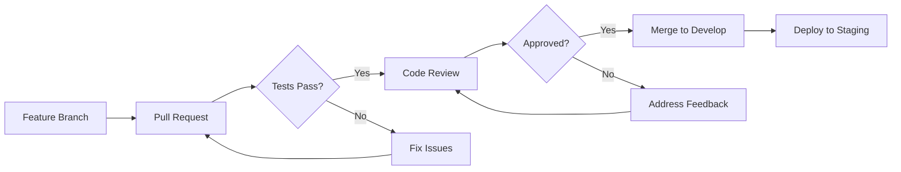
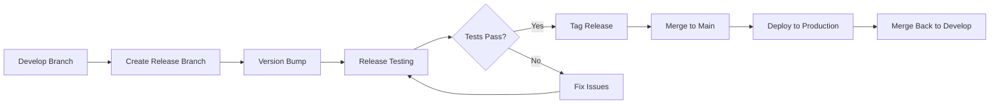
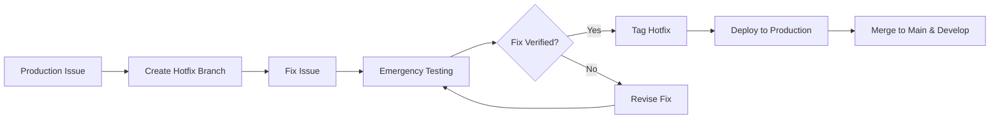

# CI/CD Architecture

This document describes the continuous integration and continuous deployment (CI/CD) architecture for Hexabase KaaS, including pipeline stages, deployment workflows, and integration with GitOps tools.

## Architecture Overview

```
┌─────────────────────────────────────────────────────────────────────────────────┐
│                                 Developer Workflow                                │
├─────────────────────────────────────────────────────────────────────────────────┤
│                                                                                   │
│  Developer ──> Git Push ──> GitHub/GitLab ──> Webhook ──> CI Pipeline           │
│                                                                                   │
└─────────────────────────────────────────────────────────────────────────────────┘
                                        │
                                        ▼
┌─────────────────────────────────────────────────────────────────────────────────┐
│                              CI Pipeline (GitHub Actions/GitLab CI/Tekton)        │
├─────────────────────────────────────────────────────────────────────────────────┤
│                                                                                   │
│  ┌─────────┐  ┌─────────┐  ┌──────────┐  ┌────────────┐  ┌──────────────┐      │
│  │  Build  │──│  Test   │──│ Security │──│   Build    │──│    Push      │      │
│  │  Code   │  │  Suite  │  │   Scan   │  │  Container │  │  to Registry │      │
│  └─────────┘  └─────────┘  └──────────┘  └────────────┘  └──────────────┘      │
│                                                                                   │
└─────────────────────────────────────────────────────────────────────────────────┘
                                        │
                                        ▼
┌─────────────────────────────────────────────────────────────────────────────────┐
│                            Container Registry (Harbor/DockerHub/ECR)              │
├─────────────────────────────────────────────────────────────────────────────────┤
│                                                                                   │
│  ┌──────────────┐  ┌──────────────┐  ┌──────────────┐  ┌──────────────┐       │
│  │   API Image  │  │  UI Image    │  │ Worker Image │  │  Init Image  │       │
│  │  :latest     │  │  :latest     │  │  :latest     │  │  :latest     │       │
│  │  :v1.2.3     │  │  :v1.2.3     │  │  :v1.2.3     │  │  :v1.2.3     │       │
│  └──────────────┘  └──────────────┘  └──────────────┘  └──────────────┘       │
│                                                                                   │
└─────────────────────────────────────────────────────────────────────────────────┘
                                        │
                                        ▼
┌─────────────────────────────────────────────────────────────────────────────────┐
│                              GitOps (Flux/ArgoCD)                                │
├─────────────────────────────────────────────────────────────────────────────────┤
│                                                                                   │
│  Git Repository ──> Flux/ArgoCD ──> Kubernetes Clusters                         │
│       │                  │                    │                                  │
│       │                  │                    ├── Local (Kind)                   │
│       │                  │                    ├── Staging                        │
│       │                  └──────────────────> └── Production                     │
│       │                                                                          │
│       └── manifests/                                                            │
│           ├── base/                                                              │
│           ├── overlays/                                                          │
│           │   ├── local/                                                         │
│           │   ├── staging/                                                       │
│           │   └── production/                                                    │
│           └── kustomization.yaml                                                 │
│                                                                                   │
└─────────────────────────────────────────────────────────────────────────────────┘
```

## CI Pipeline Architecture

### Provider Model and Extensibility

The CI/CD functionality in Hexabase KaaS is designed with extensibility in mind, using a provider model based on Dependency Injection (DI). The system defines a common Go interface for CI/CD operations (e.g., `RunPipeline`, `GetStatus`). The Hexabase API server can be configured to use a specific implementation (e.g., Tekton, GitHub Actions), which will be injected at runtime. This allows for easily swapping or adding new CI/CD backends without changing the core business logic.

### Authentication and Credentials Management

The platform employs a simple and standard mechanism for managing CI/CD credentials securely at the project level.

1.  **UI Configuration**: Users configure Git repository SSH keys and container registry credentials through the Hexabase UI for each Project.
2.  **Secret Storage**: The Hexabase API server securely stores these credentials within the project's namespace as two distinct Kubernetes Secrets:
    - `[project-name]-git-creds` (type: `kubernetes.io/ssh-auth`)
    - `[project-name]-registry-creds` (type: `kubernetes.io/dockerconfigjson`)
3.  **Pipeline-Scoped Access**: A dedicated `ServiceAccount` is created for each project's pipeline runs. This ServiceAccount is granted permission to access only these specific secrets.
4.  **Secure Usage**: When a pipeline (e.g., a Tekton `PipelineRun`) is executed, it runs under this ServiceAccount, which automatically mounts the secrets for use by the pipeline tasks (e.g., for cloning the Git repository and pushing to the container registry).

This approach ensures that credentials are scoped to the specific project and are handled using standard, secure Kubernetes primitives.

### Pipeline Stages

#### 1. Code Quality Stage

The code quality stage ensures consistent code formatting and identifies potential issues early:

- **Linting**: Uses language-specific linters (golangci-lint for Go, eslint for JavaScript, hadolint for Dockerfiles)
- **Formatting**: Enforces code style with gofmt and prettier
- **Static Analysis**: Performs deep code analysis with staticcheck and security scanning with gosec

#### 2. Testing Stage

Comprehensive testing ensures code reliability and functionality:

- **Unit Tests**: Fast, isolated tests for individual components with minimum 80% coverage requirement
- **Integration Tests**: Tests component interactions using real services via testcontainers
- **End-to-End Tests**: Full system validation using Playwright for UI and k6 for load testing

#### 3. Security Scanning Stage

Multiple layers of security validation protect against vulnerabilities:

- **Dependency Scanning**: Identifies vulnerable dependencies using nancy/snyk for Go and npm audit for Node.js
- **Container Scanning**: Scans container images for CVEs using Trivy and validates against CIS benchmarks
- **Secret Detection**: Prevents accidental credential commits using gitleaks
- **SAST**: Performs static application security testing with SonarQube

#### 4. Build Stage

Optimized container building for multiple architectures:

- **Multi-stage Builds**: Creates minimal, secure container images
- **BuildKit**: Leverages advanced caching for faster builds
- **Multi-platform**: Supports both linux/amd64 and linux/arm64 architectures
- **Helm Charts**: Validates and packages Helm charts with digital signatures

#### 5. Publish Stage

Secure artifact distribution to registries:

- **Container Registry**: Tags images with semantic versioning, performs final security scan, and signs with cosign
- **Helm Repository**: Hosts charts in ChartMuseum with updated repository index

## CI/CD Tools

### GitHub Actions

Our primary CI/CD platform for projects hosted on GitHub. GitHub Actions provides:

- Native integration with GitHub repositories
- Extensive marketplace of pre-built actions
- Matrix builds for testing multiple versions
- Built-in secret management
- Deployment environments with approval gates

Configuration files are located in `/ci/github-actions/`

### GitLab CI

Alternative CI/CD platform for GitLab-hosted projects, offering:

- Deep GitLab integration
- Built-in container registry
- Dynamic environments
- Merge request pipelines
- Advanced caching mechanisms

Configuration files are located in `/ci/gitlab-ci/`

### Tekton

Cloud-native CI/CD solution running directly in Kubernetes:

- Kubernetes-native pipeline execution
- Reusable task definitions
- Resource-efficient with pod-based execution
- Extensible through custom tasks
- Event-driven pipeline triggers

Configuration files are located in `/ci/tekton/`

## GitOps Architecture

### Flux

Flux enables GitOps workflows by continuously reconciling cluster state with Git repositories:

- Automated synchronization from Git
- Multi-tenancy support
- Helm release management
- Automated image updates
- Progressive delivery with Flagger

Configuration files are located in `/deployments/gitops/flux/`

### ArgoCD

ArgoCD provides a UI-driven GitOps experience:

- Web UI for visualization and management
- Multi-cluster support
- SSO integration
- RBAC for fine-grained access control
- Application health monitoring

Configuration files are located in `/deployments/gitops/argocd/`

## Deployment Workflows

### Feature Branch Workflow



### Release Workflow



### Hotfix Workflow



## Security Integration

### Supply Chain Security

We implement comprehensive supply chain security measures:

- **SBOM Generation**: Creates Software Bill of Materials for all releases
- **Container Signing**: All production images are signed with cosign
- **Attestation**: SBOM and vulnerability scan results are attached to images
- **Policy Enforcement**: Kyverno policies ensure only signed images are deployed

Configuration files are located in:

- `/ci/github-actions/supply-chain.yml`
- `/deployments/policies/kyverno/`

### Policy Enforcement

Kyverno policies enforce security requirements at runtime:

- Image signature verification
- Resource quota enforcement
- Network policy requirements
- Pod security standards

## Monitoring and Observability

### Pipeline Metrics

We collect and visualize key CI/CD metrics:

- Build success rate
- Pipeline duration
- Test coverage trends
- Deployment frequency
- Mean time to recovery (MTTR)

Configuration files are located in `/deployments/monitoring/prometheus/`

### Deployment Tracking

Comprehensive deployment monitoring includes:

- Real-time deployment status
- Historical deployment data
- Rollback tracking
- Performance impact analysis

## Rollback Strategy

### Automated Rollback

Progressive delivery with automatic rollback capabilities:

- **Flagger Integration**: Automated canary deployments with metric-based promotion
- **Health Checks**: Continuous validation of application health
- **Metric Thresholds**: Automatic rollback on SLO violations
- **Notifications**: Instant alerts on rollback events

Configuration files are located in `/deployments/canary/flagger/`

### Manual Rollback

Multiple options for manual intervention:

- **Helm Rollback**: `helm rollback` for quick restoration
- **Flux Suspension**: Pause reconciliation for manual fixes
- **ArgoCD Rollback**: UI-driven rollback to previous versions
- **Git Revert**: Source-level rollback through version control

## Best Practices

### 1. Pipeline Design

- Keep pipelines fast (< 10 minutes)
- Run tests in parallel
- Use caching effectively
- Fail fast on critical issues

### 2. Security

- Scan at every stage
- Sign all artifacts
- Enforce policies
- Audit all deployments

### 3. Reliability

- Implement health checks
- Use progressive rollouts
- Monitor key metrics
- Maintain rollback capability

### 4. Efficiency

- Optimize build times
- Minimize image sizes
- Reuse common components
- Automate repetitive tasks

## Integration Points

### External Services

| Service       | Purpose                | Integration   |
| ------------- | ---------------------- | ------------- |
| GitHub/GitLab | Source control         | Webhooks, API |
| Harbor        | Container registry     | Docker API    |
| Vault         | Secret management      | CSI driver    |
| Slack         | Notifications          | Webhooks      |
| PagerDuty     | Incident management    | Events API    |
| SonarQube     | Code quality           | Scanner       |
| Snyk          | Vulnerability database | CLI/API       |

### Internal Services

| Service    | Purpose             | Integration    |
| ---------- | ------------------- | -------------- |
| Prometheus | Metrics collection  | ServiceMonitor |
| Grafana    | Visualization       | Dashboards     |
| Loki       | Log aggregation     | Promtail       |
| Jaeger     | Distributed tracing | OpenTelemetry  |

## Disaster Recovery

### Backup Strategy

- Git repositories: Mirrored to multiple locations
- Container images: Replicated across regions
- Helm charts: Stored in multiple repositories
- Secrets: Backed up in Vault

### Recovery Procedures

1. **Source Code Loss**: Restore from mirror repositories
2. **Registry Failure**: Failover to backup registry
3. **Pipeline Failure**: Use backup CI/CD system
4. **Deployment Failure**: Rollback using GitOps history

## Configuration Locations

All CI/CD configurations are organized in the following structure:

- `/ci/github-actions/` - GitHub Actions workflows
- `/ci/gitlab-ci/` - GitLab CI configurations
- `/ci/tekton/` - Tekton pipeline definitions
- `/deployments/gitops/flux/` - Flux GitOps configurations
- `/deployments/gitops/argocd/` - ArgoCD application definitions
- `/deployments/policies/kyverno/` - Security policies
- `/deployments/monitoring/prometheus/` - Monitoring configurations
- `/deployments/canary/flagger/` - Progressive delivery configurations

Each directory contains a README.md file with detailed usage instructions and examples.

## Future Enhancements

### Short Term (Q1 2024)

- [ ] Implement progressive delivery with Flagger
- [ ] Add automated performance testing
- [ ] Integrate chaos engineering tests
- [ ] Implement dependency updates automation

### Medium Term (Q2-Q3 2024)

- [ ] Multi-region deployment pipelines
- [ ] Advanced canary analysis
- [ ] Cost optimization in pipelines
- [ ] ML-based anomaly detection

### Long Term (Q4 2024+)

- [ ] Full GitOps automation
- [ ] Self-healing deployments
- [ ] Predictive scaling
- [ ] Zero-downtime database migrations
