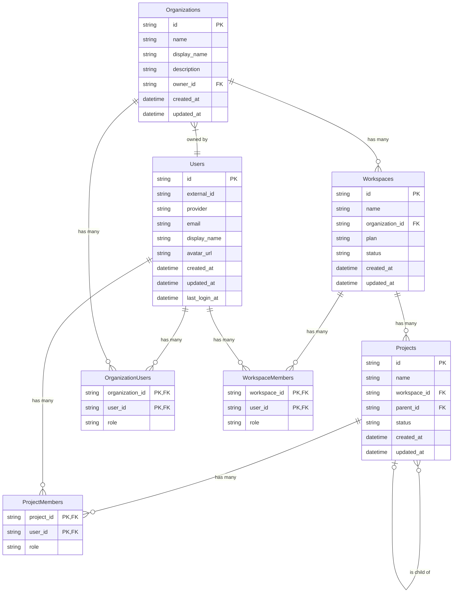

# データベース設計

このドキュメントでは、Hexabase AIプラットフォームのデータベース設計について詳述します。設計は、マルチテナントアーキテクチャをサポートし、スケーラビリティとデータの整合性を確保することを目指しています。

## 設計思想

データベース設計は、ドメイン駆動設計（DDD）の原則に基づいています。各ドメインは明確に分離され、それぞれが自身のデータとビジネスロジックに責任を持ちます。主要なエンティティは以下の通りです。

-   **Organizations**: プラットフォーム上のトップレベルのエンティティで、企業やチームを表します。
-   **Users**: プラットフォームを利用する個々のユーザーです。
-   **Workspaces**: 各Organizationに属する仮想的なクラスタ環境です。
-   **Projects**: 各Workspace内に作成される開発プロジェクトです。

## ER図

以下は、主要なエンティティとそのリレーションシップを示すER図です。

### リレーションシップ解説

-   **Users - Organizations**: 多対多の関係です。`OrganizationUsers` テーブルが中間テーブルとして機能し、ユーザーの組織への所属と役割（`role`）を管理します。
-   **Organizations - Workspaces**: 1対多の関係です。1つのOrganizationは複数のWorkspaceを持つことができます。
-   **Workspaces - Projects**: 1対多の関係です。1つのWorkspaceは複数のProjectを持つことができます。
-   **Users - Workspaces**: 多対多の関係です。`WorkspaceMembers` テーブルが中間テーブルとして機能し、ユーザーのWorkspaceへのアクセス権と役割を管理します。
-   **Users - Projects**: 多対多の関係です。`ProjectMembers` テーブルが中間テーブルとして機能し、ユーザーのProjectへのアクセス権と役割を管理します。
-   **Projects - Projects**: 自己参照の1対多の関係です。`parent_id` を使用してプロジェクトの階層構造を表現できます。

## コンポーネント図

以下の図は、データベースへのアクセスに関するコンポーネントの依存関係を示しています。データアクセスはリポジトリパターンを介して抽象化されており、ビジネスロジック（Service）は具体的なデータベース実装から分離されています。

このアーキテクチャにより、以下の利点がもたらされます。

-   **関心の分離**: 各レイヤーが特定の責任を持つため、コードの保守性とテスト容易性が向上します。
-   **柔軟性**: リポジトリインターフェースを変更することなく、基礎となるデータベース実装（例: PostgreSQLから別のDBへ）を置き換えることが可能です。
-   **一貫性**: すべてのデータベース操作がリポジトリ層を介して行われるため、データアクセスロジックの一貫性が保たれます。 