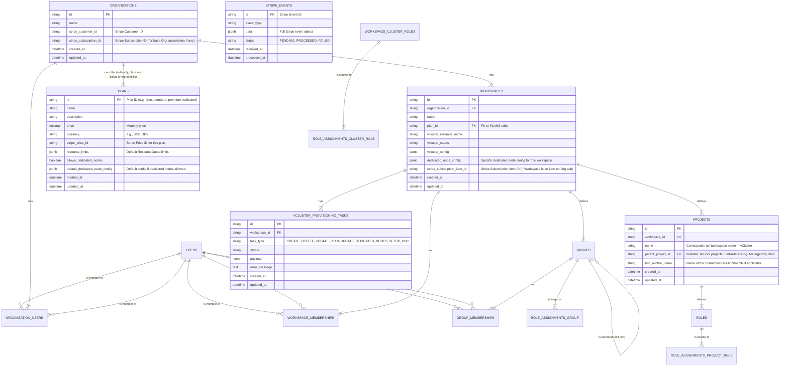

# Hexabase コントロールプレーン実装仕様書 v1.0

## 1. はじめに

### 1.1. ドキュメントの目的

本ドキュメントは、Hexabase KaaS (Kubernetes as a Service) プラットフォームの中核をなすコントロールプレーンの設計および実装に関する包括的な仕様を定義します。コントロールプレーンは、API サーバー、OIDC (OpenID Connect) プロバイダー、vCluster オーケストレーター、非同期処理ワーカー、課金システム連携モジュールなど、多岐にわたるコンポーネントで構成されます。本書は、これらのコンポーネントを Go 言語で実装する際の技術的な指針となり、データベーススキーマ設計 (PostgreSQL)、RESTful API エンドポイントの仕様、主要なビジネスロジック、リソース分離戦略、セキュリティ対策、そして将来的な拡張性に関する考慮事項を網羅的に記述します。このドキュメントを通じて、開発チームは一貫した理解のもと、堅牢かつスケーラブルな KaaS 基盤の構築を目指します。

### 1.2. 対象読者

本ドキュメントは、Hexabase KaaS プロジェクトに携わる以下の関係者を主な対象としています。

- **バックエンド開発エンジニア**: Go 言語による API サーバー、各種モジュール、非同期ワーカーの実装を担当する開発者。
- **データベース管理者 (DBA)**: PostgreSQL データベースのスキーマ設計、最適化、運用を担当する専門家。
- **フロントエンド開発エンジニア**: Next.js で開発される UI と API サーバー間の連携を理解する必要がある開発者。
- **インフラストラクチャエンジニア/SRE**: Host K3s クラスタ、vCluster、および関連ミドルウェアの構築・運用を担当するエンジニア。
- **プロダクトマネージャー/プロジェクトリーダー**: システム全体の機能と技術的制約を把握し、プロジェクト進行を管理する責任者。
- **セキュリティ担当者**: システムのセキュリティアーキテクチャと対策を評価・検証する専門家。

### 1.3. 前提ドキュメント

本ドキュメントを理解する上で、以下のドキュメントの内容を事前に把握していることが推奨されます。

- **Hexabase KaaS 最終技術仕様書 v1.2**: プロジェクト全体の技術スタック、アーキテクチャ概要、採用するオープンソースプロダクト（K3s, vCluster, NATS, Flux, Kyverno, Prometheus, Grafana, Loki 等）に関する基本方針が記載されています。本実装仕様書は、この全体技術仕様書で定義された枠組みの中で、コントロールプレーンに特化した詳細設計を行うものです。

## 2. アーキテクチャ概要

### 2.1. コントロールプレーンの役割と責務

Hexabase コントロールプレーンは、KaaS プラットフォーム全体の司令塔として機能し、ユーザーからのリクエスト処理、リソース管理、テナント分離、課金処理など、多岐にわたる重要な責務を担います。これらの責務を果たすことで、ユーザーは複雑な Kubernetes の運用詳細を意識することなく、サービスを利用できます。コントロールプレーンの設計は、システムの信頼性、スケーラビリティ、セキュリティ、そして運用効率に直接的な影響を与えるため、極めて重要です。各責務は、明確に定義されたインターフェースを持つ独立した、あるいは協調して動作するモジュール群によって実現されます。

- **ユーザーインターフェース (UI) への API 提供**: Next.js で構築される洗練されたフロントエンドアプリケーションからの HTTP リクエストを受け付け、ビジネスロジックを実行し、結果を JSON 形式で返却します。これには、Organization の作成と管理、Workspace（実体は vCluster）のプロビジョニングと設定変更、Project（実体は Namespace）の作成・削除・階層化、ユーザー招待とチーム管理、Role および Group を通じた詳細な権限設定、課金プランの選択と支払い方法の管理など、ユーザーが行うほぼ全ての操作が含まれます。API は RESTful 原則に基づき、リソース指向で設計され、バージョン管理によって将来的な変更にも対応できるようにします。

- **認証・認可**:

  - **認証**: 外部の信頼できる ID プロバイダー（Google, GitHub など）との OIDC 連携を通じて、ユーザーの本人確認を確実に行います。認証プロセスが成功すると、Hexabase は独自のセッショントークン（推奨はステートレスな JWT）を発行し、以降の API アクセスにおいてこのトークンを使用してユーザーを識別します。これにより、パスワード管理の負担を軽減し、セキュリティを向上させます。
  - **認可**: API リクエストごとに、認証されたユーザーが要求された操作を実行する正当な権限を持っているかを厳密に検証します。この検証ロジックは、Hexabase DB に格納された Organization レベルの役割（例: オーナー、管理者、メンバー）、Workspace 内のグループ所属情報、および各 Project や Workspace 全体に割り当てられた Role (Namespace スコープの Role) や ClusterRole (vCluster スコープの Role) の情報を複合的に評価します。権限が不足している場合は、適切な HTTP ステータスコード（例: `403 Forbidden`）とともにエラーレスポンスを返却します。

- **OIDC プロバイダー**: 各 Workspace (vCluster) に対して、独立した OIDC ID トークンを発行する機能を提供します。これにより、ユーザーは`kubectl`などの標準的な Kubernetes ツールを使用して、自身の権限範囲内で vCluster に直接、かつ安全にアクセスできます。発行される ID トークンには、ユーザーの Hexabase 内部 ID (`sub`クレーム) および所属する全ての有効なグループ名 (`groups`クレーム、階層構造を解決したフラットなリスト) が含まれます。この機能は、Kubernetes ネイティブな認証・認可フローとのシームレスな統合を実現する上で不可欠であり、テナントごとのセキュリティコンテキストを維持します。

- **vCluster ライフサイクル管理**: テナント環境である vCluster の完全なライフサイクルを、作成から削除まで一貫して管理します。

  - **プロビジョニング**: ユーザーの要求（選択されたプラン、リージョン、Dedicated Node の要否など）に基づき、Host K3s クラスタ上に新しい vCluster インスタンスを動的に作成します。これには、vCluster 自体のデプロイメント（通常は Pod として実行）、必要なネットワーク設定（Service、場合によっては Ingress）、ストレージのプロビジョニング（PersistentVolumeClaim）、そして vCluster API サーバーの OIDC 設定（Hexabase OIDC プロバイダーを信頼するように構成）が含まれます。さらに、HNC (Hierarchical Namespace Controller) を各 vCluster 内に自動的にインストールし、Project の階層化を可能にするための初期設定も行います。
  - **設定**: Workspace プランに応じて、vCluster 内のデフォルトリソースクオータ（CPU、メモリ、ストレージなど）を設定します。また、Dedicated Node プランが選択された場合には、Host K3s クラスタから特定の物理（または仮想）ノードをその vCluster 専用に割り当てるためのスケジューリング設定（Node Selector, Taints/Tolerations）を行います。
  - **リソース割り当て**: 特に Dedicated Node プランの場合、Host K3s クラスタから特定の物理（または仮想）ノードを vCluster 専用に割り当て、他のテナントとのリソース競合を排除し、パフォーマンスとセキュリティを向上させます。これには、Host クラスタの Node へのラベリングや Taint 付与、vCluster Pod のスケジューリング制約の設定が含まれます。
  - **監視とスケーリング**: vCluster のリソース使用状況を監視し、プランによっては自動スケーリング機能（例: vCluster のコントロールプレーン Pod のレプリカ数調整、将来的には Node プールの自動拡張）を提供することも視野に入れます。
  - **削除**: Workspace の削除要求に応じて、関連する vCluster インスタンスおよびその内部に作成された全ての Kubernetes リソース（Namespace、Deployment、Service など）、割り当てられたストレージ、ネットワーク設定などを安全かつ完全にクリーンアップします。データ損失を防ぐため、削除操作は慎重に行われ、必要に応じて確認ステップを設けます。

- **状態管理**: システム内の主要なエンティティ（Organization, Workspace, Project, Group, Role, User, Plan, 課金情報、非同期タスクの進捗など）に関する全ての状態情報を、トランザクション機能を備えたリレーショナルデータベースである PostgreSQL に永続的に保存・管理します。これにより、システム障害発生時にもデータの損失を最小限に抑え、迅速な復旧を可能にします。また、データの一貫性と整合性を保証します。Project については、HNC を利用した Namespace の階層構造も DB と同期して管理し、UI での表示や権限チェックに利用します。

- **課金処理**: Stripe ペイメントゲートウェイと密接に連携し、Organization および Workspace 単位での柔軟なサブスクリプションベースの課金モデルを実現します。

  - **プラン管理**: 様々なリソース量、機能セット、価格帯を持つ課金プラン（例: Free Tier, Standard Tier, Premium Dedicated Node Tier）を定義し、ユーザーが自身のニーズに合わせて選択できるようにします。各プランは Stripe の Product および Price オブジェクトに対応付けられます。
  - **サブスクリプション管理**: ユーザーが Workspace を作成し有料プランを選択した際、または既存 Workspace のプランを変更した際に、Stripe API を呼び出してサブスクリプションを作成または更新します。これには、顧客の作成、支払い方法の登録、サブスクリプションアイテムの管理が含まれます。
  - **請求処理**: Stripe が提供する自動請求機能を利用し、定期的な請求（月次または年次）、支払い処理、支払い失敗時の自動リトライ、延滞管理などを行います。
  - **領収書発行と履歴**: Stripe を通じて自動的に領収書が発行され、ユーザーは Hexabase UI または Stripe カスタマーポータルから請求履歴を確認できます。
  - **Webhook 処理**: Stripe からの様々なイベント通知（例: `invoice.payment_succeeded`, `invoice.payment_failed`, `customer.subscription.updated`, `customer.subscription.deleted`など）をリアルタイムに受信するための専用 Webhook エンドポイントを設けます。受信したイベントは検証後、非同期ワーカーによって処理され、Hexabase 内のユーザーアカウントや Workspace のステータス、課金情報などが適切に更新されます。

- **非同期タスク処理**: 時間のかかる処理や、外部システムとの連携を伴う処理（例: vCluster のプロビジョニングと設定、Stripe API への複雑な呼び出し、HNC セットアップ、大規模なデータ移行やバックアップ処理など）は、API サーバーの応答性を維持し、ユーザー体験を損なわないように、NATS メッセージキューを介してバックグラウンドの非同期ワーカーで実行します。API サーバーはタスク要求を受け付けると、タスク ID を発行して即座にレスポンスを返し、ユーザーは UI を通じてタスクの進捗状況を確認できます。ワーカーはタスクの実行結果（成功、失敗、エラー詳細）をデータベースに記録します。

### 2.2. 主要コンポーネント

Hexabase コントロールプレーンは、以下の連携する主要コンポーネント群によって構成されます。各コンポーネントは特定の責務を持ち、システム全体の機能を実現するために協調して動作します。これらのコンポーネントは、マイクロサービスアーキテクチャの思想を取り入れつつ、初期段階ではモノリシックな Go アプリケーション内の論理モジュールとして実装し、将来的なスケールアウトや個別デプロイの必要性に応じて物理的なサービス分割を検討できるように設計します。

- **API サーバー (Go)**: システムの中心的コンポーネントであり、クライアント（主に Next.js フロントエンド）からの全ての RESTful API リクエストを受け付けます。ビジネスロジックの実行、リクエストの検証、認証・認可処理、データベースへのアクセス、他の内部コンポーネントや外部サービスへの指示など、コントロールプレーンの頭脳としての役割を果たします。課金関連のロジックもこのコンポーネントが主導します。Go 言語の標準ライブラリや Gin/Echo のような軽量な Web フレームワークを利用して構築されます。ステートレス設計を基本とし、必要に応じて Redis などのキャッシュストアと連携します。

- **OIDC プロバイダーモジュール (Go)**: API サーバーに組み込まれる形で実装され、各 vCluster に対する OIDC プロバイダーとして機能します。ユーザーが特定の Workspace の`kubeconfig`を取得する際に、その Workspace (vCluster) スコープの ID トークンを動的に生成・発行します。これには、ユーザーのグループメンバーシップ（階層解決済み）を`groups`クレームに含める処理が含まれます。また、vCluster API サーバーがトークン署名を検証するための JWKS (JSON Web Key Set) エンドポイント (`/jwks.json`) および OIDC Discovery Document (`/.well-known/openid-configuration`) も提供します。署名鍵の管理とローテーションも考慮されます。

- **vCluster オーケストレーター (Go)**: vCluster のライフサイクル管理に特化したモジュールです。Go の Kubernetes クライアントライブラリ (`client-go`) を使用して、Host K3s クラスタおよび個々の vCluster API サーバーと直接対話します。主なタスクには、vCluster Pod のデプロイと削除（`vcluster CLI`のラップまたは Helm 操作）、vCluster 内部への HNC コントローラーのインストールと設定、Namespace (Project) の階層構造の作成（`SubnamespaceAnchor` CR の操作）、Dedicated Node の割り当て（Node ラベルや Taint/Toleration の操作を通じたスケジューリング制御）、vCluster のネットワーク設定、ストレージ設定などが含まれます。このモジュールは、非同期ワーカーから呼び出されることが多いです。

- **Stripe 連携モジュール (Go)**: 課金処理を担当し、Stripe API との全ての通信をカプセル化します。Stripe が提供する公式 Go SDK (`stripe-go`) を利用し、顧客情報 (Customer)、支払い方法 (PaymentMethod)、製品と価格 (Product/Price)、サブスクリプション (Subscription) の作成・更新・キャンセル、請求書 (Invoice) の処理、そして Stripe からの Webhook イベントの受信と検証を行います。ビジネスロジック（例: プラン変更時の日割り計算の要否判断、支払い失敗時の Workspace 停止処理など）もこのモジュールまたは関連サービスが担います。

- **非同期ワーカー (Go)**: NATS メッセージキューからタスクメッセージを購読し、バックグラウンドで処理を実行する独立した Go プロセス群です。vCluster のプロビジョニング、Stripe API への時間のかかる呼び出し（例: 大量の顧客データ同期）、HNC セットアップ、定期的なメンテナンス作業（例: 古いログのアーカイブ）、大規模なデータ移行やバックアップ処理など、API サーバーの同期処理をブロックする可能性のあるタスクを担当します。ワーカーはタスクの種類に応じて複数定義され、それぞれが特定の NATS トピックを購読します。複数のワーカーインスタンスを起動することで、処理のスループットとシステムの耐障害性を向上させます。

- **データベース (PostgreSQL)**: システム全体の状態情報を永続化するためのリレーショナルデータベースです。ユーザーアカウント、Organization、Workspace、Project、Group、Role、課金プラン、サブスクリプション情報、非同期タスクの状況、監査ログなどが格納されます。トランザクション管理によりデータの一貫性を保証し、適切なインデックス設計により検索性能を最適化します。スキーマの変更は`golang-migrate`のようなマイグレーションツールを用いてバージョン管理されます。

- **キャッシュ (Redis)**: 頻繁にアクセスされるデータ（例: ユーザーセッション情報、アクティブな OIDC トークンの検証に必要な情報、権限チェックのための集約済みグループ情報、レートリミットカウンターなど）をインメモリでキャッシュし、データベースへの負荷を軽減し、API の応答速度を向上させます。キャッシュ戦略（例: TTL、Write-Through、Write-Back）はデータの特性に応じて選択します。

- **メッセージキュー (NATS)**: API サーバーと非同期ワーカー間のタスク連携に使用される高性能なメッセージングシステムです。API サーバーは時間のかかる処理要求を NATS の特定のトピックにメッセージとして発行（Publish）し、対応するワーカーがそのメッセージを購読（Subscribe）して処理を実行します。NATS のストリーミング機能（NATS Streaming/JetStream）を利用することで、メッセージの永続化や確実な配信（At-Least-Once セマンティクスなど）も実現可能です。これにより、システム全体の疎結合性と耐障害性が向上します。

### 2.3. 外部システムとの連携

Hexabase コントロールプレーンは、以下の外部システムと密接に連携してサービスを提供します。これらの連携は、システムの機能性、セキュリティ、運用効率を高める上で不可欠です。

- **Host K3s Cluster**:

  - **役割**: Hexabase コントロールプレーンの各コンポーネント（API サーバー、ワーカー、DB など）自体がコンテナとして稼働する基盤となる Kubernetes クラスタです。また、各テナントに提供される vCluster も、この Host クラスタ上で Pod として実行されます。Host クラスタのリソース（CPU、メモリ、ストレージ、ネットワーク）が、プラットフォーム全体のキャパシティを決定します。
  - **連携方法**: Hexabase コントロールプレーンの vCluster オーケストレーターは、`client-go`ライブラリを通じて Host K3s クラスタの API サーバーと通信し、vCluster の Pod や Service、ConfigMap、Secret などの Kubernetes リソースを宣言的に管理します。Dedicated Node を提供する場合、オーケストレーターは Host クラスタの Node に特定のラベルを付与したり、Node の状態を監視したりします。Host クラスタ自体の監視（Prometheus/Grafana）も重要です。

- **vCluster**:

  - **役割**: 各テナント（Workspace）に割り当てられる、論理的に分離された Kubernetes 環境です。ユーザーは自身の vCluster 内で自由に Namespace やアプリケーションをデプロイし、Kubernetes API を直接操作できます。各 vCluster は独自の API サーバー、etcd（または代替のデータストア）、コントローラーマネージャーを持ち、Host クラスタからは隔離されています。
  - **連携方法**: Hexabase コントロールプレーンは、各 vCluster の API サーバーエンドポイントに対して`client-go`や`kubectl`（内部的にラッパー経由）を使用して接続します。この接続には、通常、特権的な ServiceAccount トークン（vCluster 作成時に生成）や、ユーザー操作を代行する場合はユーザーの OIDC トークンが用いられます。コントロールプレーンは vCluster に対して、Namespace の作成（HNC 経由での階層 Namespace 作成を含む）、Role/RoleBinding/ClusterRoleBinding の適用、OIDC 認証設定の構成、ネットワークポリシーの適用、デフォルトリソースクオータの設定などを行います。HNC コントローラーは各 vCluster 内にインストールされ、その vCluster 内での Namespace の階層化を実現します。

- **外部 IdP (Google, GitHub 等)**:

  - **役割**: Hexabase への初期ユーザー認証（サインアップ・ログイン）を提供します。ユーザーは既存の外部アカウント（例: Google アカウント、GitHub アカウント）を利用して、新しいパスワードを覚えることなく、安全かつ簡単に Hexabase サービスを開始できます。これにより、ユーザーの利便性が向上し、パスワード管理のリスクも低減されます。
  - **連携方法**: OAuth 2.0 および OpenID Connect (OIDC) プロトコルに基づいて連携します。Hexabase API は OIDC Relying Party (RP) として機能します。ユーザーが UI で特定の外部 IdP を選択すると、Hexabase API は認証リクエストを生成し、ユーザーをその IdP の認証ページにリダイレクトします。ユーザーが IdP で認証し、Hexabase への情報提供に同意すると、IdP は認可コードを付けて Hexabase API のコールバック URL にリダイレクトします。Hexabase API はこの認可コードを IdP のトークンエンドポイントで ID トークンおよびアクセストークンと交換し、ID トークンを検証してユーザー情報を取得・登録します。

- **Stripe**:
  - **役割**: クレジットカード決済、サブスクリプション管理、請求書発行、税計算（設定による）、支払い失敗時のリトライ処理など、全ての課金関連処理を安全かつ確実に実行するペイメントゲートウェイです。PCI DSS コンプライアンスなどの複雑な要件を Stripe に委任することで、Hexabase は課金システムの開発・運用負荷を大幅に軽減できます。
  - **連携方法**: Hexabase API 内の Stripe 連携モジュールが、Stripe が提供する公式 API SDK（Go 言語版）を使用して、Stripe API と HTTPS 経由で安全に通信します。顧客情報、支払い方法、製品カタログ、価格、サブスクリプション、請求書などの Stripe オブジェクトをプログラムから操作します。また、Stripe からのイベント通知（例: `invoice.payment_succeeded`, `customer.subscription.deleted`など）をリアルタイムに受信するための専用 Webhook エンドポイントを Hexabase API に設け、イベントの署名を検証した上で、非同期ワーカーによって関連するビジネスロジック（例: Workspace の有効化、DB のステータス更新）を実行します。

### 3. API 設計

#### 3.1. 設計原則

Hexabase コントロールプレーンの API は、開発者にとって使いやすく、スケーラブルで、保守性の高いものとなるよう、以下の設計原則に従います。

- **RESTful API の原則に従う**: HTTP メソッド（GET, POST, PUT, DELETE, PATCH）を適切に利用し、リソース指向のアーキテクチャを採用します。各リソースは一意な URI で識別されます。
- **リソース指向の URL 設計**: URL は名詞（リソース）を中心に構成し、階層構造を表現します（例: `/organizations/{orgId}/workspaces/{wsId}/projects`）。動詞は HTTP メソッドで表現します。
- **JSON 形式でのリクエスト/レスポンス**: リクエストボディおよびレスポンスボディのデータ形式は、広く普及し、多くの言語で扱いやすい JSON (application/json) を標準とします。
- **標準的な HTTP ステータスコードの使用**: RFC 7231 等で定義される HTTP ステータスコードを適切に返し、クライアントが API の処理結果を正確に理解できるようにします（例: `200 OK`, `201 Created`, `204 No Content`, `400 Bad Request`, `401 Unauthorized`, `403 Forbidden`, `404 Not Found`, `500 Internal Server Error`）。
- **バージョン管理**: API の互換性を維持しつつ将来的な変更を可能にするため、URL パスにバージョン情報を含めます（例: `/api/v1/...`）。これにより、旧バージョンの API を利用しているクライアントへの影響を最小限に抑えながら、新機能の導入や仕様変更を行えます。
- **冪等性 (Idempotency)**: `PUT`や`DELETE`のような副作用を伴う操作は、可能な限り冪等になるように設計します。つまり、同じリクエストを複数回送信しても、結果が 1 回だけ実行された場合と同じになるようにします。これは、ネットワークエラーによるリトライ処理などを安全に行うために重要です。`POST`によるリソース作成時は、重複作成を防ぐためにクライアント側で冪等キーを生成し、サーバー側でそれを検証する仕組みも検討できます。
- **エラーレスポンスの標準化**: エラー発生時には、HTTP ステータスコードに加え、エラーの詳細情報（エラーコード、メッセージ、場合によっては問題箇所）を構造化された JSON 形式でレスポンスボディに含めます。これにより、クライアントはエラー内容をプログラム的に解析し、適切なユーザーフィードバックやエラー処理を行うことができます。
  例: `{ "error": { "code": "INVALID_INPUT", "message": "Workspace name cannot be empty.", "field": "name" } }`

#### 3.2. 認証・認可フロー

Hexabase コントロールプレーンへのアクセスは、厳格な認証・認可フローによって保護されます。

1.  **UI からのログイン要求**: ユーザーは Hexabase の UI（Next.js アプリケーション）を通じて、サポートされている外部 ID プロバイダー（例: Google, GitHub）のいずれかを選択し、ログイン処理を開始します。UI は Hexabase API の `/auth/login/{provider}` エンドポイントにリクエストを送信します。

2.  **外部 IdP へのリダイレクト**: Hexabase API サーバーは、選択されたプロバイダーに応じた認証リクエストを生成し、ユーザーのブラウザを外部 IdP の認証ページへリダイレクトさせます。この際、OAuth 2.0 の認可コードフローが開始されます。

3.  **外部 IdP での認証と同意**: ユーザーは外部 IdP の認証画面で認証情報（ユーザー名、パスワード、場合によっては二要素認証コード）を入力し、Hexabase が要求する情報（例: メールアドレス、表示名）へのアクセスを許可（同意）します。

4.  **コールバック処理**: 認証と同意が成功すると、外部 IdP はユーザーのブラウザを、事前に登録された Hexabase API のコールバックエンドポイント (`/auth/callback/{provider}`) へリダイレクトさせます。このリダイレクトには、認可コード (authorization code) や `state` パラメータが含まれます。

5.  **トークン交換とユーザー情報取得**: Hexabase API サーバーは、受け取った認可コードと自身のクライアントシークレットを使用して、外部 IdP のトークンエンドポイントにアクセストークンと ID トークンを要求します。取得した ID トークンを検証し、署名確認、発行者確認、有効期限確認などを行います。検証後、ID トークン内のクレーム（例: `sub`, `email`, `name`）からユーザー情報を抽出します。

6.  **Hexabase ユーザーアカウントの処理**:

    - **既存ユーザーの場合**: 抽出した外部 IdP のユーザー ID (`external_id` と `provider`) をキーに、Hexabase DB の`users`テーブルを検索します。該当ユーザーが存在すれば、そのユーザーとして認識します。
    - **新規ユーザーの場合**: 該当ユーザーが存在しなければ、新しいユーザーレコードを`users`テーブルに作成します。この際、初回サインアップであれば、新しい`Organization`も自動的に作成し、ユーザーをその Organization の最初の管理者として登録します。

7.  **Hexabase セッション発行**: ユーザーアカウントの処理が完了後、Hexabase API は独自のセッショントークン（ステートレスな JWT を推奨）を生成します。このトークンには、Hexabase 内部のユーザー ID、セッション有効期限、その他の必要なセッション情報が含まれます。生成されたセッショントークンは、JSON レスポンスとして UI に返却されるか、安全な HTTP Cookie として設定されます。

8.  **API アクセス**: UI（または他の API クライアント）は、以降の Hexabase API へのリクエスト時に、取得した Hexabase セッショントークンを HTTP ヘッダーの `Authorization: Bearer <token>` フィールドに含めて送信します。

9.  **API サーバーでの認可**: 各 API エンドポイントの処理に先立ち、API サーバーに組み込まれた認証ミドルウェアが `Authorization` ヘッダーからセッショントークンを検証します（署名、有効期限など）。検証が成功すれば、トークン内のユーザー ID に基づいてリクエスト元のユーザーを特定します。その後、各エンドポイントのロジック内で、特定されたユーザーが要求された操作（例: Workspace の作成、Project へのメンバー追加）を実行する権限を持っているかを、Hexabase DB 内の Organization メンバーシップ、Workspace メンバーシップ、Group 所属、Role 割り当て情報などを参照して詳細に検証します。権限がない場合は、`403 Forbidden` エラーを返します。

#### 3.3. 主要 API エンドポイント定義

以下に、Hexabase コントロールプレーンが提供する主要な RESTful API エンドポイントの概要を示します。各エンドポイントの詳細は、個別の API 仕様書でさらに具体化されます。

##### 3.3.1. 認証 (`/auth`)

このエンドポイント群は、ユーザーのサインアップ、ログイン、ログアウト、および現在の認証状態の確認といった、認証ライフサイクル全体を管理します。

- `POST /auth/login/{provider}`: 外部 IdP によるログイン処理を開始します。
  - Path Parameters: `provider` (string, required) - 外部 IdP の識別子 (例: "google", "github", "microsoft")。
  - Request Body: プロバイダーによっては、追加のパラメータ（例: 組織固有のログインヒント）を受け付ける場合がありますが、通常は空です。
  - Response: 外部 IdP の認証ページへのリダイレクト URL、または認証フローを開始するための情報（例: OAuth 2.0 の認可エンドポイント URL と必要なパラメータ）を JSON 形式で返します。
- `GET /auth/callback/{provider}`: 外部 IdP からの認証成功後のコールバックを受け付けます。
  - Path Parameters: `provider` (string, required) - 外部 IdP の識別子。
  - Query Parameters: 外部 IdP から渡されるパラメータ（通常は `code` (認可コード) および `state` (CSRF 対策)）。
  - Response: 認証に成功した場合、Hexabase 独自のセッショントークン（JWT）を含む JSON オブジェクトを返します。UI はこのトークンを保存し、以降の API リクエストで使用します。失敗した場合は、適切なエラー情報を含む JSON オブジェクトまたはエラーページへのリダイレクトを返します。
- `POST /auth/logout`: 現在の Hexabase セッションを無効化し、ユーザーをログアウトさせます。
  - Request Body: なし。
  - Response: 成功した場合、`204 No Content` を返します。セッショントークンはクライアント側で破棄されるべきです。サーバー側では、必要に応じてトークンのブラックリスト処理などを行います。
- `GET /auth/me`: 現在認証されているユーザー自身の情報を取得します。
  - Response Body: 認証済みユーザーの基本情報（Hexabase ユーザー ID、メールアドレス、表示名、所属 Organization の概要など）を JSON 形式で返します。未認証の場合は `401 Unauthorized` を返します。
    ```json
    {
      "id": "hxb-usr-a1b2c3d4",
      "email": "user@example.com",
      "displayName": "Taro Yamada",
      "organizations": [
        { "id": "org-x1y2z3", "name": "My First Org", "role": "admin" }
      ]
    }
    ```

##### 3.3.2. Organization (`/api/v1/organizations`)

Organization は、課金、ユーザー管理、Workspace 群の論理的なコンテナとしての役割を果たします。

- `POST /`: 新しい Organization を作成します。主に初回サインアップ時にシステム内部で自動的に呼び出されることを想定しますが、将来的にはユーザーが複数の Organization を作成できる機能（ライセンスベース）の基盤となります。
  - Request Body: `{ "name": "My New Organization" }`
  - Response Body: 作成された Organization の情報（ID、名前など）を返します。
    ```json
    {
      "id": "org-e5f6a7b8",
      "name": "My New Organization",
      "createdAt": "2025-06-01T12:00:00Z"
    }
    ```
- `GET /`: 認証済みユーザーが所属（または管理権限を持つ）する全ての Organization の一覧を取得します。
  - Response Body: Organization オブジェクトの配列。各オブジェクトには ID、名前、ユーザーの役割などが含まれます。
- `GET /{orgId}`: 指定された ID の Organization の詳細情報を取得します。
  - Path Parameters: `orgId` (string, required) - 対象 Organization の ID。
  - Response Body: Organization の詳細情報（名前、作成日、Stripe 顧客 ID、現在のサブスクリプションステータスなど）。
- `PUT /{orgId}`: 指定された ID の Organization 情報を更新します（例: Organization 名の変更）。
  - Path Parameters: `orgId` (string, required)
  - Request Body: `{ "name": "Updated Organization Name" }`
  - Response Body: 更新後の Organization 情報。
- `POST /{orgId}/users`: 指定された Organization に新しいユーザーを招待します。
  - Path Parameters: `orgId` (string, required)
  - Request Body: `{ "email": "newuser@example.com", "role": "admin" }` (`role` は `admin` または `member` など Organization レベルの役割)
  - Response Body: 招待されたユーザーの情報とステータス（例: `invited`）。招待メール送信処理は非同期で行われる場合があります。
- `DELETE /{orgId}/users/{userId}`: 指定された Organization からユーザーを削除（または招待を取り消し）します。
  - Path Parameters: `orgId` (string, required), `userId` (string, required) - 対象ユーザーの Hexabase ユーザー ID。
  - Response: `204 No Content`。
- `POST /{orgId}/billing/portal-session`: 指定された Organization の Stripe カスタマーポータルへのセッションを作成し、リダイレクト用 URL を返します。ユーザーはこの URL を通じて支払い方法の管理や請求履歴の確認ができます。
  - Path Parameters: `orgId` (string, required)
  - Response Body: `{ "portalUrl": "https://billing.stripe.com/p/session/..." }`
- `GET /{orgId}/billing/subscriptions`: 指定された Organization に関連付けられた Stripe サブスクリプションの一覧と詳細情報を取得します。
  - Path Parameters: `orgId` (string, required)
  - Response Body: サブスクリプションオブジェクトの配列。各オブジェクトにはプラン情報、ステータス、現在の請求期間などが含まれます。
- `GET /{orgId}/billing/payment-methods`: 指定された Organization に登録されている支払い方法の一覧を取得します（Stripe から取得）。
  - Path Parameters: `orgId` (string, required)
  - Response Body: 支払い方法オブジェクトの配列。セキュリティのため、カード番号全体などは返しません。
- `POST /{orgId}/billing/payment-methods/setup-intent`: 新しい支払い方法を安全に登録するための Stripe SetupIntent を作成し、クライアントシークレットを返します。UI はこれを利用して Stripe Elements などと連携し、支払い情報を Stripe に直接送信します。
  - Path Parameters: `orgId` (string, required)
  - Response Body: `{ "clientSecret": "seti_xxxx_secret_yyyy" }`

##### 3.3.3. Workspace (`/api/v1/organizations/{orgId}/workspaces`)

Workspace は vCluster の実体であり、テナントごとの Kubernetes 環境を提供します。

- `POST /`: 指定された Organization 内に新しい Workspace を作成します。このリクエストは vCluster の非同期プロビジョニングを開始します。
  - Path Parameters: `orgId` (string, required)
  - Request Body: `{ "name": "my-production-workspace", "planId": "premium-dedicated-v1", "dedicatedNodeConfig": { "nodeCount": 2, "instanceType": "c5.xlarge", "region": "ap-northeast-1" } }` (`dedicatedNodeConfig` は専用ノードプランの場合のみ必須)
  - Response Body: 非同期タスク ID、作成中の Workspace の仮 ID、および現在のステータス（例: `PENDING_CREATION`）を返します。
    ```json
    {
      "taskId": "task-abc123xyz",
      "workspaceId": "ws-pqr789stu-pending",
      "name": "my-production-workspace",
      "status": "PENDING_CREATION"
    }
    ```
- `GET /`: 指定された Organization 内の全ての Workspace の一覧を取得します。
  - Path Parameters: `orgId` (string, required)
  - Response Body: Workspace オブジェクトの配列。各オブジェクトには ID、名前、プラン ID、vCluster の現在のステータス（例: `RUNNING`, `ERROR`）などが含まれます。
- `GET /{wsId}`: 指定された ID の Workspace の詳細情報を取得します。
  - Path Parameters: `orgId` (string, required), `wsId` (string, required)
  - Response Body: Workspace の詳細情報（名前、プラン、vCluster ステータス、作成日、Dedicated Node 構成、関連する Stripe サブスクリプションアイテム ID など）。
- `PUT /{wsId}`: 指定された ID の Workspace の情報を更新します（例: プラン変更、Dedicated Node 構成の変更）。これらの変更も非同期タスクとして処理される場合があります。
  - Path Parameters: `orgId` (string, required), `wsId` (string, required)
  - Request Body: `{ "planId": "enterprise-v2", "dedicatedNodeConfig": { "nodeCount": 3, "instanceType": "m6g.2xlarge" } }`
  - Response Body: 非同期タスク ID と更新受付ステータス。
- `DELETE /{wsId}`: 指定された ID の Workspace を削除します。関連する vCluster の削除も非同期で開始されます。
  - Path Parameters: `orgId` (string, required), `wsId` (string, required)
  - Response Body: 非同期タスク ID と削除受付ステータス。
- `GET /{wsId}/kubeconfig`: 対象 Workspace (vCluster) にアクセスするための`kubeconfig`ファイル（YAML 形式）を生成して返します。この`kubeconfig`には、Hexabase OIDC プロバイダーを利用した認証設定が含まれており、ユーザーはこれを使って`kubectl`等で vCluster を操作できます。
  - Path Parameters: `orgId` (string, required), `wsId` (string, required)
  - Response: `Content-Type: application/yaml` で `kubeconfig`ファイルの内容。

##### 3.3.4. Workspace Group (`/api/v1/workspaces/{wsId}/groups`)

Workspace 内のユーザーグループを管理します。グループは階層構造を持つことができます。

- `POST /`: 指定された Workspace 内に新しい Group を作成します。
  - Path Parameters: `wsId` (string, required)
  - Request Body: `{ "name": "developers", "parentId": "grp-developers-uuid" }` (`parentId` はオプションで、ルートグループの場合は null)
  - Response Body: 作成された Group の情報。
- `GET /`: 指定された Workspace 内の全ての Group を階層構造で取得します。
  - Path Parameters: `wsId` (string, required)
  - Response Body: Group オブジェクトの配列（各オブジェクトは子グループの配列を持つことができる）。
- `PUT /{groupId}`: 指定された ID の Group 名を変更します。
  - Path Parameters: `wsId` (string, required), `groupId` (string, required)
  - Request Body: `{ "name": "Frontend Engineering Team" }`
  - Response Body: 更新後の Group 情報。
- `DELETE /{groupId}`: 指定された ID の Group を削除します。子グループやメンバーシップの扱い（カスケード削除か、制限するか）は慎重に設計する必要があります。
  - Path Parameters: `wsId` (string, required), `groupId` (string, required)
  - Response: `204 No Content`。
- `POST /{groupId}/members`: 指定された Group に既存の Workspace Member を追加します。
  - Path Parameters: `wsId` (string, required), `groupId` (string, required)
  - Request Body: `{ "userId": "hxb-usr-member-uuid" }` (Hexabase ユーザー ID)
  - Response: `201 Created`。
- `DELETE /{groupId}/members/{userId}`: 指定された Group からメンバーを削除します。
  - Path Parameters: `wsId` (string, required), `groupId` (string, required), `userId` (string, required)
  - Response: `204 No Content`。

##### 3.3.5. Project (Namespace) (`/api/v1/workspaces/{wsId}/projects`)

Project は vCluster 内の Namespace に相当し、アプリケーションやリソースの論理的な分離単位となります。HNC を利用して階層化が可能です。

- `POST /`: 指定された Workspace 内に新しい Project を作成します。HNC が有効な場合、指定された`parentId`に基づいて階層的な Namespace が vCluster 内に作成されます。
  - Path Parameters: `wsId` (string, required)
  - Request Body: `{ "name": "my-microservice-alpha", "parentId": "prj-backend-services-uuid" }` (`parentId` はオプション)
  - Response Body: 作成された Project の情報（ID、名前、実際の Namespace 名、HNC アンカー名など）。
- `GET /`: 指定された Workspace 内の全ての Project の一覧を取得します。
  - Path Parameters: `wsId` (string, required)
  - Query Parameters: `hierarchical=true` (オプション。true の場合、HNC による階層構造を反映した形式で返す)
  - Response Body: Project オブジェクトの配列、または階層構造を持つ Project オブジェクト。
- `GET /{projectId}`: 指定された ID の Project の詳細情報を取得します。
  - Path Parameters: `wsId` (string, required), `projectId` (string, required)
  - Response Body: Project の詳細情報。
- `DELETE /{projectId}`: 指定された ID の Project を削除します。HNC が管理する Namespace の場合、関連する子 Namespace も HNC のポリシーに従って処理されます。
  - Path Parameters: `wsId` (string, required), `projectId` (string, required)
  - Response: `204 No Content`。

##### 3.3.6. Project Role (`/api/v1/projects/{projectId}/roles`)

Project (Namespace) スコープのカスタム Role を管理します。これにより、ユーザーは特定の Namespace 内でのみ有効な詳細な権限セットを定義できます。

- `POST /`: 指定された Project 内に新しいカスタム Role を作成します。
  - Path Parameters: `projectId` (string, required)
  - Request Body: `{ "name": "database-migrator", "rules": [{"apiGroups": ["batch"], "resources": ["jobs"], "verbs": ["create", "get", "list", "delete"]}] }` (Kubernetes Role の`rules`仕様に準拠)
  - Response Body: 作成された Role の情報。
- `GET /`: 指定された Project 内で利用可能な全ての Role の一覧を取得します。これにはユーザーが作成したカスタム Role と、Hexabase が提供するプリセット Project Role（例: `hexabase:project-viewer`, `hexabase:project-editor`）が含まれます。
  - Path Parameters: `projectId` (string, required)
  - Response Body: Role オブジェクトの配列。各オブジェクトにはカスタムかプリセットかの区別も含まれます。
- `GET /{roleId}`: 指定された ID のカスタム Role の詳細情報を取得します。
  - Path Parameters: `projectId` (string, required), `roleId` (string, required)
  - Response Body: Role の詳細情報。
- `PUT /{roleId}`: 指定された ID のカスタム Role の権限ルールを更新します。
  - Path Parameters: `projectId` (string, required), `roleId` (string, required)
  - Request Body: `{ "rules": [...] }` (新しい`rules`定義)
  - Response Body: 更新後の Role 情報。
- `DELETE /{roleId}`: 指定された ID のカスタム Role を削除します。この Role が割り当てられている`RoleBinding`も適切に処理する必要があります（例: 関連する Binding を削除するか、管理者に通知する）。
  - Path Parameters: `projectId` (string, required), `roleId` (string, required)
  - Response: `204 No Content`。

##### 3.3.7. Role Assignment

Group に対して Project Role または Workspace ClusterRole を割り当てる（つまり、vCluster 内に`RoleBinding`または`ClusterRoleBinding`を作成する）ためのエンドポイントです。

- **Project Role Assignment**:
  - `POST /api/v1/projects/{projectId}/roleassignments`: 指定された Project 内で、特定の Group に Project Role を割り当てます。
    - Path Parameters: `projectId` (string, required)
    - Request Body: `{ "groupId": "grp-developers-uuid", "roleId": "role-custom-deployer-uuid" }`
    - Response Body: 作成された割り当て（`RoleBinding`に対応する Hexabase 内部のエンティティ）情報。
  - `DELETE /api/v1/projects/{projectId}/roleassignments/{assignmentId}`: 指定された Project Role の割り当てを解除します。
    - Path Parameters: `projectId` (string, required), `assignmentId` (string, required)
    - Response: `204 No Content`。
- **Workspace ClusterRole Assignment**:
  - `POST /api/v1/workspaces/{wsId}/clusterroleassignments`: 指定された Workspace 全体で、特定の Group にプリセット ClusterRole（例: `hexabase:workspace-admin`, `hexabase:workspace-viewer`）を割り当てます。
    - Path Parameters: `wsId` (string, required)
    - Request Body: `{ "groupId": "grp-ws-admins-uuid", "clusterRoleName": "hexabase:workspace-admin" }`
    - Response Body: 作成された割り当て（`ClusterRoleBinding`に対応する Hexabase 内部のエンティティ）情報。
  - `DELETE /api/v1/workspaces/{wsId}/clusterroleassignments/{assignmentId}`: 指定された Workspace ClusterRole の割り当てを解除します。
    - Path Parameters: `wsId` (string, required), `assignmentId` (string, required)
    - Response: `204 No Content`。

##### 3.3.8. Stripe Webhook (`/webhooks/stripe`)

Stripe からの非同期イベント通知（支払い成功、サブスクリプション変更など）を受信するための専用エンドポイントです。

- `POST /webhooks/stripe`: Stripe からのイベント通知を受信します。
  - Request Body: (Stripe Event Object)
  - Response: イベント受信成功を示す `200 OK` または、非同期処理キューへの登録成功を示す `202 Accepted`。Webhook リクエストの署名検証が必須です。

### 4. データベース設計 (PostgreSQL)

#### 4.1. ER 図 (概念)



#### 4.2. テーブル定義

以下に主要なテーブルの定義を示します。データ型、制約、インデックス戦略についても考慮が必要です。

- **users**

  - `id` (TEXT, PK): Hexabase 内部ユーザー ID (例: `hxb-usr-uuid`)。UUID v4 を推奨。
  - `external_id` (TEXT, NOT NULL): 外部 IdP のユーザー ID。
  - `provider` (TEXT, NOT NULL): 外部 IdP の識別子 (例: `google`, `github`)。
  - `email` (TEXT, UNIQUE, NOT NULL): ユーザーのメールアドレス。正規表現による形式チェックをアプリケーションレベルで行う。
  - `display_name` (TEXT, Nullable): 表示名。
  - `created_at` (TIMESTAMPZ, Default: `NOW()`, NOT NULL): レコード作成日時。
  - `updated_at` (TIMESTAMPZ, Default: `NOW()`, NOT NULL): レコード最終更新日時。
  - `CONSTRAINT users_external_id_provider_unique UNIQUE (external_id, provider)`
  - Indexes: `idx_users_email`

- **organizations**:

  - `id` (TEXT, PK): Organization ID (例: `org-uuid`)。UUID v4 を推奨。
  - `name` (TEXT, NOT NULL): Organization 名。
  - `stripe_customer_id` (TEXT, Nullable, UNIQUE): Stripe 上の顧客 ID。コントロールプレーンは、最初の有料プラン契約時に Stripe 顧客を作成し、この ID を紐付けます。
  - `stripe_subscription_id` (TEXT, Nullable, UNIQUE): Organization 全体の基本サブスクリプション ID（もしあれば、特定の Organization プランが存在する場合など）。
  - `created_at` (TIMESTAMPZ, Default: `NOW()`, NOT NULL): 作成日時。
  - `updated_at` (TIMESTAMPZ, Default: `NOW()`, NOT NULL): 更新日時。
  - Indexes: `idx_organizations_stripe_customer_id`

- **organization_users**:

  - `organization_id` (TEXT, PK, FK to `organizations.id` ON DELETE CASCADE, NOT NULL): Organization ID。
  - `user_id` (TEXT, PK, FK to `users.id` ON DELETE CASCADE, NOT NULL): ユーザー ID。
  - `role` (TEXT, Default: `'member'`, NOT NULL, CHECK (`role` IN (`'admin'`, `'member'`))): Organization 内での役割。`admin`は Organization 設定変更、ユーザー管理、課金管理などの権限を持つ。`member`は通常、Workspace への参加権限のみ。
  - `joined_at` (TIMESTAMPZ, Default: `NOW()`, NOT NULL): 参加日時。
  - Indexes: `idx_organization_users_user_id`

- **plans** (新規テーブル):

  - `id` (TEXT, PK): プラン識別子 (例: `free`, `standard`, `premium-dedicated-m5.large-2nodes`)。人間が読める ID であり、かつシステム内で一意であること。
  - `name` (TEXT, NOT NULL): プラン表示名 (例: 「フリープラン」, 「スタンダードプラン」)。
  - `description` (TEXT, Nullable): プランの詳細な説明。UI 表示用。
  - `price` (DECIMAL(10, 2), NOT NULL): 月額（または年額）料金。通貨は`currency`フィールドで指定。
  - `currency` (TEXT, NOT NULL, CHECK (length(`currency`) = 3)): ISO 4217 通貨コード (例: `usd`, `jpy`)。
  - `stripe_price_id` (TEXT, UNIQUE, NOT NULL): このプランに対応する Stripe の Price ID。Stripe 側で事前に Product と Price を作成しておく。
  - `resource_limits` (JSONB, Nullable): このプランの Workspace 内の各 Project (Namespace) にデフォルトで適用される`ResourceQuota`の定義 (例: `{ "requests.cpu": "1", "requests.memory": "1Gi", "limits.cpu": "2", "limits.memory": "2Gi", "count/pods": "50" }`)。
  - `allows_dedicated_nodes` (BOOLEAN, Default: `false`, NOT NULL): このプランで専用ノードの利用が可能かどうか。
  - `default_dedicated_node_config` (JSONB, Nullable): 専用ノードが利用可能な場合のデフォルト設定 (例: `{ "instanceType": "m5.large", "minNodes": 1, "maxNodes": 3, "region": "ap-northeast-1", "storageSizeGb": 50 }`)。
  - `max_projects_per_workspace` (INTEGER, Nullable): Workspace あたり作成可能な Project 数の上限。
  - `max_members_per_workspace` (INTEGER, Nullable): Workspace あたり招待可能なメンバー数の上限。
  - `is_active` (BOOLEAN, Default: `true`, NOT NULL): プランが現在ユーザーに選択可能か。旧プランを非表示にする場合などに使用。
  - `display_order` (INTEGER, Default: 0): UI での表示順。
  - `created_at` (TIMESTAMPZ, Default: `NOW()`, NOT NULL): 作成日時。
  - `updated_at` (TIMESTAMPZ, Default: `NOW()`, NOT NULL): 更新日時。

- **workspaces**:

  - `id` (TEXT, PK): Workspace ID (例: `ws-uuid`)。UUID v4 を推奨。
  - `organization_id` (TEXT, FK to `organizations.id` ON DELETE CASCADE, NOT NULL): 所属 Organization ID。
  - `name` (TEXT, NOT NULL): Workspace 名。同一 Organization 内でユニークであることをアプリケーションレベルで保証。
  - `plan_id` (TEXT, FK to `plans.id`, NOT NULL): 適用されているプラン ID。
  - `vcluster_instance_name` (TEXT, UNIQUE, Nullable): Host K3s クラスタ上の vCluster インスタンス名 (例: `hxb-ws-uuid`)。プロビジョニング成功後に設定される。
  - `vcluster_status` (TEXT, NOT NULL, CHECK (`vcluster_status` IN (`PENDING_CREATION`, `CONFIGURING_HNC`, `RUNNING`, `UPDATING_PLAN`, `UPDATING_NODES`, `DELETING`, `ERROR`, `UNKNOWN`))): vCluster の状態。
  - `vcluster_config` (JSONB, Nullable): vCluster 固有の設定情報 (例: `{ "k3sVersion": "v1.28.5+k3s1", "helmValues": { "syncer": { "extraArgs": ["--tls-san=my.custom.domain"] } } }`)。
  - `dedicated_node_config` (JSONB, Nullable): この Workspace に割り当てられた専用ノードの設定 (例: `{ "nodeCount": 2, "instanceType": "m5.large", "nodeSelector": {"hexabase.io/node-pool": "ws-uuid"}, "taints": [{"key": "dedicated", "value": "ws-uuid", "effect": "NoSchedule"}] }`)。Plan で許可されている場合にのみ設定可能。
  - `stripe_subscription_item_id` (TEXT, Nullable, UNIQUE): Workspace が Organization の Stripe サブスクリプションの個別アイテムとして課金される場合の ID、または Workspace 単位のサブスクリプション ID。
  - `created_at` (TIMESTAMPZ, Default: `NOW()`, NOT NULL): 作成日時。
  - `updated_at` (TIMESTAMPZ, Default: `NOW()`, NOT NULL): 更新日時。
  - `CONSTRAINT workspaces_organization_id_name_unique UNIQUE (organization_id, name)`
  - Indexes: `idx_workspaces_organization_id`, `idx_workspaces_plan_id`, `idx_workspaces_vcluster_status`

- **workspace_memberships** (新規テーブル):

  - `workspace_id` (TEXT, PK, FK to `workspaces.id` ON DELETE CASCADE, NOT NULL): Workspace ID。
  - `user_id` (TEXT, PK, FK to `users.id` ON DELETE CASCADE, NOT NULL): ユーザー ID。
  - `joined_at` (TIMESTAMPZ, Default: `NOW()`, NOT NULL): 参加日時。
  - Indexes: `idx_workspace_memberships_user_id`

- **groups** (新規テーブル):

  - `id` (TEXT, PK): Group ID (例: `grp-uuid`)。UUID v4 を推奨。
  - `workspace_id` (TEXT, FK to `workspaces.id` ON DELETE CASCADE, NOT NULL): 所属 Workspace ID。
  - `name` (TEXT, NOT NULL): Group 名。Workspace 内でユニーク。
  - `parent_group_id` (TEXT, Nullable, FK to `groups.id` ON DELETE SET NULL): 親 Group ID（階層化のため）。ルートグループの場合は NULL。
  - `description` (TEXT, Nullable): グループの説明。
  - `created_at` (TIMESTAMPZ, Default: `NOW()`, NOT NULL): 作成日時。
  - `updated_at` (TIMESTAMPZ, Default: `NOW()`, NOT NULL): 更新日時。
  - `CONSTRAINT groups_workspace_id_name_unique UNIQUE (workspace_id, name)`
  - Indexes: `idx_groups_workspace_id`, `idx_groups_parent_group_id`

- **group_memberships** (新規テーブル):

  - `group_id` (TEXT, PK, FK to `groups.id` ON DELETE CASCADE, NOT NULL): Group ID。
  - `user_id` (TEXT, PK, FK to `users.id` ON DELETE CASCADE, NOT NULL): ユーザー ID。
  - `added_at` (TIMESTAMPZ, Default: `NOW()`, NOT NULL): グループへの追加日時。
  - Indexes: `idx_group_memberships_user_id`

- **projects**:

  - `id` (TEXT, PK): Project ID (例: `prj-uuid`)。UUID v4 を推奨。
  - `workspace_id` (TEXT, FK to `workspaces.id` ON DELETE CASCADE, NOT NULL): 所属 Workspace ID。
  - `name` (TEXT, NOT NULL): Project 名 (vCluster 内の Namespace 名と対応)。Kubernetes の Namespace 命名規則（小文字英数字、'-', '.'など、最大 253 文字）に準拠する必要がある。アプリケーションレベルでのバリデーションが必須。
  - `parent_project_id` (TEXT, Nullable, FK to `projects.id` ON DELETE CASCADE): 親 Project ID。HNC によって vCluster 内の Namespace 階層がこれに追従する。
  - `hnc_anchor_name` (TEXT, Nullable): 親 Namespace に作成される HNC の`SubnamespaceAnchor`カスタムリソースの名前。通常は`name`と同じ値が設定される。
  - `status` (TEXT, NOT NULL, Default: `'ACTIVE'`, CHECK (`status` IN (`'CREATING'`, `'ACTIVE'`, `'DELETING'`, `'ERROR'`))): Project のステータス。
  - `created_at` (TIMESTAMPZ, Default: `NOW()`, NOT NULL): 作成日時。
  - `updated_at` (TIMESTAMPZ, Default: `NOW()`, NOT NULL): 更新日時。
  - `CONSTRAINT projects_workspace_id_name_unique UNIQUE (workspace_id, name)`
  - Indexes: `idx_projects_workspace_id`, `idx_projects_parent_project_id`

- **roles** (新規テーブル):

  - `id` (TEXT, PK): Role ID (例: `role-uuid`)。UUID v4 を推奨。
  - `project_id` (TEXT, FK to `projects.id` ON DELETE CASCADE, NOT NULL): この Role が定義されている所属 Project ID。
  - `name` (TEXT, NOT NULL): カスタム Role 名。Project 内でユニーク。Kubernetes の Role 名としても利用されるため、命名規則に注意（例: `hexabase-custom-<name>`）。
  - `description` (TEXT, Nullable): Role の説明。
  - `rules` (JSONB, NOT NULL): Kubernetes `Role`の`rules`フィールドに相当する JSON 配列 (例: `[{"apiGroups": ["apps"], "resources": ["deployments"], "verbs": ["get", "list", "create", "update"]}]`)。
  - `is_preset` (BOOLEAN, Default: `false`, NOT NULL): Hexabase が提供するプリセット Role か（例: `hexabase:project-admin`, `hexabase:project-editor`, `hexabase:project-viewer`）。プリセット Role は DB に初期データとして投入し、ユーザーは編集不可とする。
  - `created_at` (TIMESTAMPZ, Default: `NOW()`, NOT NULL): 作成日時。
  - `updated_at` (TIMESTAMPZ, Default: `NOW()`, NOT NULL): 更新日時。
  - `CONSTRAINT roles_project_id_name_unique UNIQUE (project_id, name)`
  - Indexes: `idx_roles_project_id`

- **role_assignments** (新規テーブル):

  - `id` (TEXT, PK): Assignment ID (例: `assign-uuid`)。UUID v4 を推奨。
  - `group_id` (TEXT, FK to `groups.id` ON DELETE CASCADE, NOT NULL): 権限を付与される Group ID。
  - `target_scope` (TEXT, NOT NULL, CHECK (`target_scope` IN (`'PROJECT'`, `'WORKSPACE'`))): 権限の適用範囲。
  - `target_id` (TEXT, NOT NULL): `target_scope`に応じた ID。
    - `target_scope`が`PROJECT`の場合: `projects.id`。
    - `target_scope`が`WORKSPACE`の場合: `workspaces.id`。
  - `role_reference` (TEXT, NOT NULL): 割り当てられる Role の参照。
    - `target_scope`が`PROJECT`の場合: `roles.id` (カスタム Project Role またはプリセット Project Role の ID)。
    - `target_scope`が`WORKSPACE`の場合: プリセット ClusterRole 名 (例: `hexabase:workspace-admin`, `hexabase:workspace-viewer`)。
  - `created_at` (TIMESTAMPZ, Default: `NOW()`, NOT NULL): 作成日時。
  - `CONSTRAINT role_assignments_unique UNIQUE (group_id, target_scope, target_id, role_reference)`
  - Indexes: `idx_role_assignments_group_id`, `idx_role_assignments_target` (`target_scope`, `target_id`)

- **workspace_cluster_roles** (プリセット ClusterRole 定義): このテーブルは、DB で管理する代わりに、アプリケーションコード内に定数として埋め込むか、初期起動時に DB に投入する Seed データとして管理することも可能です。DB で管理する場合のスキーマ例。

  - `name` (TEXT, PK): プリセット ClusterRole 名 (例: `hexabase:workspace-admin`, `hexabase:workspace-viewer`)。
  - `description` (TEXT, Nullable): ClusterRole の説明。
  - `rules` (JSONB, NOT NULL): Kubernetes `ClusterRole`の`rules`フィールドに相当する JSON 配列。

- **vcluster_provisioning_tasks**:

  - `id` (TEXT, PK): Task ID (例: `task-uuid`)。UUID v4 を推奨。
  - `workspace_id` (TEXT, FK to `workspaces.id` ON DELETE CASCADE, Nullable): 対象 Workspace ID (Workspace 作成タスクの場合は、作成後の ID を後から設定)。
  - `organization_id` (TEXT, FK to `organizations.id` ON DELETE CASCADE, NOT NULL): タスクが関連する Organization ID。
  - `task_type` (TEXT, NOT NULL, CHECK (`task_type` IN (`CREATE_WORKSPACE`, `DELETE_WORKSPACE`, `UPDATE_PLAN`, `UPDATE_DEDICATED_NODES`, `SETUP_HNC`, `STRIPE_SUBSCRIPTION_UPDATE`))): タスク種別。
  - `status` (TEXT, NOT NULL, CHECK (`status` IN (`PENDING`, `IN_PROGRESS`, `COMPLETED_SUCCESS`, `COMPLETED_FAILURE`, `RETRYING`))): タスク状態。
  - `payload` (JSONB, Nullable): タスク固有のデータ (例: Plan 変更時の新しい Plan ID、エラー発生時のスタックトレースや詳細情報)。
  - `error_message` (TEXT, Nullable): エラー発生時の簡潔なメッセージ。
  - `retry_count` (INTEGER, Default: 0, NOT NULL): リトライ回数。
  - `max_retries` (INTEGER, Default: 3, NOT NULL): 最大リトライ回数。
  - `created_at` (TIMESTAMPZ, Default: `NOW()`, NOT NULL): 作成日時。
  - `updated_at` (TIMESTAMPZ, Default: `NOW()`, NOT NULL): 更新日時。
  - Indexes: `idx_vcluster_tasks_workspace_id`, `idx_vcluster_tasks_status_type` (`status`, `task_type`)

- **stripe_events** (新規テーブル):
  - `id` (TEXT, PK): Stripe イベント ID (Stripe から提供される ID、例: `evt_xxxxxxxxxxxxxx`)。
  - `event_type` (TEXT, NOT NULL): Stripe イベントタイプ (例: `invoice.payment_succeeded`, `customer.subscription.deleted`)。
  - `data` (JSONB, NOT NULL): Stripe イベントオブジェクト全体の JSON データ。
  - `status` (TEXT, NOT NULL, CHECK (`status` IN (`PENDING`, `PROCESSING`, `PROCESSED_SUCCESS`, `PROCESSED_FAILURE`))): Hexabase 内での処理ステータス。
  - `error_message` (TEXT, Nullable): Hexabase での処理失敗時のエラーメッセージ。
  - `received_at` (TIMESTAMPZ, Default: `NOW()`, NOT NULL): Hexabase がイベントを受信した日時。
  - `processed_at` (TIMESTAMPZ, Nullable): Hexabase での処理完了日時。
  - Indexes: `idx_stripe_events_status_event_type` (`status`, `event_type`)

### 5. OIDC プロバイダー実装

Hexabase コントロールプレーンは、各 Workspace (vCluster) に対して独立した OIDC プロバイダーとして機能し、ユーザーが`kubectl`などの標準ツールで vCluster にアクセスする際の認証を担います。これにより、Kubernetes の標準的な認証メカニズムを利用しつつ、Hexabase のユーザー・グループ管理と連携した柔軟なアクセス制御を実現します。

- **トークン発行ロジック**:
  1.  **トリガー**: ユーザーが特定の Workspace の`kubeconfig`を要求した際、または OIDC 認証フロー（例: `kubectl oidc-login`プラグインを使用した場合など）が Hexabase コントロールプレーンによって開始された際に、トークン発行プロセスが起動します。
  2.  **ユーザー特定**: まず、リクエストを行っている Hexabase ユーザーを特定します。これは通常、API リクエストに付与された Hexabase のセッショントークンを検証することで行われます。
  3.  **`sub` (Subject) クレーム**: 特定されたユーザーの Hexabase 内部 ID (`users.id`) を、OIDC ID トークンの`sub`クレームの値として設定します。これはトークンの主体（ユーザー）を一意に識別するための重要なクレームです。
  4.  **`groups`クレームの解決**:
      - 対象となる Workspace ID とユーザー ID に基づき、Hexabase のデータベース（`GROUP_MEMBERSHIPS`テーブルおよび`GROUPS`テーブル）を検索します。
      - ユーザーがその Workspace 内で直接所属している全てのグループを取得します。
      - 各直接所属グループについて、`GROUPS`テーブルの親子関係 (`parent_group_id`) を再帰的に辿り、全ての祖先グループ（親グループ、親の親グループなど、Workspace のルートグループまで）を特定します。
      - 収集された全てのグループ名（直接所属グループ名＋全ての継承された祖先グループ名）から重複を除外し、**フラットなグループ名の文字列配列**を作成します。この配列を OIDC ID トークンの`groups`クレームの値として設定します。
      - 例: ユーザーが`frontend-devs`に所属し、`frontend-devs`の親が`developers`、`developers`の親が`all-workspace-users`である場合、`groups`クレームは`["frontend-devs", "developers", "all-workspace-users"]`となります。
  5.  **標準 OIDC クレーム設定**:
      - `iss` (Issuer): Hexabase OIDC プロバイダーの一意な発行者 URL を設定します。この URL は vCluster の API サーバー設定と一致する必要があります。セキュリティとテナント分離の観点から、Workspace ごとに異なる発行者 URL（例: `https://auth.hexabase.io/oidc/{workspaceId}`）とするか、単一の発行者 URL（例: `https://auth.hexabase.io/oidc`）とし、`aud`クレームで対象を区別するかを検討します。後者の場合、vCluster 側の設定もそれに合わせる必要があります。現状は Workspace 毎に異なる Issuer URL を採用する方向で進めます。
      - `aud` (Audience): ID トークンの対象者（オーディエンス）を指定します。通常、これは vCluster の API サーバーが期待するクライアント ID（例: Kubernetes API サーバーのデフォルト識別子である`kubernetes`、または Workspace/vCluster ごとに動的に設定した OIDC クライアント ID、例: `hexabase-kaas-{workspaceId}`)。
      - `exp` (Expiration Time): トークンの有効期限（Unix タイムスタンプ）。セキュリティを考慮し、短期間（例: 10 分から 1 時間程度）に設定します。`kubectl`のようなツールは通常、有効期限切れ時にリフレッシュトークン（スコープ外とする場合は再認証フロー）をトリガーするメカニズムを持っています。
      - `iat` (Issued At): トークンの発行日時（Unix タイムスタンプ）。
      - `nbf` (Not Before): トークンが有効になる日時（Unix タイムスタンプ）。通常は`iat`と同じか、わずかに未来の時刻を設定します。
      - `email`: ユーザーのメールアドレス (`users.email`)。
      - `email_verified`: (オプション) メールアドレスが検証済みであるかを示すブール値。外部 IdP から取得できる場合は含めます。
      - `name` または `preferred_username`: ユーザーの表示名 (`users.display_name`) またはメールアドレス。Kubernetes がユーザー名として認識するために利用される場合があります。
  6.  **署名**: 生成されたクレームセット（ペイロード）に対して、Hexabase OIDC プロバイダーが管理する RSA 秘密鍵（RS256 アルゴリズムを推奨）を使用して JWS (JSON Web Signature) 形式で署名を行います。秘密鍵は安全に管理され、定期的なローテーションが計画されるべきです。
- **JWKS (JSON Web Key Set) エンドポイント**:
  - **パス**: 標準的には `/.well-known/jwks.json` （OIDC Discovery Document で指定された`jwks_uri`）。このパスは Issuer URL からの相対パスとなります。
  - **機能**: vCluster の API サーバー（および他の OIDC Relying Party）が、Hexabase OIDC プロバイダーによって発行された ID トークンの署名を検証するために必要な公開鍵のセットを JSON 形式で提供します。各鍵には`kid`（Key ID）が含まれ、ID トークンのヘッダーにある`kid`と照合して適切な検証鍵を選択します。
  - **鍵のローテーション**: セキュリティ向上のため、署名に使用する秘密鍵と対応する公開鍵は定期的にローテーションする必要があります。JWKS エンドポイントは、現在有効な鍵と、移行期間中の古い鍵（まだ有効期限内のトークンを検証するために必要）の両方を含めることができるように設計します。これにより、鍵ローテーション中も既存のトークンが即座に無効になることを防ぎます。
- **OIDC Discovery Document エンドポイント**:
  - **パス**: 標準的には `/.well-known/openid-configuration`。このパスは Issuer URL からの相対パスとなります。
  - **機能**: OIDC プロバイダーの各種エンドポイントの URL（例: `authorization_endpoint`, `token_endpoint` (Hexabase KaaS では直接使用しない可能性が高いが標準仕様として)、`userinfo_endpoint` (オプション)、`jwks_uri`, `end_session_endpoint` (ログアウト用、オプション)など）、サポートするレスポンスタイプ、スコープ、クレーム、署名アルゴリズム、認証方式といったメタ情報を提供します。これにより、vCluster API サーバーなどの OIDC クライアントは、OIDC プロバイダーの設定を動的に検出し、自動的に構成を行うことができます。
- **vCluster への設定**:
  - vCluster プロビジョニング時（または HNC セットアップ完了後など適切なタイミングで）、対象 vCluster の API サーバー起動オプションや設定ファイルに以下の情報を正確に構成します。これは通常、vCluster の Helm Chart の values を通じて、または`vcluster CLI`のフラグとして設定されます。
    - `--oidc-issuer-url`: Hexabase OIDC プロバイダーの Discovery Document エンドポイント URL（例: `https://auth.hexabase.io/oidc/{workspaceId}`）。
    - `--oidc-client-id`: vCluster が OIDC プロバイダーに対して自身を識別するためのクライアント ID (例: `kubernetes`、または Workspace ごとに一意に生成される ID、例: `hexabase-kaas-{workspaceId}`)。
    - `--oidc-username-claim`: ID トークン内のどのクレームを Kubernetes のユーザー名として解釈するかを指定します（例: `sub` または `email`）。`sub`（Hexabase User ID）を推奨します。
    - `--oidc-username-prefix`: Kubernetes ユーザー名に自動的に付与されるプレフィックス（例: `hexabase:`）。これにより、他の認証方法（例: ServiceAccount）で作成されたユーザーとの名前空間の衝突を避けることができます。
    - `--oidc-groups-claim`: ID トークン内のどのクレームをグループ情報として使用するかを指定します（例: `groups`）。
    - `--oidc-groups-prefix`: Kubernetes グループ名に自動的に付与されるプレフィックス（例: `hexabase:`）。
    - `--oidc-ca-file`: (オプション、通常は不要) Hexabase OIDC プロバイダーの TLS 証明書がプライベート CA によって署名されている場合に、その CA 証明書バンドルファイルへのパス。通常は公的に信頼された CA（Let's Encrypt など）を使用するため不要です。
    - `--oidc-required-claim`: (オプション) 特定のクレームが存在することを必須とする場合（例: `aud=kubernetes`など、オーディエンス検証を強化するため）。

### 6. vCluster オーケストレーション

vCluster のライフサイクル全体（作成、設定、更新、削除）を管理し、テナント環境の分離とリソース割り当てを確実に実行します。このオーケストレーションは、主に非同期ワーカーによって実行され、ユーザーの操作に対して迅速な UI 応答を可能にします。

- **vCluster クライアント**:

  - **主要手段**: `vcluster CLI`を Go の`os/exec`パッケージ経由でラップして利用することを強く推奨します。`vcluster CLI`は vCluster のデプロイ、削除、接続、設定更新といった複雑な操作を抽象化し、内部的に Helm Chart の管理や K3s（または他のディストリビューション）固有の設定を適切に処理してくれるため、コントロールプレーンの実装を大幅に簡素化できます。`vcluster CLI`のバージョンアップへの追従は必要ですが、Kubernetes のマイナーバージョンアップへの対応などは CLI 側で吸収されるメリットがあります。
  - **代替/補完**: Go の Kubernetes クライアントライブラリである`client-go`を使用して、Host K3s クラスタ上の vCluster Pod（実体は StatefulSet や Deployment としてデプロイされる）や関連する Service、ConfigMap、Secret などの Kubernetes リソースを直接操作することも可能です。これは、`vcluster CLI`では対応できない非常に細かいカスタマイズや、vCluster 自体のコンポーネントの状態を直接監視・操作する必要がある場合に有効です。しかし、vCluster の内部実装への依存度が高まるため、vCluster のバージョンアップ時の追従コストが増加する可能性があります。基本的には CLI を利用し、必要な場合にのみ`client-go`で補完するアプローチが良いでしょう。
  - **SDK の利用**: `vcluster-sdk-go`のような公式またはコミュニティ提供の Go SDK が存在し、それが安定してメンテナンスされている場合は、CLI のラップよりも優先的に利用を検討します。SDK はより Go ネイティブなインターフェースを提供し、エラーハンドリングや型安全性が向上します。現時点では、`vcluster CLI`の安定性と機能性を鑑み、これを中心に据えるのが現実的です。

- **Dedicated Node 割り当て**:

  - Workspace 作成時またはプラン更新時に`dedicatedNodeConfig`（例: ノード数、インスタンスタイプ、リージョン、カスタムラベルなど）が指定された場合、Host K3s クラスタ内の特定の Node 群に、その Workspace の vCluster インスタンス（Pod）が排他的または優先的にスケジュールされるように設定します。これにより、パフォーマンスの保証、セキュリティ分離の強化（他のテナントワークロードからの隔離）、特定ハードウェア要件（例: GPU 搭載ノード）への対応などが可能になります。
  - **事前準備 (Host K3s Cluster)**:
    - 専用割り当て可能な Node には、事前にインスタンスタイプ、CPU アーキテクチャ、搭載 GPU の種類、リージョン、アベイラビリティゾーン、特定のテナントグループ向けなどの情報を示すラベルが付与されている必要があります（例: `hexabase.io/node-type=c5.xlarge`, `hexabase.io/node-pool=dedicated-gpu`, `topology.kubernetes.io/region=ap-northeast-1`, `topology.kubernetes.io/zone=ap-northeast-1a`）。これらのラベルは Host クラスタの管理者が付与します。
    - 必要に応じて、特定のテナント専用の Node プールを作成し、そのプール内の Node に共通の Taint を付与しておくことで、他の一般的なワークロードがその Node 群にスケジュールされるのを防ぎます（例: Taint `dedicated-for-workspace=ws-uuid:NoSchedule` や `resource-type=gpu:NoSchedule`）。
  - **実装方法 (vCluster プロビジョニング時)**:
    - vCluster をデプロイする際の Helm Chart の values.yaml（`vcluster CLI`が内部で使用）、または`vcluster CLI`の直接的なパラメータを通じて、vCluster のコントロールプレーン Pod（API サーバー、コントローラーマネージャーなど）およびデータプレーンコンポーネント（syncer など）の Pod テンプレートに`nodeSelector`, `affinity` (nodeAffinity), `tolerations` を適切に設定します。
      - **`nodeSelector`**: 特定のラベルセットを完全に満たす Node にのみ vCluster Pod を配置します（例: `hexabase.io/node-pool: "dedicated-ws-uuid-123"`）。これは最も単純な割り当て方法です。
      - **`affinity.nodeAffinity`**: より柔軟なスケジューリングルール（例: 特定のインスタンスタイプを強く推奨するが、利用できなければ他のタイプも許容する`preferredDuringSchedulingIgnoredDuringExecution`、または特定のラベルを持つ Node 群に均等に分散させる`podAntiAffinity`など）を定義します。例えば、「c5.xlarge が望ましいが、なければ m5.xlarge でも可」といった指定が可能です。
      - **`tolerations`**: 専用 Node に付与された Taint（例: `dedicated-for-workspace=ws-uuid-123:NoSchedule`）を許容するように設定し、その Node にスケジュールできるようにします。
    - これら設定により、vCluster の主要コンポーネントが指定された Node 群にデプロイされ、テナントは割り当てられたリソース内で隔離された形でワークロードを実行できます。
  - **動的な Node プロビジョニング (高度な機能)**: 指定された`dedicatedNodeConfig`（ノード数、インスタンスタイプ）を満たす Node が Host クラスタに現在存在しない場合、クラウドプロバイダー（AWS EC2, GCP Compute Engine, Azure Virtual Machines など）の API を呼び出して動的に Node をプロビジョニングし、必要なラベルを付与してから vCluster をスケジュールする処理も、非同期ワーカーの責務として将来的に検討できます。これには、Kubernetes Cluster Autoscaler や Karpenter のようなツール、またはカスタムの Node コントローラーとの連携が必要になる場合があります。この機能は初期リリースには含めず、段階的に導入することを推奨します。まずは手動での Node プール管理を前提とします。

- **Project 階層化 (HNC 利用)**:
  HNC (Hierarchical Namespace Controller) を活用し、ユーザーが Hexabase UI 上で Project を階層的に管理できるようにし、それが vCluster 内の Namespace 階層として反映されるようにします。これにより、ポリシーや RBAC の継承が可能になり、管理が簡素化されます。

  - **HNC の自動インストール**:
    1.  Workspace (vCluster) が作成され、初期プロビジョニングが完了した後、非同期タスク (`SETUP_HNC`) の一部として、HNC コントローラーの最新安定版が対象の vCluster 内に自動的にインストールされます。この処理は vCluster が`RUNNING`状態になった後に行われます。
    2.  インストールは、HNC プロジェクトが提供する公式 Helm Chart または`kubectl apply -f <hnc_manifest_url>`コマンドを、vCluster の`kubeconfig`（コントロールプレーンが管理する特権的なもの）を使用して実行することで行います。Hexabase コントロールプレーンは、vCluster の`kubeconfig`を使用して HNC の Deployment、CRD (CustomResourceDefinitions: `HierarchicalNamespace`, `HierarchyConfiguration`, `SubnamespaceAnchor`など)、ServiceAccount、ClusterRole、ClusterRoleBinding といった関連リソースを作成します。
    3.  HNC コントローラー Pod が正常に起動し、利用可能になったことを確認するためのヘルスチェック処理（例: HNC の Service への疎通確認、HNC 関連 CRD の API サーバーへの登録確認）も実装します。HNC のインストールに失敗した場合は、タスクをエラーとして記録し、管理者に通知するとともに、UI 上でも Workspace が部分的に機能不全である可能性を示唆します。
  - **階層 Project 作成**:
    1.  API が Project 作成リクエストを受信し、リクエストボディに`parentId`（親 Project の Hexabase ID）が含まれている場合、階層 Project 作成フローがトリガーされます。
    2.  対象 vCluster に HNC が正常にインストールされ、稼働していることを確認します。未稼働の場合はエラーを返すか、HNC セットアップ処理を再試行します（タスクの依存関係管理）。
    3.  Hexabase DB から`parentId`に対応する親 Project の情報を取得し、その vCluster 内での実際の Namespace 名（親 Namespace）を特定します。
    4.  `client-go`を使用して、特定された親 Namespace 内に`SubnamespaceAnchor`カスタムリソース (CR) を作成します。この CR の`metadata.name`が、新しく作成される子 Project の Namespace 名となります。HNC コントローラーはこの`SubnamespaceAnchor` CR を監視し、対応する子 Namespace を自動的に作成し、親 Namespace の特定の RoleBinding や NetworkPolicy などを（HNC の`HierarchyConfiguration`リソースの設定に従って）子 Namespace に伝播させます。
        ```yaml
        # 例: 親Namespace "backend-services" に作成するSubnamespaceAnchor
        apiVersion: hnc.x-k8s.io/v1alpha2
        kind: SubnamespaceAnchor
        metadata:
          name: "my-microservice-alpha" # これが子Namespace名になる
          namespace: "backend-services" # 親Namespace
          labels:
            hexabase.io/project-id: "prj-child-uuid" # Hexabase Project IDをラベルとして付与
            # その他の管理用ラベル
        # spec:
        #   allowCascadingDeletion: true # 親が削除されたときに一緒に削除されるか (デフォルトfalse)
        ```
    5.  `SubnamespaceAnchor` CR の作成が成功し、HNC によって子 Namespace がプロビジョニングされたことを確認後（例: 子 Namespace の存在確認、`SubnamespaceAnchor` CR のステータスが`Ok`であることの確認など）、Hexabase DB の`PROJECTS`テーブルに新しい Project レコードを作成し、`parent_project_id`と`hnc_anchor_name`（作成した`SubnamespaceAnchor`の`metadata.name`）を記録します。また、Workspace のプランに基づいたデフォルトの`ResourceQuota`もこの新しい子 Namespace に適用します。
  - **階層 Project 削除**:
    1.  API が Project 削除リクエストを受信します。
    2.  Hexabase DB から対象 Project の情報を取得し、`hnc_anchor_name`が設定されている（つまり HNC 管理下のサブネームスペースである）ことを確認します。
    3.  もし`hnc_anchor_name`が存在すれば、対応する親 Namespace 内の`SubnamespaceAnchor` CR を`client-go`を使用して削除します。HNC コントローラーがこの CR の削除を検知し、関連する子 Namespace およびその中の全リソース（HNC の伝播ポリシーやファイナライザーに従って）を自動的に、かつ安全に削除します。HNC は子 Namespace が空になるまで削除を待機するなどの安全機構も持っています。
    4.  `SubnamespaceAnchor` CR の削除と子 Namespace の実際の削除が完了したことを（ポーリングやイベント監視により）確認後、Hexabase DB から該当する Project レコードおよび関連する`Role`や`RoleAssignment`レコードを削除します。ルートプロジェクト（`parent_project_id`が null）の場合は、通常の Namespace 削除ロジック（`client-go`で Namespace を直接削除）を実行します。この際、削除対象の Namespace 内に HNC 管理下の子 Namespace が存在しないか（つまり、他の`SubnamespaceAnchor`がその Namespace を指していないか）を確認し、存在する場合は先に子 Namespace の削除を促すなどの処理が必要です。

### 7. 非同期処理 (NATS & Go Worker)

時間のかかる操作や外部システムとの連携は、API サーバーの応答性を損なわないよう、NATS メッセージキューと Go 言語で実装された非同期ワーカー群によって処理されます。これにより、システム全体の耐障害性とスケーラビリティが向上します。

- **トピック定義**:
  NATS のトピックは、処理の種類や対象リソースに基づいて階層的かつ明確な命名規則を設けます。これにより、メッセージのルーティングやワーカーの責務分担が容易になります。

  - **vCluster ライフサイクル**:
    - `vcluster.provisioning.create`: 新規 Workspace (vCluster) のプロビジョニング要求。
    - `vcluster.provisioning.delete`: Workspace (vCluster) の削除要求。
    - `vcluster.plan.update`: Workspace のプラン変更に伴う vCluster リソース更新要求。
    - `vcluster.nodes.update`: Workspace の Dedicated Node 設定変更要求。
  - **HNC 関連**:
    - `vcluster.hnc.setup`: vCluster への HNC コントローラーのインストールおよび初期設定要求。
    - `project.namespace.hnc.create`: (HNC 利用時) `SubnamespaceAnchor` CR 作成要求。
    - `project.namespace.hnc.delete`: (HNC 利用時) `SubnamespaceAnchor` CR 削除要求。
  - **Stripe/課金関連**:
    - `stripe.webhook.event.received`: Stripe Webhook から受信したイベントの処理要求 (例: `invoice.payment_succeeded`, `customer.subscription.updated`)。
    - `workspace.billing.subscription.update`: Plan 変更や使用量変更に伴う Stripe サブスクリプションの更新要求。
    - `organization.billing.sync`: Organization の課金情報を Stripe と同期する定期的なタスク（例: 支払い方法の有効期限確認など）。
  - **通知関連**:
    - `user.notification.email.send`: ユーザーへのメール通知要求（例: 招待、課金アラート、vCluster プロビジョニング完了、重要なセキュリティ通知）。
    - `user.notification.slack.send`: (将来拡張) Slack への通知要求。
  - **その他**:
    - `system.maintenance.task`: 定期的なメンテナンスタスク（例: 古い監査ログのアーカイブ、孤立リソースのクリーンアップ、DB の最適化）。
    - `system.backup.request`: (将来拡張) vCluster データやコントロールプレーン DB のバックアップ要求。

- **メッセージペイロード**:
  各メッセージには、処理に必要な情報を JSON 形式で含めます。共通してタスク ID (`taskId`) や対象リソース ID (`workspaceId`, `projectId`など) を含み、処理の追跡、ロギング、冪等性確保に利用します。メッセージのスキーマはバージョン管理されるべきです（例: Protocol Buffers や Avro の利用も検討可能ですが、初期は JSON で十分でしょう）。

  - 例 (`vcluster.provisioning.create`):
    ```json
    {
      "taskId": "task-uuid-create-ws-123",
      "workspaceId": "ws-uuid-new-abc",
      "organizationId": "org-uuid-parent-def",
      "planId": "premium-dedicated-v1",
      "vclusterName": "hxb-ws-uuid-new-abc", // Hostクラスタ内で一意な名前
      "dedicatedNodeConfig": {
        "nodeCount": 2,
        "instanceType": "c5.xlarge",
        "region": "ap-northeast-1"
      },
      "oidcConfig": {
        "issuerUrl": "[https://auth.hexabase.io/oidc/ws-uuid-new-abc](https://auth.hexabase.io/oidc/ws-uuid-new-abc)",
        "clientId": "kubernetes",
        "usernameClaim": "sub",
        "groupsClaim": "groups"
      },
      "initiatingUserId": "hxb-usr-creator-xyz" // 操作開始ユーザーID (監査用)
    }
    ```
  - 例 (`stripe.webhook.event.received`):
    ```json
    {
      "stripeEventId": "evt_1LqR3q2eZvKYlo2Ck0XyZ0zX", // DBのSTRIPE_EVENTSテーブルのID
      "eventTypeOriginal": "invoice.payment_succeeded", // Stripeからのイベントタイプ
      "payloadSignature": "whsec_..." // Webhook署名（検証済みであることのフラグ、または検証用情報）
    }
    ```

- **ワーカーの責務**:
  - **トピック購読**: 各ワーカーは、自身が担当する処理に対応する NATS トピック（またはトピック群）を購読します。ワーカーは機能（例: vCluster 管理ワーカー、Stripe 連携ワーカー、通知ワーカー）ごとに異なる実行ファイル/コンテナとしてデプロイされることを想定します。各ワーカーは複数インスタンス起動可能とし、NATS のキューグループ機能を利用してメッセージが複数のワーカーインスタンスに重複して処理されないようにし、負荷分散と高可用性を実現します。
  - **タスク実行**: メッセージを受信すると、ペイロードからタスク ID や関連情報をパースし、必要に応じて Hexabase DB の`VCLUSTER_PROVISIONING_TASKS`テーブルや`STRIPE_EVENTS`テーブルなどからタスクの詳細情報を取得します。
  - **ロジック実行**: 各ワーカーは、それぞれの責務に応じた具体的な処理ロジック（vCluster オーケストレーション、Stripe API 呼び出し、HNC 関連操作、メール送信など）を実行します。処理は複数のステップに分割され、各ステップの成功・失敗が記録されることが望ましいです。重要な処理の前後で DB トランザクションを利用し、処理の一貫性を保ちます。
  - **状態更新**: 処理の進捗や最終結果（成功、失敗、エラーメッセージ）を DB のタスク管理テーブルに逐次更新します。これにより、UI からユーザーに進捗状況を提示したり、運用者がタスクの実行状況を追跡したりできます。
  - **エラーハンドリングとリトライ**:
    - **一時的なエラー**: ネットワーク障害、外部 API の一時的なレートリミット超過、DB のデッドロックなど、再試行によって解決する可能性のあるエラーが発生した場合は、指数バックオフ（Exponential Backoff）とジッター（Jitter）を用いたリトライ処理を実装します。最大リトライ回数やリトライ間隔の上限は設定可能とします（例: `vcluster_provisioning_tasks`テーブルに`retry_count`, `max_retries`, `next_retry_at`カラムを追加）。リトライ時にはメッセージを NACK（Negative Acknowledgment）し、NATS の再配信機能（遅延配信など）を利用することも検討します。
    - **永続的なエラー**: リトライしても解消しない永続的なエラー（例: 設定ミスによる vCluster 作成失敗、Stripe での支払い恒久的拒否）や、ビジネスロジック上のエラーが発生した場合は、タスクを明確に`FAILED`ステータスとし、詳細なエラー情報をログと DB に記録します。関連するリソースの状態も適切に更新します（例: Workspace のステータスを`ERROR`にする）。
  - **冪等性**: ワーカーの処理は冪等（idempotent）になるように厳密に設計します。同じメッセージを何らかの理由で複数回受信・処理しても、システムの状態が不正になったり、副作用（例: Stripe への課金リクエスト）が複数回発生したりしないようにします。タスク ID や Stripe イベント ID などを利用して、DB で処理済みかどうかを確認する、あるいは処理内容自体が冪等になるようにロジックを組む（例: Kubernetes リソースの`Apply`操作は冪等）などの対策を講じます。
  - **アラート通知**: 致命的なエラーや、設定された最大リトライ回数を超えても成功しないタスクが発生した場合は、Prometheus Alertmanager と連携し、運用チームにアラート（Slack 通知、メール、PagerDuty など）を送信する仕組みを導入します。
  - **リソースクリーンアップ**: 特に vCluster 作成のような複数ステップにわたる処理の途中で失敗した場合、作成途中で放置されたリソース（例: Host クラスタ上の不完全な vCluster Pod、Stripe 上の未完了サブスクリプション、DB 上の中途半端なレコード）が発生しないように、可能な範囲でロールバック処理やクリーンアップ処理を試みます。複雑なロールバックは、補償トランザクション（Compensating Transaction）の考え方を取り入れることも検討します。 Saga パターンなどが参考になります。

### 8. Stripe 連携モジュール実装

Stripe との連携は、Hexabase KaaS の課金機能を支える重要な部分です。Stripe が提供する公式 Go SDK (`stripe-go`) を使用して実装し、支払い処理の複雑性と PCI DSS コンプライアンスの大部分を Stripe に委任します。このモジュールは、Stripe API との通信、Webhook の処理、および課金に関連するビジネスロジックの一部を担当します。

- **機能**:
  - **顧客作成・更新 (`stripe.Customer`)**:
    - Hexabase で Organization が作成された際、またはその Organization が初めて有料プランの Workspace を作成しようとした際に、対応する Stripe 顧客オブジェクト (`cus_...`) を Stripe 側に作成します。API リクエストには、Organization 名、関連する代表者のメールアドレスを含め、Stripe 顧客オブジェクトの`metadata`フィールドに Hexabase の`organization_id`を格納し、相互の ID で紐付けを行います。これにより、Stripe ダッシュボードからも Hexabase のどの Organization に対応するかが容易に判別できます。
    - Organization 名の変更、代表メールアドレスの変更など、関連情報が Hexabase 側で更新された場合は、Stripe 顧客情報にも同期します。
  - **支払い方法設定 (`stripe.SetupIntent`, `stripe.PaymentMethod`)**:
    - ユーザーが Hexabase UI から新しい支払い方法（主にクレジットカード）を登録する際、バックエンドは Stripe SetupIntent を作成し、その`client_secret`をフロントエンドに返します。
    - フロントエンドは Stripe Elements（またはモバイルプラットフォーム向けの Stripe SDK）を使用して、この`client_secret`を使い、支払い情報を Stripe のサーバーに直接トークン化して送信します。Hexabase サーバーは実際のカード番号などの機密性の高い情報に一切触れることなく、安全に支払い方法を登録できます。
    - Stripe Elements から返された PaymentMethod ID (`pm_...`) を Hexabase API 経由で受け取り、Stripe API を呼び出して該当の Stripe 顧客にアタッチし、必要に応じてデフォルトの支払い方法として設定します。
  - **サブスクリプション作成・更新・キャンセル (`stripe.Subscription`, `stripe.SubscriptionItem`)**:
    - ユーザーが Workspace を作成し有料プランを選択した際、または既存 Workspace のプランをアップグレード/ダウングレードした際に、Stripe API を呼び出してサブスクリプションを作成または更新します。Hexabase DB の`plans`テーブルに保存されている`stripe_price_id`（Stripe の Price オブジェクト ID）を使用します。
    - Workspace ごとに Stripe サブスクリプションアイテム (`si_...`) を作成し、Organization のメインサブスクリプション (`sub_...`) に追加するモデル、または Workspace ごとに独立したサブスクリプションを作成するモデルのいずれか、またはその組み合わせを検討します。前者は請求の一元化に優れ、後者は個別の請求サイクル管理に柔軟性があります。初期は Workspace ごとにサブスクリプションアイテムとするか、シンプルなサブスクリプションとするかを明確に決定します。
    - Workspace 削除時や無料プランへの変更時には、対応する Stripe サブスクリプションまたはサブスクリプションアイテムをキャンセル（または数量をゼロに更新、あるいは削除）します。Stripe の解約ポリシー（即時解約、期間終了時解約など）や日割り計算の有無を設定できるようにします。
  - **Price/Product 管理**:
    - Hexabase が提供する各課金プラン（`plans`テーブルに定義）は、Stripe ダッシュボード上で事前に Product および Price として手動または API で定義しておきます。Hexabase DB には、これらの Stripe `product_id`（オプションだが推奨）と`stripe_price_id`を保存し、サブスクリプション作成時に正確な課金アイテムを指定するために使用します。プランの料金改定や新プラン追加は、まず Stripe ダッシュボードで行い、その後 Hexabase DB の情報を同期する運用フローを確立します。
  - **Invoice 取得**:
    - ユーザーが Hexabase UI から過去の請求情報を確認できるように、Stripe API 経由で特定の顧客に関連する Invoice の一覧や詳細（PDF ダウンロード URL など）を取得する機能を提供します。フィルタリング（期間指定など）もサポートします。
  - **カスタマーポータルセッション作成**:
    - Stripe Billing Customer Portal へのリダイレクト用の一時的なセッションを作成する API エンドポイントを提供します。ユーザーは、このポータルを通じて、支払い方法の更新、サブスクリプションの管理（一部プラン変更やキャンセルなど、ポータルで許可されている操作）、請求書のダウンロード、連絡先情報の更新などをセルフサービスで行うことができます。これにより、Hexabase 側のサポート負荷を大幅に軽減できます。
- **Webhook ハンドラ**:
  - エンドポイント: `/webhooks/stripe` (POST)。このエンドポイントはインターネットに公開され、Stripe からの様々なイベント通知を HTTPS で受信します。
  - **署名検証**: Stripe から送信される各 Webhook リクエストの HTTP ヘッダーに含まれる`Stripe-Signature`を、事前に Stripe ダッシュボードで取得・設定した Webhook 署名シークレット（エンドポイントシークレット、`whsec_...`）を使用して必ず検証します。検証アルゴリズム（通常は HMAC-SHA256）に従い、受信したリクエストボディ（生の JSON 文字列）とタイムスタンプから署名を再計算し、ヘッダーの値と一致することを確認します。検証に失敗したリクエストは、不正なアクセスとみなし、即座に`400 Bad Request`などで応答し、処理を中断します。これは、第三者による偽装リクエストを防ぐために極めて重要です。
  - **イベント永続化**: 検証済みの Webhook イベントは、まず`STRIPE_EVENTS`テーブルにその内容（Stripe イベント ID、イベントタイプ、Stripe から送信された JSON データ全体）と初期ステータス（例: `PENDING`または`RECEIVED`）を記録します。これにより、イベント処理中に一時的なエラーが発生した場合でも、イベント情報を失うことなく、後で再処理や監査、デバッグが可能になります。Stripe イベント ID に対する重複登録を防ぐための UNIQUE 制約もテーブルに設定します。
  - **非同期処理への委譲**: イベントの永続化後、NATS の専用トピック（例: `stripe.event.received`）にメッセージ（ペイロードには DB に保存した`stripe_events`テーブルのレコード ID や Stripe イベント ID を含む）を Publish します。実際のビジネスロジックの実行（データベースの更新、ユーザーへの通知、関連サービスの呼び出しなど）は、このメッセージを購読する専用の非同期ワーカーが担当します。これにより、Webhook エンドポイントの応答時間を極めて短く保ち（Stripe は数秒以内の応答を期待）、Stripe からのタイムアウトや過度なリトライを防ぎます。
  - **応答**: Stripe に対しては、イベントを正常に受信し、検証に成功し、処理キューに登録したことを示すために、速やかに`200 OK`または`202 Accepted`を返します。これにより、Stripe はイベントが正しく配信されたと認識し、同じイベントの不要な再送を行わなくなります。
  - **冪等性の確保**: 非同期ワーカーは、`STRIPE_EVENTS`テーブルのイベント ID と処理ステータス（例: `PROCESSING`, `PROCESSED_SUCCESS`, `PROCESSED_FAILURE`）を確認し、同じイベントを複数回処理しないように冪等性を確保します。例えば、`invoice.payment_succeeded`イベントを処理する際は、対応する請求の支払いが既に Hexabase DB に記録済みでないかを確認します。Stripe イベントは順序が保証されない場合があるため、処理ロジックはイベントの順序に依存しないように設計するか、順序性を担保する仕組み（例: イベント ID やタイムスタンプに基づくシーケンス管理）を検討します。
  - **エラー処理と監視**: Webhook 処理中にエラーが発生した場合、エラー内容を詳細にログ記録し、`STRIPE_EVENTS`テーブルのステータスを`PROCESSED_FAILURE`に更新し、エラー内容も記録します。特定のエラータイプ（例: 一時的な DB 接続エラー）については自動リトライ機構をワーカー側に設けることも検討します。処理の失敗や大幅な遅延は監視システム（Prometheus/Alertmanager）で検知し、運用チームに通知します。

### 9. Go バックエンド実装詳細

Go 言語によるバックエンドの実装は、モジュール性、テスト容易性、保守性を重視したパッケージ構成とします。クリーンアーキテクチャやヘキサゴナルアーキテクチャの原則を参考に、ビジネスロジックとインフラストラクチャ層（DB アクセス、外部 API 連携など）を分離することを推奨します。

#### 9.1. パッケージ構成案

以下は、プロジェクトのルートからの推奨パッケージ構成例です。これはあくまで一例であり、プロジェクトの規模やチームの好みに応じて調整可能です。`internal`ディレクトリ配下のパッケージは、プロジェクト内部でのみ利用可能とし、意図しない外部依存を防ぎます。`pkg`ディレクトリは、将来的に他のプロジェクトやモジュールから再利用される可能性のある汎用的なライブラリコードを配置するために予約しますが、初期段階では必須ではありません。

```
/cmd                          # アプリケーションのエントリーポイントとなるmainパッケージ群
  /api                        # APIサーバーのmainパッケージ (HTTPサーバー起動、ルーティング設定、DIコンテナ初期化)
  /worker                     # 各種非同期ワーカーのmainパッケージ (NATS接続、トピック購読設定、DIコンテナ初期化、ワーカー種別ごとの起動)
/internal                     # プロジェクト内部でのみ使用されるパッケージ群
  /api                        # HTTPハンドラ、APIルーティング、リクエスト/レスポンス型定義、共通ミドルウェア
    /handler                  # 各リソースのエンドポイント処理ロジック (サービス層を呼び出す)
    /router                   # HTTPルーター設定 (例: Ginエンジンへのルート登録、ミドルウェアの適用)
    /middleware               # 認証ミドルウェア、リクエストロギングミドルウェア、CORS設定ミドルウェア、リカバリーミドルウェアなどの共通処理
    /dto                      # Data Transfer Object (APIリクエストボディやレスポンスボディの構造体定義、JSONタグ、バリデーションタグ含む)
  /auth                       # 認証・認可関連ロジック
    /jwt                      # JWT (JSON Web Token) の生成・検証ユーティリティ
    /oidc                     # Hexabase OIDCプロバイダーのコアロジック、JWKSエンドポイントハンドラ、Discoveryドキュメント
    /session                  # Hexabase独自のセッション管理 (例: Redisを利用したセッションストアとの連携)
  /billing                    # 課金関連ロジック、Stripe連携
    /stripe                   # Stripe APIクライアントラッパー、Webhookハンドラ、Stripe関連のビジネスロジックを実装するサービス
  /config                     # 設定ファイル読み込み・管理
    /loader.go                # Viperライブラリなどを使用し、環境変数や設定ファイル (例: config.yaml) からの設定値読み込みを実装
    /types.go                 # 設定値の構造体定義
  /db                         # PostgreSQLデータベースアクセス層
    /models                   # GORMモデル定義 (各テーブルに対応するGoのstruct、バリデーションタグ、関連付け定義など)
    /repository               # データベース操作の具体的な実装 (CRUD操作、トランザクション管理など)。ドメインサービス層で定義されたインターフェースの具象実装。
    /migrations               # データベーススキーママイグレーションファイル (golang-migrateなどのツールで管理)
  /k8s                      # Kubernetesクラスタ操作関連
    /client                   # client-goのラッパー、Kubernetesクラスタへの接続設定管理 (kubeconfigの読み込みやin-cluster config)、コンテキスト管理
    /vcluster                 # vClusterのプロビジョニング、削除、更新などのオーケストレーションロジック。vcluster CLIのラッパー等。
    /hnc                      # HNCコントローラーのインストール、SubnamespaceAnchor CR操作ロジック
    /util_k8s                 # Kubernetes関連の共通ユーティリティ関数 (例: リソース名の生成、ラベル操作)
  /messaging                  # NATSクライアント操作、メッセージ送受信
    /publisher                # NATSへのメッセージ発行用インターフェースと実装
    /subscriber               # NATSからのメッセージ購読と、対応するハンドラへのディスパッチ処理の基盤、ワーカーごとのハンドラ登録
    /handlers                 # 各NATSトピックに対応するメッセージハンドラの実装
  /service                    # 各エンティティやユースケースに対応するコアビジネスロジック層 (ドメインサービス)
    /organization             # Organizationエンティティに関するビジネスロジック
    /workspace                # Workspaceエンティティに関するビジネスロジック
    /project                  # Projectエンティティに関するビジネスロジック
    /group                    # Groupエンティティに関するビジネスロジック
    /role                     # RoleおよびRoleAssignmentエンティティに関するサービスロジック
    /user                     # Userエンティティに関するサービスロジック
    /task                     # 非同期タスクの管理・状態遷移に関するサービスロジック
  /util                       # プロジェクト全体で利用される共通ユーティリティ関数 (ID生成、エラーハンドリングヘルパー、日時操作など)
/pkg                          # プロジェクト外から利用される可能性のある公開ライブラリ (初期は空でも可、または共通の型定義など)
/api                          # OpenAPI/Swagger定義ファイル (API仕様の定義とドキュメント生成用)
  /openapi.yaml
/deploy                       # デプロイメント関連ファイル
  /helm                       # Hexabase KaaSコントロールプレーンのHelm Chart
    /hexabase-kaas
      /templates
      Chart.yaml
      values.yaml
  /docker                     # 各コンポーネントのDockerfile
    /api/Dockerfile
    /worker/Dockerfile
```

#### 9.2. 主要インターフェース定義 (例)

サービス間の依存関係を明確にし、モック化によるテストを容易にするため、主要なロジックはインターフェースを通じて提供します。インターフェースは`internal`配下の各ドメインパッケージ（例: `internal/workspace`）で定義し、その実装は同パッケージ内またはサブパッケージに配置します。

```go
package workspace // internal/workspace/service.go (または workspace.go)

import (
	"context"
	// internal/db/modelsのような形で実際のプロジェクトパスを指定
	"hexabase-kaas/internal/db/models"
)

// WorkspaceService defines the interface for managing Workspaces (vClusters).
// It encapsulates the business logic related to workspace creation, retrieval,
// updates, deletion, and kubeconfig generation.
type Service interface {
	// CreateWorkspace initiates the asynchronous creation of a new workspace (vCluster).
	// It validates the request, records the intent in the database,
	// and dispatches a task to the asynchronous worker via NATS.
	// Returns the initially created Workspace model, a task ID for tracking, and an error if any.
	CreateWorkspace(ctx context.Context, orgID string, userID string, name string, planID string, dedicatedNodeConfig *models.DedicatedNodeConfig) (workspace *models.Workspace, taskID string, err error)

	// GetWorkspaceByID retrieves detailed information about a specific workspace.
	// It checks if the requesting user has permission to access this workspace.
	GetWorkspaceByID(ctx context.Context, orgID string, wsID string, userID string) (*models.Workspace, error)

	// ListWorkspacesByOrgID retrieves a list of all workspaces belonging to a specific organization
	// that the requesting user has permission to view.
	ListWorkspacesByOrgID(ctx context.Context, orgID string, userID string) ([]*models.Workspace, error)

	// UpdateWorkspacePlan initiates an asynchronous update of the workspace's plan.
	// This involves updating Stripe subscriptions and potentially reconfiguring vCluster resources.
	// Returns a task ID for tracking.
	UpdateWorkspacePlan(ctx context.Context, wsID string, userID string, newPlanID string) (taskID string, err error)

	// UpdateWorkspaceDedicatedNodes initiates an asynchronous update of the workspace's dedicated node configuration.
	// This may involve re-provisioning or reconfiguring the vCluster.
	// Returns a task ID for tracking.
	UpdateWorkspaceDedicatedNodes(ctx context.Context, wsID string, userID string, newConfig models.DedicatedNodeConfig) (taskID string, err error)

	// DeleteWorkspace initiates the asynchronous deletion of a workspace (vCluster).
	// This includes de-provisioning vCluster resources and cancelling any related Stripe subscriptions.
	// Returns a task ID for tracking.
	DeleteWorkspace(ctx context.Context, wsID string, userID string) (taskID string, err error)

	// GetWorkspaceKubeconfig generates and returns a kubeconfig file content (as a string)
	// for the specified workspace, configured for OIDC authentication.
	// The userID is used to ensure the user has access to the workspace and potentially
	// to embed user-specific context into the OIDC token generation process.
	GetWorkspaceKubeconfig(ctx context.Context, wsID string, userID string) (string, error) // returns kubeconfig yaml string, error
}

package billing // internal/billing/service.go (または stripe_service.go)

import (
	"context"
	// "hexabase-kaas/internal/db/models" // Assuming models are defined here
	"[github.com/stripe/stripe-go/v72](https://github.com/stripe/stripe-go/v72)" // Stripe Go SDKの型を利用する場合
)

// StripeService defines the interface for interacting with the Stripe payment gateway.
// It abstracts away the direct Stripe API calls and handles Hexabase-specific logic
// related to customer and subscription management.
type StripeService interface {
	// CreateCustomer creates a new customer object in Stripe, associated with a Hexabase Organization.
	CreateCustomer(ctx context.Context, orgID string, email string, name string, hexabaseUserID string) (stripeCustomerID string, err error)

	// GetCustomer retrieves Stripe customer details by Hexabase organization ID.
	GetCustomer(ctx context.Context, orgID string) (*stripe.Customer, error)

	// CreateSubscription creates a new Stripe subscription for a given workspace,
	// associating it with the organization's Stripe customer and a specific Stripe Price ID.
	// Returns the Stripe Subscription ID and Subscription Item ID.
	CreateSubscription(ctx context.Context, stripeCustomerID string, stripePriceID string, workspaceID string, orgID string, userID string, metadata map[string]string) (stripeSubscriptionID string, stripeSubscriptionItemID string, err error)

	// UpdateSubscriptionItem updates the quantity of an existing Stripe subscription item,
	// or changes the price (plan). Used for plan upgrades/downgrades or changes in metered items.
	UpdateSubscriptionItem(ctx context.Context, stripeSubscriptionItemID string, newStripePriceID string, quantity int64) error

	// CancelSubscriptionItem cancels a specific item within a Stripe subscription,
	// typically when a workspace is deleted or downgraded to a free plan.
	CancelSubscriptionItem(ctx context.Context, stripeSubscriptionItemID string, prorate bool) error

	// GetCustomerPortalSessionURL creates and returns a URL for the Stripe Customer Portal.
	// This allows users to manage their billing details, payment methods, and view invoices directly on Stripe.
	// returnURL specifies where the user should be redirected after leaving the portal.
	GetCustomerPortalSessionURL(ctx context.Context, stripeCustomerID string, returnURL string) (string, error)

	// HandleWebhookEvent processes incoming webhook events from Stripe.
	// It verifies the webhook signature, records the event, and dispatches it for further asynchronous processing.
	HandleWebhookEvent(ctx context.Context, payload []byte, signature string) error
}

package k8s // internal/k8s/manager.go

import (
	"context"
	"k8s.io/client-go/kubernetes"       // Kubernetes standard client
	"k8s.io/client-go/rest"             // For in-cluster and out-of-cluster config
	"hexabase-kaas/internal/db/models" // Assuming models are defined here
	v1 "k8s.io/apimachinery/pkg/apis/meta/v1"
	"k8s.io/apimachinery/pkg/runtime"
	"k8s.io/apimachinery/pkg/apis/meta/v1/unstructured"
)

// VClusterManager defines the interface for managing the lifecycle and configuration of vClusters.
type VClusterManager interface {
	// ProvisionVCluster provisions a new vCluster instance in the host K3s cluster.
	// It handles the creation of necessary Kubernetes resources (Deployments, Services, Secrets, etc.)
	// for the vCluster, configures OIDC, and optionally installs HNC.
	// `vclusterName` is the unique name within the host cluster.
	// `plan` and `dedicatedNodeConfig` dictate resource allocation and scheduling.
	// `oidcParams` contains settings for configuring the vCluster's API server for OIDC.
	ProvisionVCluster(ctx context.Context, wsID string, vclusterName string, namespace string, plan models.Plan, dedicatedNodeConfig *models.DedicatedNodeConfig, oidcParams models.OIDCConfig) error

	// DeleteVCluster deprovisions an existing vCluster instance from the host K3s cluster.
	// It ensures all associated Kubernetes resources in the host cluster are cleanly removed.
	DeleteVCluster(ctx context.Context, vclusterName string, namespace string) error // namespace where vcluster control plane runs

	// UpdateVClusterResources updates the resources allocated to an existing vCluster,
	// such as CPU/memory limits or node affinity, based on plan changes or dedicated node config updates.
	UpdateVClusterResources(ctx context.Context, vclusterName string, namespace string, newPlan models.Plan, newDedicatedNodeConfig *models.DedicatedNodeConfig) error

	// GetVClusterHostKubeConfig retrieves the kubeconfig for a given vCluster instance to be used from the host cluster.
	// This kubeconfig is typically configured to use the vCluster's internal service endpoint.
	// The returned string is the YAML content of the kubeconfig.
	GetVClusterHostKubeConfig(ctx context.Context, vclusterName string, namespace string) (string, error)

    // ApplyRBAC applies Roles, ClusterRoles, RoleBindings, and ClusterRoleBindings within a vCluster.
    // `resources` is a slice of Kubernetes objects (e.g., *rbacv1.Role, *rbacv1.RoleBinding).
    ApplyRBAC(ctx context.Context, vclusterKubeConfig *rest.Config, resources []runtime.Object) error

    // CreateNamespace creates a namespace within a vCluster.
    CreateNamespace(ctx context.Context, vclusterKubeConfig *rest.Config, namespaceName string, labels map[string]string, annotations map[string]string) error

    // DeleteNamespace deletes a namespace within a vCluster.
    DeleteNamespace(ctx context.Context, vclusterKubeConfig *rest.Config, namespaceName string) error

    // GetNamespace retrieves a specific namespace from a vCluster.
    GetNamespace(ctx context.Context, vclusterKubeConfig *rest.Config, namespaceName string) (*unstructured.Unstructured, error)

    // CreateOrUpdateResource applies a generic Kubernetes resource (provided as unstructured.Unstructured) to a vCluster.
    CreateOrUpdateResource(ctx context.Context, vclusterKubeConfig *rest.Config, resource *unstructured.Unstructured) error

    // DeleteResource deletes a generic Kubernetes resource from a vCluster.
    DeleteResource(ctx context.Context, vclusterKubeConfig *rest.Config, groupVersionKind string, namespace string, name string) error
}

// HNCManager defines the interface for managing HNC (Hierarchical Namespace Controller)
// installations and subnamespace anchors within vClusters.
type HNCManager interface {
	// InstallHNC ensures HNC is installed in the target vCluster.
	// It uses the provided vCluster client (obtained from vClusterKubeConfig)
	// to apply HNC manifests or its Helm chart.
	InstallHNC(ctx context.Context, vclusterKubeConfig *rest.Config) error

	// CreateSubnamespaceAnchor creates a SubnamespaceAnchor custom resource in the parent namespace
	// within the vCluster, which HNC then uses to create the actual child namespace.
	CreateSubnamespaceAnchor(ctx context.Context, vclusterKubeConfig *rest.Config, parentNamespace string, childName string, labels map[string]string, annotations map[string]string) error

	// DeleteSubnamespaceAnchor deletes a SubnamespaceAnchor custom resource,
	// triggering HNC to delete the corresponding child namespace and its contents.
	DeleteSubnamespaceAnchor(ctx context.Context, vclusterKubeConfig *rest.Config, parentNamespace string, childName string) error

	// IsHNCInstalled checks if HNC is correctly installed and running in the target vCluster.
	// This might involve checking for HNC CRDs and the HNC controller deployment.
	IsHNCInstalled(ctx context.Context, vclusterKubeConfig *rest.Config) (bool, error)

    // GetSubnamespaceAnchor retrieves a SubnamespaceAnchor CR.
    GetSubnamespaceAnchor(ctx context.Context, vclusterKubeConfig *rest.Config, parentNamespace string, childName string) (*unstructured.Unstructured, error)
}
```

### 10. セキュリティ考慮事項

Hexabase KaaS はマルチテナント環境を提供するため、セキュリティは最優先事項です。以下の項目に特に注意して設計・実装を行います。

- **API 入力バリデーション**: 全ての API エンドポイントで、リクエストボディ、パスパラメータ、クエリパラメータの内容を厳格に検証します。`go-playground/validator`のようなライブラリを利用し、型チェック、必須フィールドチェック、文字長制限、正規表現によるフォーマットチェック（メールアドレス、UUID、リソース名など）を実装します。不正な入力は早期に検出し、`400 Bad Request`エラーを返します。特に、ユーザーが指定可能な名前（Workspace 名、Project 名、Role 名など）については、Kubernetes のリソース命名規則や潜在的なインジェクション攻撃（例: パス トラバーサル）を防ぐためのサニタイズ処理も重要です。

- **SQL インジェクション対策**: データベース操作には GORM のような ORM（Object-Relational Mapper）を利用し、プリペアドステートメント（パラメータ化クエリ）を徹底します。ユーザーからの入力を SQL クエリに直接文字列結合するようなことは絶対に避けます。動的にソート順や検索条件を組み立てる場合も、ORM の安全な機能を利用するか、許可されたカラム名や演算子のみを使用するホワイトリスト方式を採用します。

- **XSS (クロスサイトスクリプティング) / CSRF (クロスサイトリクエストフォージェリ) 対策**:

  - XSS: API は主に JSON 形式でデータを返しますが、UI 側（Next.js）でユーザー提供コンテンツを表示する際には、React の標準機能によるエスケープや、`dangerouslySetInnerHTML`のような関数の使用を避けるなど、適切な XSS 対策が必須です。API レスポンスに HTML やスクリプトを含める場合は特に慎重なサニタイズが必要です。Content Security Policy (CSP) ヘッダーの導入も検討します。
  - CSRF: ステートフルなセッション Cookie を利用する場合は、CSRF トークン（Synchronizer Token Pattern や Double Submit Cookie など）の実装が不可欠です。API が完全にステートレスで、`Authorization`ヘッダーの Bearer トークン（JWT）のみで認証する場合は、CSRF のリスクは大幅に低減されます。ただし、Cookie ベースのセッション管理（例: OIDC コールバック後のセッション確立）と併用する場合は、Cookie の`SameSite`属性を適切に設定（例: `Lax`または`Strict`）し、重要な状態変更操作には CSRF トークンを要求するなどの対策を検討します。

- **機密情報の管理**: データベース接続情報（ユーザー名、パスワード）、OIDC プロバイダーのクライアントシークレット、Stripe API キー、JWT 署名用の秘密鍵などの機密情報は、アプリケーションのコード中にハードコードすることは絶対に避けます。これらは Kubernetes `Secret`オブジェクトに格納し、Pod 起動時に環境変数またはボリュームマウントされたファイルとしてアプリケーションに安全に渡されるようにします。開発環境では、`.env`ファイル（Git 管理外）や HashiCorp Vault のような専用のシークレット管理ツールを利用します。Secret へのアクセス権限も最小限に絞ります。

- **レートリミット**: API エンドポイントへの過度なリクエスト（ブルートフォース攻撃、DoS 攻撃の試み、偶発的なループ処理など）を防ぎ、サービス全体の安定性と公平性を保つため、レートリミットを実装します。IP アドレスごと、または認証済みユーザー ID ごとに、単位時間あたりのリクエスト数を制限します。Redis を利用したスライディングウィンドウアルゴリズムやトークンバケットアルゴリズムなどが効果的です。特定の計算コストが高いエンドポイント（例: Workspace 作成 API）や認証関連エンドポイントには、より厳しい制限を設けることを検討します。

- **依存関係の脆弱性スキャン**: CI/CD パイプラインの重要なステップとして、使用している Go のサードパーティライブラリ (`go.mod`経由) や、アプリケーションをパッケージングするベースコンテナイメージに対する既知の脆弱性を定期的にスキャンします。`Trivy`（コンテナイメージ、ファイルシステム、Git リポジトリ向け）や`govulncheck`（Go コードの脆弱性検出ツール）、Snyk、Dependabot などを利用し、発見された脆弱性には深刻度に応じて迅速に対応（パッチ適用、ライブラリ更新、代替手段の検討など）します。

- **Stripe API キーの管理**: Stripe API キー（特にシークレットキー `sk_live_...` または `sk_test_...`）は最高レベルの機密情報として扱います。Kubernetes `Secret`に安全に格納し、環境変数経由で Go アプリケーションの Stripe 連携モジュールにのみ渡します。アプリケーションログに API キーが誤って出力されないよう注意します。Stripe ダッシュボードで API キーの権限を最小限に設定することも検討します（例: 特定の Webhook エンドポイントのみを操作できる制限付きキーなど）。

- **Stripe Webhook 署名検証**: Stripe から送信される Webhook リクエストの HTTP ヘッダーに含まれる`Stripe-Signature`を、事前に Stripe ダッシュボードで取得・設定した Webhook 署名シークレット（エンドポイントシークレット、`whsec_...`）を使用して必ず検証します。これにより、リクエストが実際に Stripe から送信されたものであること、およびリクエスト内容（ペイロード）が転送中に改ざんされていないことを保証します。検証に失敗したリクエストは処理せず、ログに記録して調査対象とします。

- **最小権限の原則 (Principle of Least Privilege)**: システムを構成する各コンポーネント（API サーバー、非同期ワーカー、データベースユーザーなど）や、システムを利用する各ユーザー（Organization User, Workspace Member など）には、その役割やタスクを遂行するために必要最小限の権限のみを付与します。例えば、非同期ワーカーが特定の種類のタスクしか処理しないのであれば、そのタスクに必要なデータベースアクセス権や Kubernetes API 権限のみを持つべきです。これは、万が一コンポーネントが侵害された場合の影響範囲を限定するために不可欠です。

- **定期的なセキュリティ監査とペネトレーションテスト**: 開発プロセスの一環として、また定期的に（例: 年に一度、または大きな機能変更後）、外部のセキュリティ専門家によるセキュリティ監査やペネトレーションテストを実施し、アーキテクチャ設計、コード、運用体制における潜在的な脆弱性を発見・修正する体制を整えます。

### 11. テスト戦略

品質の高いソフトウェアを提供し、リグレッションを防止するため、多層的なテスト戦略を採用します。

- **ユニットテスト**:

  - **対象**: 各 Go パッケージ内の個別の関数、メソッド、小規模なロジック単位。
  - **ツール**: Go 標準の`testing`パッケージ、`testify/assert`および`testify/mock`（モッキング用）。
  - **方針**: 外部依存（DB、NATS、Stripe API、Kubernetes API など）はインターフェースを通じて抽象化し、モックオブジェクトを使用してテストします。正常系だけでなく、エッジケースやエラーケースも網羅的にテストします。カバレッジ目標を設定し（例: 80%以上）、CI で計測します。
  - **テストケース例**:
    - 入力バリデーション関数のテスト（正常値、境界値、異常値）。
    - 特定のビジネスロジック（例: プラン料金計算、権限チェックヘルパー）のテスト。
    - データ構造変換関数のテスト。

- **インテグレーションテスト**:
  - **対象**: 複数のコンポーネント間の連携部分。
    - API エンドポイントのテスト: `net/http/httptest`を使用して、HTTP リクエストをシミュレートし、レスポンス（ステータスコード、ボディ内容）を検証します。認証・認可ミドルウェアの動作も確認します。実際のサービス（DB アクセスなど）を呼び出すが、外部 API（Stripe など）はモック化することが多い。
    - データベースインテグレーション: 実際に PostgreSQL コンテナ（例: `testcontainers-go`を利用）をテスト実行時に起動し、リポジトリ層の CRUD 操作が正しく行われるか、トランザクションが期待通りに動作するかを検証します。テストデータは各テストケースの開始時にセットアップし、終了時にクリーンアップします。
    - NATS インテグレーション: テスト用の NATS サーバーコンテナを起動し、メッセージの Publish/Subscribe が正しく行われるか、メッセージペイロードが期待通りにシリアライズ/デシリアライズされるかを確認します。ワーカーのハンドラロジックの起動テストも含む。
    - Stripe 連携: Stripe のテストモード API キーを使用し、Stripe が提供するテストカード番号やテスト Webhook イベントを利用して、顧客作成、サブスクリプション処理、Webhook ハンドラの基本的な動作などを検証します。複雑なシナリオやエラーケースは Stripe API のモック (`stripe-mock`など) を利用することも検討します。
- **E2E (End-to-End) テスト**:

  - **対象**: システム全体を通したユーザーシナリオ。UI 操作から始まり、API リクエスト、バックエンド処理、データベース更新、外部システム連携（vCluster 作成、Stripe 課金など）、そして UI への結果反映までを一貫してテストします。
  - **ツール**:
    - UI 操作の自動化: `Playwright` または `Cypress`。
    - バックエンド API の呼び出し: UI テストツールから直接、または専用の API テストクライアント（例: `go-resty`）を使用。
  - **シナリオ例**:
    1.  新規ユーザーが外部 IdP 経由でサインアップし、Organization と Workspace（無料プラン）が自動作成される。
    2.  作成した Workspace に Project を HNC を利用して階層的に作成し、カスタム Role を定義する。
    3.  別のユーザーを Workspace に招待し、特定の Group に所属させ、定義した Project Role をその Group に割り当てる。
    4.  招待されたユーザーが`kubeconfig`を取得し、OIDC 認証を経て、自身の権限で vCluster 内の指定された Namespace にアクセスできること、および権限のない操作が拒否されることを確認する。
    5.  Workspace のプランを有料プラン（Dedicated Node 付き）に変更し、Stripe での課金が開始（または更新）され、vCluster のリソース（Node 割り当てなど）が期待通りに変更されることを確認する。
    6.  Workspace を削除し、関連リソース（vCluster、Stripe サブスクリプションアイテム、DB レコード）が適切にクリーンアップされることを確認する。
  - **環境**: E2E テストは、本番環境に近い独立したステージング環境またはテスト専用クラスタで定期的に（例: Nightly Build 時、リリース前）実行します。HNC コントローラーや Stripe テスト環境との連携が実際に動作する環境が必要です。

- **テストデータ管理**: 各テストレベルで、一貫性があり再現可能なテストデータを用意する戦略が重要です。ユニットテストではインメモリデータやハードコードされたモックデータ、インテグレーションテストや E2E テストでは DB マイグレーションと連携したテストデータ生成スクリプト（例: Go のテストフィクスチャライブラリ、SQL スクリプト）や、テストデータ生成サービスを利用します。機密情報を含まない、現実的なデータセットを作成します。

### 12. 今後の拡張性

Hexabase KaaS は、初期リリース後も継続的に進化していくことを目指し、以下の拡張性を考慮して設計します。これにより、変化するユーザーニーズや技術トレンドに柔軟に対応できるプラットフォームを構築します。

- **プラグインアーキテクチャの導入検討**:

  - 将来的に、コア機能以外の拡張機能（例: 特定のクラウドプロバイダー（AWS, GCP, Azure）とのより深い連携によるマネージドサービス（RDS, S3 など）のプロビジョニング、カスタム監視ソリューション（Datadog, New Relic）との連携、特殊な認証方式（LDAP, SAML）のサポート）をプラグインとして追加・管理できるようなアーキテクチャを検討します。Go 言語のインターフェースやプラグイン機構（例: HashiCorp go-plugin、またはよりシンプルな RPC ベースの仕組み）の利用が考えられます。
  - これにより、コアシステムの変更を最小限に抑えつつ新機能を追加でき、コミュニティによる独自の拡張機能開発も促進できます。

- **gRPC API の提供検討**:

  - 現在の RESTful API に加え、内部サービス間通信（例: API サーバーと特定のマイクロサービス化した機能間）や、高パフォーマンスが要求されるクライアント（例: 高度な自動化を行う CLI ツール、大規模なデータ同期処理）向けに、gRPC API を提供することを検討します。Protocol Buffers によるスキーマ定義は、型安全で効率的なバイナリ通信プロトコルであり、多言語対応も容易です。ストリーミング RPC なども活用できます。

- **HNC ポリシーの伝播ルールのカスタマイズ UI**:

  - 現在は HNC のデフォルトのポリシー伝播（例: `RoleBinding`や`NetworkPolicy`の特定のラベルを持つものが伝播）に依存する部分がありますが、将来的にはユーザーが Hexabase UI を通じて、どの種類のリソースを親 Namespace から子 Namespace に伝播させるか、または伝播させないかといった HNC の`PropagationPolicy`や、Namespace の`HierarchyConfiguration`リソースの`allowCascadingDeletion`などの設定をカスタマイズできる機能を追加します。

- **より高度な HNC 機能のサポート**:

  - HNC が提供する階層リソースクオータ（`HierarchicalResourceQuota`）のサポート。これにより、親 Namespace で設定したクオータ（例: CPU、メモリ、Pod 数）を、その配下の子 Namespace 群全体で共有・消費できるようになります。これにより、リソース管理の柔軟性が向上します。
  - その他の HNC の高度な機能（例: 例外設定、条件付き伝播、HNC のバージョンアップ管理など）についても、ユーザーニーズに応じて段階的にサポートを検討します。

- **マルチクラウド/ハイブリッドクラウド対応の強化**:

  - vCluster を異なるクラウドプロバイダー上（AWS EKS, GCP GKE, Azure AKS など）やオンプレミス環境にもデプロイ・管理できるような抽象化レイヤーの強化。これには、各クラウドの IAM やネットワーク設定との連携、ストレージプロビジョニングの違いの吸収などが含まれます。
  - 将来的には、ユーザーが複数のクラウドプロバイダーにまたがる Workspace を統一的に管理できるような機能も視野に入れます。

- **マーケットプレイス機能**:

  - サードパーティ開発者やコミュニティが作成したアプリケーション（Helm Chart 形式、Operator 形式など）を、Hexabase KaaS の Workspace/Project に簡単に検索・デプロイできるマーケットプレイス機能の構想。これにより、ユーザーはワンクリックで便利なツールやアプリケーションスタックを自身の環境に導入できるようになります。

- **サーバーレス機能の統合**:

  - Knative や OpenFaaS のようなサーバーレスフレームワークを vCluster 内で容易に利用できるようにし、FaaS (Function as a Service) やサーバーレスコンテナの実行環境を提供することを検討します。

- **AI/ML ワークロード支援**:

  - Kubeflow や MLflow といった AI/ML プラットフォームの vCluster への導入を簡素化し、データサイエンティストや ML エンジニアが機械学習モデルの開発・学習・デプロイを容易に行える環境を提供します。GPU 搭載ノードの Dedicated Node としての提供もこれに関連します。

- **コスト管理と最適化機能の強化**:
  - テナントごとのリソース消費量やコストをより詳細に可視化し、最適化のための推奨事項を提示する機能。FinOps の観点を取り入れ、ユーザーがコスト効率よく KaaS を利用できるように支援します。

本ドキュメントは、Hexabase コントロールプレーン開発の初期設計図です。開発の進行に伴い、より詳細な設計や変更が生じる可能性があります。

＜以上＞
