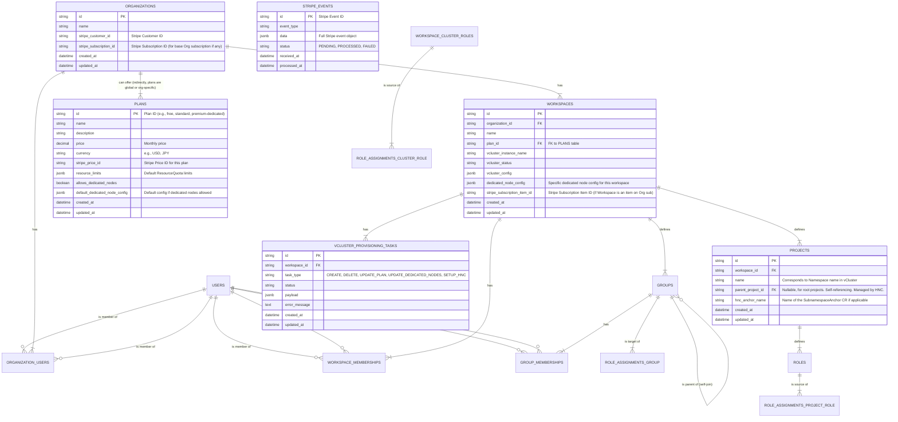

# Hexabase Control Plane Implementation Specification v1.0

## 1. Introduction

### 1.1. Purpose of this Document

This document defines a comprehensive specification for the design and implementation of the control plane that forms the core of the Hexabase KaaS (Kubernetes as a Service) platform. The control plane consists of various components including the API server, OIDC (OpenID Connect) provider, vCluster orchestrator, asynchronous processing workers, and billing system integration modules. This document serves as a technical guide for implementing these components in the Go language, comprehensively describing database schema design (PostgreSQL), RESTful API endpoint specifications, key business logic, resource isolation strategies, security measures, and considerations for future scalability. Through this document, the development team aims to build a robust and scalable KaaS infrastructure with a consistent understanding.

### 1.2. Target Audience

This document is primarily intended for the following stakeholders involved in the Hexabase KaaS project:

- **Backend Development Engineers**: Developers responsible for implementing the API server, various modules, and asynchronous workers in Go language.
- **Database Administrators (DBAs)**: Specialists responsible for PostgreSQL database schema design, optimization, and operations.
- **Frontend Development Engineers**: Developers who need to understand the integration between the UI developed in Next.js and the API server.
- **Infrastructure Engineers/SREs**: Engineers responsible for building and operating the Host K3s cluster, vCluster, and related middleware.
- **Product Managers/Project Leaders**: Managers responsible for understanding overall system functionality and technical constraints, and managing project progress.
- **Security Personnel**: Specialists who evaluate and verify the system's security architecture and measures.

### 1.3. Prerequisite Documents

To understand this document, it is recommended to have prior knowledge of the following documents:

- **Hexabase KaaS Final Technical Specification v1.2**: This document contains the overall technology stack, architecture overview, and basic policies regarding adopted open-source products (K3s, vCluster, NATS, Flux, Kyverno, Prometheus, Grafana, Loki, etc.) for the entire project. This implementation specification provides detailed design specific to the control plane within the framework defined in this overall technical specification.

## 2. Architecture Overview

### 2.1. Roles and Responsibilities of the Control Plane

The Hexabase control plane functions as the command center for the entire KaaS platform, carrying out a wide range of important responsibilities including processing user requests, resource management, tenant isolation, and billing processing. By fulfilling these responsibilities, users can utilize the service without being aware of complex Kubernetes operational details. The control plane design has a direct impact on system reliability, scalability, security, and operational efficiency, making it extremely important. Each responsibility is realized by independent or cooperatively operating module groups with clearly defined interfaces.

- **API Provisioning for User Interface (UI)**: Accepts HTTP requests from the sophisticated frontend application built with Next.js, executes business logic, and returns results in JSON format. This includes nearly all operations performed by users, such as creating and managing Organizations, provisioning and configuring Workspaces (which are vClusters), creating/deleting/hierarchizing Projects (which are Namespaces), user invitations and team management, detailed permission settings through Roles and Groups, and managing billing plan selection and payment methods. The API is designed based on RESTful principles, resource-oriented, and able to handle future changes through version management.

- **Authentication and Authorization**:

  - **Authentication**: Reliably verifies user identity through OIDC integration with trusted external ID providers (Google, GitHub, etc.). Upon successful authentication, Hexabase issues its own session token (stateless JWT is recommended) and uses this token to identify users in subsequent API access. This reduces the burden of password management and improves security.
  - **Authorization**: For each API request, strictly verifies whether the authenticated user has legitimate permissions to perform the requested operation. This verification logic comprehensively evaluates Organization-level roles (e.g., owner, admin, member) stored in the Hexabase DB, group membership information within Workspaces, and Role (Namespace-scoped Role) or ClusterRole (vCluster-scoped Role) information assigned to each Project or entire Workspace. If permissions are insufficient, it returns an error response with appropriate HTTP status codes (e.g., `403 Forbidden`).

- **OIDC Provider**: Provides functionality to issue independent OIDC ID tokens for each Workspace (vCluster). This allows users to directly and securely access vClusters within their permission scope using standard Kubernetes tools like `kubectl`. The issued ID tokens include the user's Hexabase internal ID (`sub` claim) and all valid group names they belong to (`groups` claim, a flat list with hierarchy resolved). This feature is essential for seamless integration with Kubernetes-native authentication and authorization flows while maintaining tenant-specific security contexts.

- **vCluster Lifecycle Management**: Consistently manages the complete lifecycle of vClusters, which are tenant environments, from creation to deletion.

  - **Provisioning**: Dynamically creates new vCluster instances on the Host K3s cluster based on user requests (selected plan, region, need for Dedicated Nodes, etc.). This includes deploying the vCluster itself (typically running as a Pod), necessary network settings (Service, possibly Ingress), storage provisioning (PersistentVolumeClaim), and OIDC configuration for the vCluster API server (configured to trust the Hexabase OIDC provider). Additionally, it automatically installs HNC (Hierarchical Namespace Controller) in each vCluster and performs initial configuration to enable Project hierarchization.
  - **Configuration**: Sets default resource quotas (CPU, memory, storage, etc.) within the vCluster according to the Workspace plan. When a Dedicated Node plan is selected, it performs scheduling configuration (Node Selector, Taints/Tolerations) to allocate specific physical (or virtual) nodes from the Host K3s cluster exclusively to that vCluster.
  - **Resource Allocation**: Particularly for Dedicated Node plans, it allocates specific physical (or virtual) nodes from the Host K3s cluster exclusively to the vCluster, eliminating resource contention with other tenants and improving performance and security. This includes labeling and adding Taints to Nodes in the Host cluster, and configuring scheduling constraints for vCluster Pods.
  - **Monitoring and Scaling**: Monitors vCluster resource usage and, depending on the plan, provides automatic scaling features (e.g., adjusting the number of vCluster control plane Pod replicas, and potentially automatic Node pool expansion in the future).
  - **Deletion**: In response to Workspace deletion requests, safely and completely cleans up related vCluster instances and all Kubernetes resources created within them (Namespaces, Deployments, Services, etc.), allocated storage, network settings, etc. To prevent data loss, deletion operations are performed carefully with confirmation steps as needed.

- **State Management**: Persistently stores and manages all state information about major entities in the system (Organization, Workspace, Project, Group, Role, User, Plan, billing information, asynchronous task progress, etc.) in PostgreSQL, a relational database with transaction capabilities. This minimizes data loss in case of system failures and enables rapid recovery. It also guarantees data consistency and integrity. For Projects, it manages Namespace hierarchy structures using HNC in sync with the DB, utilizing them for UI display and permission checks.

- **Billing Processing**: Works closely with the Stripe payment gateway to implement flexible subscription-based billing models at Organization and Workspace levels.

  - **Plan Management**: Defines billing plans with various resource amounts, feature sets, and price ranges (e.g., Free Tier, Standard Tier, Premium Dedicated Node Tier) that users can select based on their needs. Each plan corresponds to Stripe Product and Price objects.
  - **Subscription Management**: When users create a Workspace and select a paid plan, or when changing the plan of an existing Workspace, calls the Stripe API to create or update subscriptions. This includes creating customers, registering payment methods, and managing subscription items.
  - **Invoice Processing**: Uses Stripe's automatic billing features to handle recurring billing (monthly or yearly), payment processing, automatic retries on payment failures, and delinquency management.
  - **Receipt Issuance and History**: Receipts are automatically issued through Stripe, and users can view billing history from the Hexabase UI or Stripe customer portal.
  - **Webhook Processing**: Provides dedicated Webhook endpoints to receive various event notifications from Stripe in real-time (e.g., `invoice.payment_succeeded`, `invoice.payment_failed`, `customer.subscription.updated`, `customer.subscription.deleted`). After verification, received events are processed by asynchronous workers, appropriately updating user accounts, Workspace status, billing information, etc. within Hexabase.

- **Asynchronous Task Processing**: Time-consuming processes or those involving external system integration (e.g., vCluster provisioning and configuration, complex calls to Stripe API, HNC setup, large-scale data migration or backup processing) are executed by background asynchronous workers via NATS message queue to maintain API server responsiveness and avoid degrading user experience. When the API server accepts a task request, it issues a task ID and returns a response immediately, allowing users to check task progress through the UI. Workers record task execution results (success, failure, error details) in the database.

### 2.2. Major Components

The Hexabase control plane consists of the following cooperating major component groups. Each component has specific responsibilities and works collaboratively to realize overall system functionality. These components adopt microservice architecture concepts while being implemented as logical modules within a monolithic Go application in the initial stage, designed to allow consideration of physical service separation according to future scale-out needs or individual deployment requirements.

- **API Server (Go)**: The central component of the system, accepting all RESTful API requests from clients (primarily the Next.js frontend). It serves as the brain of the control plane, executing business logic, validating requests, handling authentication and authorization, accessing databases, and directing other internal components and external services. Billing-related logic is also led by this component. Built using Go's standard library or lightweight web frameworks like Gin/Echo. Based on stateless design, working with cache stores like Redis as needed.

- **OIDC Provider Module (Go)**: Implemented as embedded in the API server, functioning as an OIDC provider for each vCluster. When users request `kubeconfig` for a specific Workspace, it dynamically generates and issues ID tokens scoped to that Workspace (vCluster). This includes processing to include the user's group membership (hierarchy resolved) in the `groups` claim. It also provides JWKS (JSON Web Key Set) endpoints (`/jwks.json`) and OIDC Discovery Document (`/.well-known/openid-configuration`) for vCluster API servers to verify token signatures. Signing key management and rotation are also considered.

- **vCluster Orchestrator (Go)**: A module specialized in vCluster lifecycle management. Uses Go's Kubernetes client library (`client-go`) to interact directly with the Host K3s cluster and individual vCluster API servers. Main tasks include deploying and deleting vCluster Pods (wrapping `vcluster CLI` or Helm operations), installing and configuring HNC controllers inside vClusters, creating hierarchical structures of Namespaces (operating `SubnamespaceAnchor` CRs), allocating Dedicated Nodes (scheduling control through Node labels and Taint/Toleration operations), vCluster network configuration, storage configuration, etc. This module is often called from asynchronous workers.

- **Stripe Integration Module (Go)**: Handles billing processing and encapsulates all communication with the Stripe API. Uses the official Go SDK provided by Stripe (`stripe-go`) to create/update/cancel customer information (Customer), payment methods (PaymentMethod), products and prices (Product/Price), subscriptions (Subscription), process invoices (Invoice), and receive and verify Webhook events from Stripe. Business logic (e.g., determining whether prorated calculation is needed for plan changes, Workspace suspension processing on payment failure) is also handled by this module or related services.

- **Asynchronous Workers (Go)**: Independent Go process groups that subscribe to task messages from NATS message queue and execute processing in the background. Handles tasks that could block API server synchronous processing, such as vCluster provisioning, time-consuming calls to Stripe API (e.g., bulk customer data synchronization), HNC setup, periodic maintenance work (e.g., archiving old logs), large-scale data migration or backup processing. Workers are defined for different task types, each subscribing to specific NATS topics. Starting multiple worker instances improves processing throughput and system fault tolerance.

- **Database (PostgreSQL)**: A relational database for persisting state information across the entire system. Stores user accounts, Organizations, Workspaces, Projects, Groups, Roles, billing plans, subscription information, asynchronous task status, audit logs, etc. Guarantees data consistency through transaction management and optimizes search performance with appropriate index design. Schema changes are version-controlled using migration tools like `golang-migrate`.

- **Cache (Redis)**: Caches frequently accessed data (e.g., user session information, information needed for active OIDC token validation, aggregated group information for permission checks, rate limit counters) in memory to reduce database load and improve API response speed. Cache strategies (e.g., TTL, Write-Through, Write-Back) are selected based on data characteristics.

- **Message Queue (NATS)**: A high-performance messaging system used for task coordination between the API server and asynchronous workers. The API server publishes time-consuming processing requests as messages to specific NATS topics, and corresponding workers subscribe to and process these messages. Using NATS streaming features (NATS Streaming/JetStream) enables message persistence and reliable delivery (e.g., At-Least-Once semantics). This improves overall system loose coupling and fault tolerance.

### 2.3. Integration with External Systems

The Hexabase control plane provides services by closely integrating with the following external systems. These integrations are essential for enhancing system functionality, security, and operational efficiency.

- **Host K3s Cluster**:

  - **Role**: The Kubernetes cluster serving as the foundation where each component of the Hexabase control plane (API server, workers, DB, etc.) runs as containers. vClusters provided to each tenant also run as Pods on this Host cluster. Host cluster resources (CPU, memory, storage, network) determine the capacity of the entire platform.
  - **Integration Method**: The vCluster orchestrator of the Hexabase control plane communicates with the Host K3s cluster API server through the `client-go` library, declaratively managing Kubernetes resources such as vCluster Pods, Services, ConfigMaps, and Secrets. When providing Dedicated Nodes, the orchestrator adds specific labels to Host cluster Nodes or monitors Node status. Monitoring the Host cluster itself (Prometheus/Grafana) is also important.

- **vCluster**:

  - **Role**: A logically isolated Kubernetes environment assigned to each tenant (Workspace). Users can freely deploy Namespaces and applications within their vCluster and directly operate the Kubernetes API. Each vCluster has its own API server, etcd (or alternative datastore), and controller manager, isolated from the Host cluster.
  - **Integration Method**: The Hexabase control plane connects to each vCluster's API server endpoint using `client-go` or `kubectl` (internally via wrapper). This connection typically uses privileged ServiceAccount tokens (generated during vCluster creation) or user OIDC tokens when acting on behalf of user operations. The control plane performs operations on vClusters such as creating Namespaces (including hierarchical Namespace creation via HNC), applying Role/RoleBinding/ClusterRoleBinding, configuring OIDC authentication settings, applying network policies, and setting default resource quotas. The HNC controller is installed in each vCluster to enable Namespace hierarchization within that vCluster.

- **External IdPs (Google, GitHub, etc.)**:

  - **Role**: Provides initial user authentication (signup/login) to Hexabase. Users can safely and easily start using Hexabase services using existing external accounts (e.g., Google account, GitHub account) without remembering new passwords. This improves user convenience and reduces password management risks.
  - **Integration Method**: Integrates based on OAuth 2.0 and OpenID Connect (OIDC) protocols. Hexabase API functions as an OIDC Relying Party (RP). When users select a specific external IdP in the UI, Hexabase API generates an authentication request and redirects users to that IdP's authentication page. After users authenticate with the IdP and consent to providing information to Hexabase, the IdP redirects to Hexabase API's callback URL with an authorization code. Hexabase API exchanges this authorization code for ID tokens and access tokens at the IdP's token endpoint, validates the ID token, and retrieves/registers user information.

- **Stripe**:
  - **Role**: A payment gateway that safely and reliably executes all billing-related processing including credit card payments, subscription management, invoice issuance, tax calculation (depending on settings), and retry processing on payment failures. By delegating complex requirements like PCI DSS compliance to Stripe, Hexabase can significantly reduce the development and operational burden of the billing system.
  - **Integration Method**: The Stripe integration module within Hexabase API uses the official API SDK provided by Stripe (Go version) to communicate securely with Stripe API via HTTPS. It programmatically operates Stripe objects such as customer information, payment methods, product catalogs, prices, subscriptions, and invoices. Additionally, it provides dedicated Webhook endpoints in Hexabase API to receive event notifications from Stripe in real-time (e.g., `invoice.payment_succeeded`, `customer.subscription.deleted`), verifies event signatures, and executes related business logic (e.g., Workspace activation, DB status updates) through asynchronous workers.

### 3. API Design

#### 3.1. Design Principles

The Hexabase control plane API follows these design principles to be developer-friendly, scalable, and maintainable:

- **Follow RESTful API principles**: Appropriately use HTTP methods (GET, POST, PUT, DELETE, PATCH) and adopt resource-oriented architecture. Each resource is identified by a unique URI.
- **Resource-oriented URL design**: URLs are composed around nouns (resources) and express hierarchical structures (e.g., `/organizations/{orgId}/workspaces/{wsId}/projects`). Verbs are expressed through HTTP methods.
- **JSON format for requests/responses**: Use JSON (application/json), which is widely adopted and easy to handle in many languages, as the standard data format for request bodies and response bodies.
- **Use of standard HTTP status codes**: Return appropriate HTTP status codes defined in RFC 7231 etc., allowing clients to accurately understand API processing results (e.g., `200 OK`, `201 Created`, `204 No Content`, `400 Bad Request`, `401 Unauthorized`, `403 Forbidden`, `404 Not Found`, `500 Internal Server Error`).
- **Version management**: Include version information in URL paths (e.g., `/api/v1/...`) to maintain API compatibility while enabling future changes. This allows introduction of new features and specification changes while minimizing impact on clients using older API versions.
- **Idempotency**: Design operations with side effects like `PUT` and `DELETE` to be idempotent as much as possible. This means that sending the same request multiple times produces the same result as executing it only once. This is important for safely performing retry processing due to network errors. For resource creation with `POST`, consider a mechanism where clients generate idempotent keys and servers verify them to prevent duplicate creation.
- **Standardization of error responses**: When errors occur, include detailed error information (error code, message, and sometimes problem location) in the response body in structured JSON format, in addition to HTTP status codes. This allows clients to programmatically parse error content and provide appropriate user feedback or error handling.
  Example: `{ "error": { "code": "INVALID_INPUT", "message": "Workspace name cannot be empty.", "field": "name" } }`

#### 3.2. Authentication and Authorization Flow

Access to the Hexabase control plane is protected by strict authentication and authorization flows.

1.  **Login request from UI**: Users initiate the login process through Hexabase UI (Next.js application) by selecting one of the supported external ID providers (e.g., Google, GitHub). The UI sends a request to Hexabase API's `/auth/login/{provider}` endpoint.

2.  **Redirect to external IdP**: Hexabase API server generates an authentication request according to the selected provider and redirects the user's browser to the external IdP's authentication page. This initiates the OAuth 2.0 authorization code flow.

3.  **Authentication and consent at external IdP**: Users enter authentication information (username, password, and possibly two-factor authentication code) on the external IdP's authentication screen and grant (consent to) access to information requested by Hexabase (e.g., email address, display name).

4.  **Callback processing**: Upon successful authentication and consent, the external IdP redirects the user's browser to Hexabase API's pre-registered callback endpoint (`/auth/callback/{provider}`). This redirect includes an authorization code and `state` parameter.

5.  **Token exchange and user information retrieval**: Hexabase API server uses the received authorization code and its client secret to request access tokens and ID tokens from the external IdP's token endpoint. It validates the obtained ID token, performing signature verification, issuer verification, expiration verification, etc. After validation, it extracts user information from claims in the ID token (e.g., `sub`, `email`, `name`).

6.  **Hexabase user account processing**:

    - **For existing users**: Searches the `users` table in Hexabase DB using the extracted external IdP user ID (`external_id` and `provider`) as keys. If a matching user exists, recognizes them as that user.
    - **For new users**: If no matching user exists, creates a new user record in the `users` table. For first-time signups, also automatically creates a new `Organization` and registers the user as the first administrator of that Organization.

7.  **Hexabase session issuance**: After completing user account processing, Hexabase API generates its own session token (stateless JWT is recommended). This token includes the Hexabase internal user ID, session expiration, and other necessary session information. The generated session token is returned to the UI as a JSON response or set as a secure HTTP Cookie.

8.  **API access**: The UI (or other API clients) includes the obtained Hexabase session token in the HTTP header's `Authorization: Bearer <token>` field when making subsequent requests to Hexabase API.

9.  **Authorization at API server**: Before processing each API endpoint, the authentication middleware embedded in the API server validates the session token from the `Authorization` header (signature, expiration, etc.). Upon successful validation, it identifies the requesting user based on the user ID in the token. Then, within each endpoint's logic, it verifies in detail whether the identified user has permission to perform the requested operation (e.g., creating a Workspace, adding members to a Project) by referencing Organization membership, Workspace membership, Group affiliation, Role assignment information, etc. in the Hexabase DB. If unauthorized, it returns a `403 Forbidden` error.

#### 3.3. Major API Endpoint Definitions

Below is an overview of the major RESTful API endpoints provided by the Hexabase control plane. Details of each endpoint will be further specified in individual API specification documents.

##### 3.3.1. Authentication (`/auth`)

This endpoint group manages the entire authentication lifecycle including user signup, login, logout, and checking current authentication status.

- `POST /auth/login/{provider}`: Initiates login processing via external IdP.
  - Path Parameters: `provider` (string, required) - External IdP identifier (e.g., "google", "github", "microsoft").
  - Request Body: Depending on the provider, may accept additional parameters (e.g., organization-specific login hints), but usually empty.
  - Response: Returns redirect URL to external IdP's authentication page, or information to start authentication flow (e.g., OAuth 2.0 authorization endpoint URL and required parameters) in JSON format.
- `GET /auth/callback/{provider}`: Accepts callback after successful authentication from external IdP.
  - Path Parameters: `provider` (string, required) - External IdP identifier.
  - Query Parameters: Parameters passed from external IdP (usually `code` (authorization code) and `state` (CSRF protection)).
  - Response: On successful authentication, returns JSON object containing Hexabase's own session token (JWT). UI stores this token and uses it for subsequent API requests. On failure, returns JSON object with appropriate error information or redirect to error page.
- `POST /auth/logout`: Invalidates current Hexabase session and logs out the user.
  - Request Body: None.
  - Response: On success, returns `204 No Content`. Session token should be discarded on client side. Server side may perform token blacklisting as needed.
- `GET /auth/me`: Retrieves information about the currently authenticated user.
  - Response Body: Returns basic information about authenticated user (Hexabase user ID, email address, display name, overview of affiliated Organizations) in JSON format. Returns `401 Unauthorized` if unauthenticated.
    ```json
    {
      "id": "hxb-usr-a1b2c3d4",
      "email": "user@example.com",
      "displayName": "Taro Yamada",
      "organizations": [
        { "id": "org-x1y2z3", "name": "My First Org", "role": "admin" }
      ]
    }
    ```

##### 3.3.2. Organization (`/api/v1/organizations`)

Organization serves as a logical container for billing, user management, and Workspace groups.

- `POST /`: Creates a new Organization. Primarily intended to be called automatically by the system during first-time signup, but serves as the foundation for functionality allowing users to create multiple Organizations (license-based) in the future.
  - Request Body: `{ "name": "My New Organization" }`
  - Response Body: Returns information about the created Organization (ID, name, etc.).
    ```json
    {
      "id": "org-e5f6a7b8",
      "name": "My New Organization",
      "createdAt": "2025-06-01T12:00:00Z"
    }
    ```
- `GET /`: Retrieves a list of all Organizations to which the authenticated user belongs (or has administrative rights).
  - Response Body: Array of Organization objects. Each object includes ID, name, user's role, etc.
- `GET /{orgId}`: Retrieves detailed information about the Organization with the specified ID.
  - Path Parameters: `orgId` (string, required) - Target Organization ID.
  - Response Body: Detailed Organization information (name, creation date, Stripe customer ID, current subscription status, etc.).
- `PUT /{orgId}`: Updates information for the Organization with the specified ID (e.g., changing Organization name).
  - Path Parameters: `orgId` (string, required)
  - Request Body: `{ "name": "Updated Organization Name" }`
  - Response Body: Updated Organization information.
- `POST /{orgId}/users`: Invites a new user to the specified Organization.
  - Path Parameters: `orgId` (string, required)
  - Request Body: `{ "email": "newuser@example.com", "role": "admin" }` (`role` is Organization-level role such as `admin` or `member`)
  - Response Body: Information and status of invited user (e.g., `invited`). Invitation email sending may be processed asynchronously.
- `DELETE /{orgId}/users/{userId}`: Removes a user from the specified Organization (or cancels invitation).
  - Path Parameters: `orgId` (string, required), `userId` (string, required) - Hexabase user ID of target user.
  - Response: `204 No Content`.
- `POST /{orgId}/billing/portal-session`: Creates a session to the Stripe customer portal for the specified Organization and returns redirect URL. Users can manage payment methods and view billing history through this URL.
  - Path Parameters: `orgId` (string, required)
  - Response Body: `{ "portalUrl": "https://billing.stripe.com/p/session/..." }`
- `GET /{orgId}/billing/subscriptions`: Retrieves list and details of Stripe subscriptions associated with the specified Organization.
  - Path Parameters: `orgId` (string, required)
  - Response Body: Array of subscription objects. Each object includes plan information, status, current billing period, etc.
- `GET /{orgId}/billing/payment-methods`: Retrieves list of payment methods registered for the specified Organization (retrieved from Stripe).
  - Path Parameters: `orgId` (string, required)
  - Response Body: Array of payment method objects. For security, full card numbers are not returned.
- `POST /{orgId}/billing/payment-methods/setup-intent`: Creates Stripe SetupIntent for securely registering new payment methods and returns client secret. UI uses this to work with Stripe Elements etc. to send payment information directly to Stripe.
  - Path Parameters: `orgId` (string, required)
  - Response Body: `{ "clientSecret": "seti_xxxx_secret_yyyy" }`

##### 3.3.3. Workspace (`/api/v1/organizations/{orgId}/workspaces`)

Workspace is the actual vCluster, providing a Kubernetes environment for each tenant.

- `POST /`: Creates a new Workspace within the specified Organization. This request initiates asynchronous vCluster provisioning.
  - Path Parameters: `orgId` (string, required)
  - Request Body: `{ "name": "my-production-workspace", "planId": "premium-dedicated-v1", "dedicatedNodeConfig": { "nodeCount": 2, "instanceType": "c5.xlarge", "region": "ap-northeast-1" } }` (`dedicatedNodeConfig` is required only for dedicated node plans)
  - Response Body: Returns asynchronous task ID, provisional ID of Workspace being created, and current status (e.g., `PENDING_CREATION`).
    ```json
    {
      "taskId": "task-abc123xyz",
      "workspaceId": "ws-pqr789stu-pending",
      "name": "my-production-workspace",
      "status": "PENDING_CREATION"
    }
    ```
- `GET /`: Retrieves list of all Workspaces within the specified Organization.
  - Path Parameters: `orgId` (string, required)
  - Response Body: Array of Workspace objects. Each object includes ID, name, plan ID, current vCluster status (e.g., `RUNNING`, `ERROR`), etc.
- `GET /{wsId}`: Retrieves detailed information about the Workspace with the specified ID.
  - Path Parameters: `orgId` (string, required), `wsId` (string, required)
  - Response Body: Detailed Workspace information (name, plan, vCluster status, creation date, Dedicated Node configuration, associated Stripe subscription item ID, etc.).
- `PUT /{wsId}`: Updates information for the Workspace with the specified ID (e.g., plan change, Dedicated Node configuration change). These changes may also be processed as asynchronous tasks.
  - Path Parameters: `orgId` (string, required), `wsId` (string, required)
  - Request Body: `{ "planId": "enterprise-v2", "dedicatedNodeConfig": { "nodeCount": 3, "instanceType": "m6g.2xlarge" } }`
  - Response Body: Asynchronous task ID and update acceptance status.
- `DELETE /{wsId}`: Deletes the Workspace with the specified ID. Deletion of related vCluster also starts asynchronously.
  - Path Parameters: `orgId` (string, required), `wsId` (string, required)
  - Response Body: Asynchronous task ID and deletion acceptance status.
- `GET /{wsId}/kubeconfig`: Generates and returns `kubeconfig` file (YAML format) for accessing the target Workspace (vCluster). This `kubeconfig` includes authentication settings using Hexabase OIDC provider, allowing users to operate vCluster with `kubectl` etc.
  - Path Parameters: `orgId` (string, required), `wsId` (string, required)
  - Response: Content of `kubeconfig` file with `Content-Type: application/yaml`.

##### 3.3.4. Workspace Group (`/api/v1/workspaces/{wsId}/groups`)

Manages user groups within a Workspace. Groups can have hierarchical structures.

- `POST /`: Creates a new Group within the specified Workspace.
  - Path Parameters: `wsId` (string, required)
  - Request Body: `{ "name": "developers", "parentId": "grp-developers-uuid" }` (`parentId` is optional, null for root groups)
  - Response Body: Information about the created Group.
- `GET /`: Retrieves all Groups within the specified Workspace in hierarchical structure.
  - Path Parameters: `wsId` (string, required)
  - Response Body: Array of Group objects (each object can have an array of child groups).
- `PUT /{groupId}`: Changes the name of the Group with the specified ID.
  - Path Parameters: `wsId` (string, required), `groupId` (string, required)
  - Request Body: `{ "name": "Frontend Engineering Team" }`
  - Response Body: Updated Group information.
- `DELETE /{groupId}`: Deletes the Group with the specified ID. Handling of child groups and memberships (cascade deletion or restriction) needs careful design.
  - Path Parameters: `wsId` (string, required), `groupId` (string, required)
  - Response: `204 No Content`.
- `POST /{groupId}/members`: Adds existing Workspace Member to the specified Group.
  - Path Parameters: `wsId` (string, required), `groupId` (string, required)
  - Request Body: `{ "userId": "hxb-usr-member-uuid" }` (Hexabase user ID)
  - Response: `201 Created`.
- `DELETE /{groupId}/members/{userId}`: Removes member from the specified Group.
  - Path Parameters: `wsId` (string, required), `groupId` (string, required), `userId` (string, required)
  - Response: `204 No Content`.

##### 3.3.5. Project (Namespace) (`/api/v1/workspaces/{wsId}/projects`)

Project corresponds to a Namespace within vCluster and serves as a logical separation unit for applications and resources. Hierarchization is possible using HNC.

- `POST /`: Creates a new Project within the specified Workspace. When HNC is enabled, a hierarchical Namespace is created within vCluster based on the specified `parentId`.
  - Path Parameters: `wsId` (string, required)
  - Request Body: `{ "name": "my-microservice-alpha", "parentId": "prj-backend-services-uuid" }` (`parentId` is optional)
  - Response Body: Information about the created Project (ID, name, actual Namespace name, HNC anchor name, etc.).
- `GET /`: Retrieves list of all Projects within the specified Workspace.
  - Path Parameters: `wsId` (string, required)
  - Query Parameters: `hierarchical=true` (optional. If true, returns in format reflecting HNC hierarchical structure)
  - Response Body: Array of Project objects, or Project objects with hierarchical structure.
- `GET /{projectId}`: Retrieves detailed information about the Project with the specified ID.
  - Path Parameters: `wsId` (string, required), `projectId` (string, required)
  - Response Body: Detailed Project information.
- `DELETE /{projectId}`: Deletes the Project with the specified ID. For Namespaces managed by HNC, related child Namespaces are also processed according to HNC policies.
  - Path Parameters: `wsId` (string, required), `projectId` (string, required)
  - Response: `204 No Content`.

##### 3.3.6. Project Role (`/api/v1/projects/{projectId}/roles`)

Manages custom Roles scoped to Projects (Namespaces). This allows users to define detailed permission sets that are only valid within specific Namespaces.

- `POST /`: Creates a new custom Role within the specified Project.
  - Path Parameters: `projectId` (string, required)
  - Request Body: `{ "name": "database-migrator", "rules": [{"apiGroups": ["batch"], "resources": ["jobs"], "verbs": ["create", "get", "list", "delete"]}] }` (conforms to Kubernetes Role `rules` specification)
  - Response Body: Information about the created Role.
- `GET /`: Retrieves list of all Roles available within the specified Project. This includes user-created custom Roles and preset Project Roles provided by Hexabase (e.g., `hexabase:project-viewer`, `hexabase:project-editor`).
  - Path Parameters: `projectId` (string, required)
  - Response Body: Array of Role objects. Each object includes distinction between custom and preset.
- `GET /{roleId}`: Retrieves detailed information about the custom Role with the specified ID.
  - Path Parameters: `projectId` (string, required), `roleId` (string, required)
  - Response Body: Detailed Role information.
- `PUT /{roleId}`: Updates permission rules of the custom Role with the specified ID.
  - Path Parameters: `projectId` (string, required), `roleId` (string, required)
  - Request Body: `{ "rules": [...] }` (new `rules` definition)
  - Response Body: Updated Role information.
- `DELETE /{roleId}`: Deletes the custom Role with the specified ID. `RoleBindings` assigned to this Role need to be handled appropriately (e.g., delete related Bindings or notify administrators).
  - Path Parameters: `projectId` (string, required), `roleId` (string, required)
  - Response: `204 No Content`.

##### 3.3.7. Role Assignment

Endpoints for assigning Project Roles or Workspace ClusterRoles to Groups (i.e., creating `RoleBinding` or `ClusterRoleBinding` within vCluster).

- **Project Role Assignment**:
  - `POST /api/v1/projects/{projectId}/roleassignments`: Assigns a Project Role to a specific Group within the specified Project.
    - Path Parameters: `projectId` (string, required)
    - Request Body: `{ "groupId": "grp-developers-uuid", "roleId": "role-custom-deployer-uuid" }`
    - Response Body: Information about the created assignment (Hexabase internal entity corresponding to `RoleBinding`).
  - `DELETE /api/v1/projects/{projectId}/roleassignments/{assignmentId}`: Unassigns the specified Project Role assignment.
    - Path Parameters: `projectId` (string, required), `assignmentId` (string, required)
    - Response: `204 No Content`.
- **Workspace ClusterRole Assignment**:
  - `POST /api/v1/workspaces/{wsId}/clusterroleassignments`: Assigns a preset ClusterRole (e.g., `hexabase:workspace-admin`, `hexabase:workspace-viewer`) to a specific Group across the entire specified Workspace.
    - Path Parameters: `wsId` (string, required)
    - Request Body: `{ "groupId": "grp-ws-admins-uuid", "clusterRoleName": "hexabase:workspace-admin" }`
    - Response Body: Information about the created assignment (Hexabase internal entity corresponding to `ClusterRoleBinding`).
  - `DELETE /api/v1/workspaces/{wsId}/clusterroleassignments/{assignmentId}`: Unassigns the specified Workspace ClusterRole assignment.
    - Path Parameters: `wsId` (string, required), `assignmentId` (string, required)
    - Response: `204 No Content`.

##### 3.3.8. Stripe Webhook (`/webhooks/stripe`)

Dedicated endpoint for receiving asynchronous event notifications (payment success, subscription changes, etc.) from Stripe.

- `POST /webhooks/stripe`: Receives event notifications from Stripe.
  - Request Body: (Stripe Event Object)
  - Response: `200 OK` indicating successful event reception, or `202 Accepted` indicating successful registration to asynchronous processing queue. Webhook request signature verification is mandatory.

### 4. Database Design (PostgreSQL)

#### 4.1. ER Diagram (Conceptual)



#### 4.2. Table Definitions

Below are the definitions of major tables. Data types, constraints, and index strategies also need consideration.

- **users**

  - `id` (TEXT, PK): Hexabase internal user ID (e.g., `hxb-usr-uuid`). UUID v4 is recommended.
  - `external_id` (TEXT, NOT NULL): External IdP user ID.
  - `provider` (TEXT, NOT NULL): External IdP identifier (e.g., `google`, `github`).
  - `email` (TEXT, UNIQUE, NOT NULL): User's email address. Format checking via regular expression should be performed at application level.
  - `display_name` (TEXT, Nullable): Display name.
  - `created_at` (TIMESTAMPZ, Default: `NOW()`, NOT NULL): Record creation datetime.
  - `updated_at` (TIMESTAMPZ, Default: `NOW()`, NOT NULL): Record last update datetime.
  - `CONSTRAINT users_external_id_provider_unique UNIQUE (external_id, provider)`
  - Indexes: `idx_users_email`

- **organizations**:

  - `id` (TEXT, PK): Organization ID (e.g., `org-uuid`). UUID v4 is recommended.
  - `name` (TEXT, NOT NULL): Organization name.
  - `stripe_customer_id` (TEXT, Nullable, UNIQUE): Customer ID on Stripe. Control plane creates Stripe customer at first paid plan contract and associates this ID.
  - `stripe_subscription_id` (TEXT, Nullable, UNIQUE): Base subscription ID for entire Organization (if exists, such as when specific Organization plans exist).
  - `created_at` (TIMESTAMPZ, Default: `NOW()`, NOT NULL): Creation datetime.
  - `updated_at` (TIMESTAMPZ, Default: `NOW()`, NOT NULL): Update datetime.
  - Indexes: `idx_organizations_stripe_customer_id`

- **organization_users**:

  - `organization_id` (TEXT, PK, FK to `organizations.id` ON DELETE CASCADE, NOT NULL): Organization ID.
  - `user_id` (TEXT, PK, FK to `users.id` ON DELETE CASCADE, NOT NULL): User ID.
  - `role` (TEXT, Default: `'member'`, NOT NULL, CHECK (`role` IN (`'admin'`, `'member'`))): Role within Organization. `admin` has permissions for Organization setting changes, user management, billing management, etc. `member` typically only has permission to join Workspaces.
  - `joined_at` (TIMESTAMPZ, Default: `NOW()`, NOT NULL): Join datetime.
  - Indexes: `idx_organization_users_user_id`

- **plans** (new table):

  - `id` (TEXT, PK): Plan identifier (e.g., `free`, `standard`, `premium-dedicated-m5.large-2nodes`). Human-readable ID that is unique within the system.
  - `name` (TEXT, NOT NULL): Plan display name (e.g., "Free Plan", "Standard Plan").
  - `description` (TEXT, Nullable): Detailed description of the plan. For UI display.
  - `price` (DECIMAL(10, 2), NOT NULL): Monthly (or yearly) fee. Currency is specified in `currency` field.
  - `currency` (TEXT, NOT NULL, CHECK (length(`currency`) = 3)): ISO 4217 currency code (e.g., `usd`, `jpy`).
  - `stripe_price_id` (TEXT, UNIQUE, NOT NULL): Stripe Price ID corresponding to this plan. Product and Price should be pre-created on Stripe side.
  - `resource_limits` (JSONB, Nullable): Definition of `ResourceQuota` applied by default to each Project (Namespace) within Workspaces of this plan (e.g., `{ "requests.cpu": "1", "requests.memory": "1Gi", "limits.cpu": "2", "limits.memory": "2Gi", "count/pods": "50" }`).
  - `allows_dedicated_nodes` (BOOLEAN, Default: `false`, NOT NULL): Whether dedicated nodes can be used with this plan.
  - `default_dedicated_node_config` (JSONB, Nullable): Default configuration when dedicated nodes are available (e.g., `{ "instanceType": "m5.large", "minNodes": 1, "maxNodes": 3, "region": "ap-northeast-1", "storageSizeGb": 50 }`).
  - `max_projects_per_workspace` (INTEGER, Nullable): Upper limit of Projects that can be created per Workspace.
  - `max_members_per_workspace` (INTEGER, Nullable): Upper limit of members that can be invited per Workspace.
  - `is_active` (BOOLEAN, Default: `true`, NOT NULL): Whether the plan is currently selectable by users. Used to hide old plans.
  - `display_order` (INTEGER, Default: 0): Display order in UI.
  - `created_at` (TIMESTAMPZ, Default: `NOW()`, NOT NULL): Creation datetime.
  - `updated_at` (TIMESTAMPZ, Default: `NOW()`, NOT NULL): Update datetime.

- **workspaces**:

  - `id` (TEXT, PK): Workspace ID (e.g., `ws-uuid`). UUID v4 is recommended.
  - `organization_id` (TEXT, FK to `organizations.id` ON DELETE CASCADE, NOT NULL): Belonging Organization ID.
  - `name` (TEXT, NOT NULL): Workspace name. Uniqueness within the same Organization should be guaranteed at application level.
  - `plan_id` (TEXT, FK to `plans.id`, NOT NULL): Applied plan ID.
  - `vcluster_instance_name` (TEXT, UNIQUE, Nullable): vCluster instance name on Host K3s cluster (e.g., `hxb-ws-uuid`). Set after successful provisioning.
  - `vcluster_status` (TEXT, NOT NULL, CHECK (`vcluster_status` IN (`PENDING_CREATION`, `CONFIGURING_HNC`, `RUNNING`, `UPDATING_PLAN`, `UPDATING_NODES`, `DELETING`, `ERROR`, `UNKNOWN`))): vCluster status.
  - `vcluster_config` (JSONB, Nullable): vCluster-specific configuration information (e.g., `{ "k3sVersion": "v1.28.5+k3s1", "helmValues": { "syncer": { "extraArgs": ["--tls-san=my.custom.domain"] } } }`).
  - `dedicated_node_config` (JSONB, Nullable): Configuration of dedicated nodes assigned to this Workspace (e.g., `{ "nodeCount": 2, "instanceType": "m5.large", "nodeSelector": {"hexabase.ai/node-pool": "ws-uuid"}, "taints": [{"key": "dedicated", "value": "ws-uuid", "effect": "NoSchedule"}] }`). Can only be set when allowed by Plan.
  - `stripe_subscription_item_id` (TEXT, Nullable, UNIQUE): ID when Workspace is billed as individual item of Organization's Stripe subscription, or Workspace-unit subscription ID.
  - `created_at` (TIMESTAMPZ, Default: `NOW()`, NOT NULL): Creation datetime.
  - `updated_at` (TIMESTAMPZ, Default: `NOW()`, NOT NULL): Update datetime.
  - `CONSTRAINT workspaces_organization_id_name_unique UNIQUE (organization_id, name)`
  - Indexes: `idx_workspaces_organization_id`, `idx_workspaces_plan_id`, `idx_workspaces_vcluster_status`

- **workspace_memberships** (new table):

  - `workspace_id` (TEXT, PK, FK to `workspaces.id` ON DELETE CASCADE, NOT NULL): Workspace ID.
  - `user_id` (TEXT, PK, FK to `users.id` ON DELETE CASCADE, NOT NULL): User ID.
  - `joined_at` (TIMESTAMPZ, Default: `NOW()`, NOT NULL): Join datetime.
  - Indexes: `idx_workspace_memberships_user_id`

- **groups** (new table):

  - `id` (TEXT, PK): Group ID (e.g., `grp-uuid`). UUID v4 is recommended.
  - `workspace_id` (TEXT, FK to `workspaces.id` ON DELETE CASCADE, NOT NULL): Belonging Workspace ID.
  - `name` (TEXT, NOT NULL): Group name. Unique within Workspace.
  - `parent_group_id` (TEXT, Nullable, FK to `groups.id` ON DELETE SET NULL): Parent Group ID (for hierarchization). NULL for root groups.
  - `description` (TEXT, Nullable): Group description.
  - `created_at` (TIMESTAMPZ, Default: `NOW()`, NOT NULL): Creation datetime.
  - `updated_at` (TIMESTAMPZ, Default: `NOW()`, NOT NULL): Update datetime.
  - `CONSTRAINT groups_workspace_id_name_unique UNIQUE (workspace_id, name)`
  - Indexes: `idx_groups_workspace_id`, `idx_groups_parent_group_id`

- **group_memberships** (new table):

  - `group_id` (TEXT, PK, FK to `groups.id` ON DELETE CASCADE, NOT NULL): Group ID.
  - `user_id` (TEXT, PK, FK to `users.id` ON DELETE CASCADE, NOT NULL): User ID.
  - `added_at` (TIMESTAMPZ, Default: `NOW()`, NOT NULL): Datetime added to group.
  - Indexes: `idx_group_memberships_user_id`

- **projects**:

  - `id` (TEXT, PK): Project ID (e.g., `prj-uuid`). UUID v4 is recommended.
  - `workspace_id` (TEXT, FK to `workspaces.id` ON DELETE CASCADE, NOT NULL): Belonging Workspace ID.
  - `name` (TEXT, NOT NULL): Project name (corresponds to Namespace name within vCluster). Must conform to Kubernetes Namespace naming rules (lowercase alphanumeric, '-', '.', etc., max 253 characters). Application-level validation is essential.
  - `parent_project_id` (TEXT, Nullable, FK to `projects.id` ON DELETE CASCADE): Parent Project ID. Namespace hierarchy within vCluster follows this via HNC.
  - `hnc_anchor_name` (TEXT, Nullable): Name of HNC's `SubnamespaceAnchor` custom resource created in parent Namespace. Usually set to same value as `name`.
  - `status` (TEXT, NOT NULL, Default: `'ACTIVE'`, CHECK (`status` IN (`'CREATING'`, `'ACTIVE'`, `'DELETING'`, `'ERROR'`))): Project status.
  - `created_at` (TIMESTAMPZ, Default: `NOW()`, NOT NULL): Creation datetime.
  - `updated_at` (TIMESTAMPZ, Default: `NOW()`, NOT NULL): Update datetime.
  - `CONSTRAINT projects_workspace_id_name_unique UNIQUE (workspace_id, name)`
  - Indexes: `idx_projects_workspace_id`, `idx_projects_parent_project_id`

- **roles** (new table):

  - `id` (TEXT, PK): Role ID (e.g., `role-uuid`). UUID v4 is recommended.
  - `project_id` (TEXT, FK to `projects.id` ON DELETE CASCADE, NOT NULL): Belonging Project ID where this Role is defined.
  - `name` (TEXT, NOT NULL): Custom Role name. Unique within Project. Also used as Kubernetes Role name, so naming rules need attention (e.g., `hexabase-custom-<name>`).
  - `description` (TEXT, Nullable): Role description.
  - `rules` (JSONB, NOT NULL): JSON array corresponding to Kubernetes `Role`'s `rules` field (e.g., `[{"apiGroups": ["apps"], "resources": ["deployments"], "verbs": ["get", "list", "create", "update"]}]`).
  - `is_preset` (BOOLEAN, Default: `false`, NOT NULL): Whether it's a preset Role provided by Hexabase (e.g., `hexabase:project-admin`, `hexabase:project-editor`, `hexabase:project-viewer`). Preset Roles are inserted as initial data in DB and cannot be edited by users.
  - `created_at` (TIMESTAMPZ, Default: `NOW()`, NOT NULL): Creation datetime.
  - `updated_at` (TIMESTAMPZ, Default: `NOW()`, NOT NULL): Update datetime.
  - `CONSTRAINT roles_project_id_name_unique UNIQUE (project_id, name)`
  - Indexes: `idx_roles_project_id`

- **role_assignments** (new table):

  - `id` (TEXT, PK): Assignment ID (e.g., `assign-uuid`). UUID v4 is recommended.
  - `group_id` (TEXT, FK to `groups.id` ON DELETE CASCADE, NOT NULL): Group ID to which permission is granted.
  - `target_scope` (TEXT, NOT NULL, CHECK (`target_scope` IN (`'PROJECT'`, `'WORKSPACE'`))): Scope of permission application.
  - `target_id` (TEXT, NOT NULL): ID according to `target_scope`.
    - When `target_scope` is `PROJECT`: `projects.id`.
    - When `target_scope` is `WORKSPACE`: `workspaces.id`.
  - `role_reference` (TEXT, NOT NULL): Reference to assigned Role.
    - When `target_scope` is `PROJECT`: `roles.id` (custom Project Role or preset Project Role ID).
    - When `target_scope` is `WORKSPACE`: Preset ClusterRole name (e.g., `hexabase:workspace-admin`, `hexabase:workspace-viewer`).
  - `created_at` (TIMESTAMPZ, Default: `NOW()`, NOT NULL): Creation datetime.
  - `CONSTRAINT role_assignments_unique UNIQUE (group_id, target_scope, target_id, role_reference)`
  - Indexes: `idx_role_assignments_group_id`, `idx_role_assignments_target` (`target_scope`, `target_id`)

- **workspace_cluster_roles** (Preset ClusterRole definitions): This table can be managed as constants embedded in application code or as Seed data to be inserted into DB at initial startup, instead of managing in DB. Example schema when managing in DB.

  - `name` (TEXT, PK): Preset ClusterRole name (e.g., `hexabase:workspace-admin`, `hexabase:workspace-viewer`).
  - `description` (TEXT, Nullable): ClusterRole description.
  - `rules` (JSONB, NOT NULL): JSON array corresponding to Kubernetes `ClusterRole`'s `rules` field.

- **vcluster_provisioning_tasks**:

  - `id` (TEXT, PK): Task ID (e.g., `task-uuid`). UUID v4 is recommended.
  - `workspace_id` (TEXT, FK to `workspaces.id` ON DELETE CASCADE, Nullable): Target Workspace ID (for Workspace creation tasks, ID is set later after creation).
  - `organization_id` (TEXT, FK to `organizations.id` ON DELETE CASCADE, NOT NULL): Organization ID related to the task.
  - `task_type` (TEXT, NOT NULL, CHECK (`task_type` IN (`CREATE_WORKSPACE`, `DELETE_WORKSPACE`, `UPDATE_PLAN`, `UPDATE_DEDICATED_NODES`, `SETUP_HNC`, `STRIPE_SUBSCRIPTION_UPDATE`))): Task type.
  - `status` (TEXT, NOT NULL, CHECK (`status` IN (`PENDING`, `IN_PROGRESS`, `COMPLETED_SUCCESS`, `COMPLETED_FAILURE`, `RETRYING`))): Task status.
  - `payload` (JSONB, Nullable): Task-specific data (e.g., new Plan ID for plan changes, stack trace and detailed information when errors occur).
  - `error_message` (TEXT, Nullable): Concise message when error occurs.
  - `retry_count` (INTEGER, Default: 0, NOT NULL): Retry count.
  - `max_retries` (INTEGER, Default: 3, NOT NULL): Maximum retry count.
  - `created_at` (TIMESTAMPZ, Default: `NOW()`, NOT NULL): Creation datetime.
  - `updated_at` (TIMESTAMPZ, Default: `NOW()`, NOT NULL): Update datetime.
  - Indexes: `idx_vcluster_tasks_workspace_id`, `idx_vcluster_tasks_status_type` (`status`, `task_type`)

- **stripe_events** (new table):
  - `id` (TEXT, PK): Stripe event ID (ID provided by Stripe, e.g., `evt_xxxxxxxxxxxxxx`).
  - `event_type` (TEXT, NOT NULL): Stripe event type (e.g., `invoice.payment_succeeded`, `customer.subscription.deleted`).
  - `data` (JSONB, NOT NULL): JSON data of entire Stripe event object.
  - `status` (TEXT, NOT NULL, CHECK (`status` IN (`PENDING`, `PROCESSING`, `PROCESSED_SUCCESS`, `PROCESSED_FAILURE`))): Processing status within Hexabase.
  - `error_message` (TEXT, Nullable): Error message when processing fails in Hexabase.
  - `received_at` (TIMESTAMPZ, Default: `NOW()`, NOT NULL): Datetime when Hexabase received the event.
  - `processed_at` (TIMESTAMPZ, Nullable): Datetime when processing completed in Hexabase.
  - Indexes: `idx_stripe_events_status_event_type` (`status`, `event_type`)

### 5. OIDC Provider Implementation

The Hexabase control plane functions as an independent OIDC provider for each Workspace (vCluster), handling authentication when users access vClusters using standard tools like `kubectl`. This enables flexible access control linked with Hexabase's user and group management while utilizing Kubernetes' standard authentication mechanisms.

- **Token Issuance Logic**:
  1.  **Trigger**: The token issuance process starts when a user requests `kubeconfig` for a specific Workspace, or when an OIDC authentication flow (e.g., when using `kubectl oidc-login` plugin) is initiated by the Hexabase control plane.
  2.  **User Identification**: First, identify the Hexabase user making the request. This is typically done by validating the Hexabase session token attached to the API request.
  3.  **`sub` (Subject) Claim**: Set the identified user's Hexabase internal ID (`users.id`) as the value of the `sub` claim in the OIDC ID token. This is an important claim for uniquely identifying the token subject (user).
  4.  **`groups` Claim Resolution**:
      - Search Hexabase database (`GROUP_MEMBERSHIPS` and `GROUPS` tables) based on target Workspace ID and user ID.
      - Retrieve all groups the user directly belongs to within that Workspace.
      - For each directly affiliated group, recursively traverse parent-child relationships (`parent_group_id`) in the `GROUPS` table to identify all ancestor groups (parent groups, parent of parent groups, etc., up to Workspace root groups).
      - Remove duplicates from all collected group names (directly affiliated group names + all inherited ancestor group names) and create **a flat string array of group names**. Set this array as the value of the `groups` claim in the OIDC ID token.
      - Example: If a user belongs to `frontend-devs`, and `frontend-devs`'s parent is `developers`, and `developers`'s parent is `all-workspace-users`, the `groups` claim would be `["frontend-devs", "developers", "all-workspace-users"]`.
  5.  **Standard OIDC Claim Settings**:
      - `iss` (Issuer): Set the unique issuer URL of the Hexabase OIDC provider. This URL must match the vCluster API server configuration. From security and tenant isolation perspectives, consider either different issuer URLs per Workspace (e.g., `https://auth.hexabase.ai/oidc/{workspaceId}`) or a single issuer URL (e.g., `https://auth.hexabase.ai/oidc`) distinguishing targets by `aud` claim. In the latter case, vCluster side configuration must also be adjusted accordingly. Currently proceeding with different Issuer URLs per Workspace.
      - `aud` (Audience): Specifies the intended audience of the ID token. Usually, this is the client ID expected by the vCluster API server (e.g., `kubernetes` which is the default identifier for Kubernetes API servers, or OIDC client ID dynamically configured per Workspace/vCluster, e.g., `hexabase-kaas-{workspaceId}`).
      - `exp` (Expiration Time): Token expiration time (Unix timestamp). Set to a short period (e.g., 10 minutes to 1 hour) for security considerations. Tools like `kubectl` typically have mechanisms to trigger refresh tokens (or re-authentication flow if out of scope) when tokens expire.
      - `iat` (Issued At): Token issue datetime (Unix timestamp).
      - `nbf` (Not Before): Datetime when token becomes valid (Unix timestamp). Usually set to same as `iat` or slightly future time.
      - `email`: User's email address (`users.email`).
      - `email_verified`: (Optional) Boolean value indicating whether email address is verified. Include if available from external IdP.
      - `name` or `preferred_username`: User's display name (`users.display_name`) or email address. May be used for Kubernetes to recognize as username.
  6.  **Signature**: Sign the generated claim set (payload) in JWS (JSON Web Signature) format using RSA private key (RS256 algorithm recommended) managed by Hexabase OIDC provider. Private keys should be securely managed with periodic rotation planned.
- **JWKS (JSON Web Key Set) Endpoint**:
  - **Path**: Typically `/.well-known/jwks.json` (`jwks_uri` specified in OIDC Discovery Document). This path is relative to the Issuer URL.
  - **Function**: Provides the set of public keys in JSON format needed for vCluster API servers (and other OIDC Relying Parties) to verify signatures of ID tokens issued by Hexabase OIDC provider. Each key includes a `kid` (Key ID) which is matched against the `kid` in the ID token header to select the appropriate verification key.
  - **Key Rotation**: For security improvement, private keys used for signing and corresponding public keys need periodic rotation. The JWKS endpoint is designed to include both currently valid keys and old keys during transition periods (needed to verify tokens still within validity period). This prevents existing tokens from immediately becoming invalid during key rotation.
- **OIDC Discovery Document Endpoint**:
  - **Path**: Typically `/.well-known/openid-configuration`. This path is relative to the Issuer URL.
  - **Function**: Provides meta-information about various endpoint URLs of the OIDC provider (e.g., `authorization_endpoint`, `token_endpoint` (likely not directly used in Hexabase KaaS but as standard specification), `userinfo_endpoint` (optional), `jwks_uri`, `end_session_endpoint` (for logout, optional)), supported response types, scopes, claims, signature algorithms, authentication methods, etc. This allows OIDC clients like vCluster API servers to dynamically discover OIDC provider configuration and automatically configure themselves.
- **vCluster Configuration**:
  - During vCluster provisioning (or at appropriate timing such as after HNC setup completion), accurately configure the following information in the target vCluster's API server startup options or configuration files. This is usually set through vCluster Helm Chart values or as `vcluster CLI` flags.
    - `--oidc-issuer-url`: Hexabase OIDC provider's Discovery Document endpoint URL (e.g., `https://auth.hexabase.ai/oidc/{workspaceId}`).
    - `--oidc-client-id`: Client ID for vCluster to identify itself to the OIDC provider (e.g., `kubernetes`, or ID uniquely generated per Workspace, e.g., `hexabase-kaas-{workspaceId}`).
    - `--oidc-username-claim`: Specifies which claim in the ID token to interpret as Kubernetes username (e.g., `sub` or `email`). `sub` (Hexabase User ID) is recommended.
    - `--oidc-username-prefix`: Prefix automatically added to Kubernetes usernames (e.g., `hexabase:`). This avoids namespace collisions with users created by other authentication methods (e.g., ServiceAccount).
    - `--oidc-groups-claim`: Specifies which claim in the ID token to use as group information (e.g., `groups`).
    - `--oidc-groups-prefix`: Prefix automatically added to Kubernetes group names (e.g., `hexabase:`).
    - `--oidc-ca-file`: (Optional, usually unnecessary) Path to CA certificate bundle file if Hexabase OIDC provider's TLS certificate is signed by private CA. Usually unnecessary as publicly trusted CAs (like Let's Encrypt) are used.
    - `--oidc-required-claim`: (Optional) When requiring specific claims to exist (e.g., `aud=kubernetes` to strengthen audience verification).

### 6. vCluster Orchestration

Manages the entire vCluster lifecycle (creation, configuration, update, deletion) and ensures tenant environment isolation and resource allocation. This orchestration is mainly executed by asynchronous workers, enabling quick UI responses to user operations.

- **vCluster Client**:

  - **Primary Method**: Strongly recommended to wrap and use `vcluster CLI` via Go's `os/exec` package. `vcluster CLI` abstracts complex operations like vCluster deployment, deletion, connection, and configuration updates, internally handling Helm Chart management and K3s (or other distribution) specific configurations appropriately, greatly simplifying control plane implementation. While keeping up with `vcluster CLI` version updates is necessary, it has the merit of absorbing responses to Kubernetes minor version updates on the CLI side.
  - **Alternative/Complement**: It's also possible to directly operate vCluster Pods (actually deployed as StatefulSet or Deployment) on the Host K3s cluster and related Kubernetes resources like Services, ConfigMaps, Secrets using Go's Kubernetes client library `client-go`. This is effective when very fine customization not possible with `vcluster CLI` is needed, or when there's a need to directly monitor and operate vCluster component states. However, dependency on vCluster internal implementation increases, potentially increasing follow-up costs during vCluster version updates. Basically, use CLI and complement with `client-go` only when necessary.
  - **SDK Usage**: If official or community-provided Go SDKs like `vcluster-sdk-go` exist and are stably maintained, consider using them preferentially over CLI wrapping. SDKs provide more Go-native interfaces with improved error handling and type safety. Currently, considering the stability and functionality of `vcluster CLI`, centering on it is realistic.

- **Dedicated Node Allocation**:

  - When `dedicatedNodeConfig` (e.g., node count, instance type, region, custom labels) is specified during Workspace creation or plan update, configure so that vCluster instances (Pods) for that Workspace are scheduled exclusively or preferentially on specific Node groups within the Host K3s cluster. This enables performance guarantees, enhanced security isolation (isolation from other tenant workloads), and support for specific hardware requirements (e.g., GPU-equipped nodes).
  - **Preparation (Host K3s Cluster)**:
    - Nodes available for dedicated allocation need pre-applied labels indicating information like instance type, CPU architecture, GPU type, region, availability zone, specific tenant groups (e.g., `hexabase.ai/node-type=c5.xlarge`, `hexabase.ai/node-pool=dedicated-gpu`, `topology.kubernetes.io/region=ap-northeast-1`, `topology.kubernetes.io/zone=ap-northeast-1a`). These labels are applied by Host cluster administrators.
    - As needed, create Node pools dedicated to specific tenants and apply common Taints to Nodes in that pool to prevent other general workloads from being scheduled on those Node groups (e.g., Taint `dedicated-for-workspace=ws-uuid:NoSchedule` or `resource-type=gpu:NoSchedule`).
  - **Implementation Method (During vCluster Provisioning)**:
    - Through Helm Chart values.yaml used when deploying vCluster (used internally by `vcluster CLI`), or direct parameters to `vcluster CLI`, appropriately set `nodeSelector`, `affinity` (nodeAffinity), `tolerations` in Pod templates for vCluster control plane Pods (API server, controller manager, etc.) and data plane components (syncer, etc.).
      - **`nodeSelector`**: Places vCluster Pods only on Nodes that fully satisfy specific label sets (e.g., `hexabase.ai/node-pool: "dedicated-ws-uuid-123"`). This is the simplest allocation method.
      - **`affinity.nodeAffinity`**: Defines more flexible scheduling rules (e.g., `preferredDuringSchedulingIgnoredDuringExecution` that strongly recommends specific instance types but allows other types if unavailable, or `podAntiAffinity` to evenly distribute across Node groups with specific labels). For example, specifications like "c5.xlarge is preferred, but m5.xlarge is acceptable if unavailable" are possible.
      - **`tolerations`**: Configure to tolerate Taints applied to dedicated Nodes (e.g., `dedicated-for-workspace=ws-uuid-123:NoSchedule`) to allow scheduling on those Nodes.
    - These settings deploy vCluster's main components to specified Node groups, allowing tenants to execute workloads in isolated form within allocated resources.
  - **Dynamic Node Provisioning (Advanced Feature)**: When Nodes satisfying specified `dedicatedNodeConfig` (node count, instance type) don't currently exist in the Host cluster, processing to dynamically provision Nodes by calling cloud provider APIs (AWS EC2, GCP Compute Engine, Azure Virtual Machines, etc.), apply necessary labels, then schedule vCluster can be considered as a future responsibility of asynchronous workers. This may require coordination with tools like Kubernetes Cluster Autoscaler or Karpenter, or custom Node controllers. Recommend not including this feature in initial release and introducing gradually. Initially assume manual Node pool management.

- **Project Hierarchization (Using HNC)**:
  Utilize HNC (Hierarchical Namespace Controller) to allow users to hierarchically manage Projects on Hexabase UI, reflecting this as Namespace hierarchy within vCluster. This enables policy and RBAC inheritance, simplifying management.

  - **Automatic HNC Installation**:
    1.  After Workspace (vCluster) is created and initial provisioning is complete, the latest stable version of HNC controller is automatically installed in the target vCluster as part of the asynchronous task (`SETUP_HNC`). This processing is performed after vCluster reaches `RUNNING` state.
    2.  Installation is performed by executing official Helm Chart provided by HNC project or `kubectl apply -f <hnc_manifest_url>` command using vCluster's `kubeconfig` (privileged one managed by control plane). Hexabase control plane creates HNC-related resources like Deployment, CRDs (CustomResourceDefinitions: `HierarchicalNamespace`, `HierarchyConfiguration`, `SubnamespaceAnchor`, etc.), ServiceAccount, ClusterRole, ClusterRoleBinding using vCluster's `kubeconfig`.
    3.  Also implement health check processing to confirm HNC controller Pod starts normally and becomes available (e.g., connectivity check to HNC Service, confirmation of HNC-related CRD registration to API server). If HNC installation fails, record task as error, notify administrators, and suggest on UI that Workspace may be partially dysfunctional.
  - **Hierarchical Project Creation**:
    1.  When API receives Project creation request and request body contains `parentId` (Hexabase ID of parent Project), hierarchical Project creation flow is triggered.
    2.  Confirm HNC is properly installed and running in target vCluster. If not running, return error or retry HNC setup processing (task dependency management).
    3.  Retrieve parent Project information corresponding to `parentId` from Hexabase DB and identify its actual Namespace name (parent Namespace) within vCluster.
    4.  Using `client-go`, create `SubnamespaceAnchor` custom resource (CR) within identified parent Namespace. The `metadata.name` of this CR becomes the Namespace name of the newly created child Project. HNC controller monitors this `SubnamespaceAnchor` CR, automatically creates corresponding child Namespace, and propagates specific RoleBindings, NetworkPolicies, etc. from parent Namespace to child Namespace (according to HNC's `HierarchyConfiguration` resource settings).
        ```yaml
        # Example: SubnamespaceAnchor created in parent Namespace "backend-services"
        apiVersion: hnc.x-k8s.io/v1alpha2
        kind: SubnamespaceAnchor
        metadata:
          name: "my-microservice-alpha" # This becomes child Namespace name
          namespace: "backend-services" # Parent Namespace
          labels:
            hexabase.ai/project-id: "prj-child-uuid" # Attach Hexabase Project ID as label
            # Other management labels
        # spec:
        #   allowCascadingDeletion: true # Whether deleted together when parent is deleted (default false)
        ```
    5.  After confirming successful creation of `SubnamespaceAnchor` CR and child Namespace provisioning by HNC (e.g., confirming child Namespace existence, confirming `SubnamespaceAnchor` CR status is `Ok`), create new Project record in Hexabase DB's `PROJECTS` table, recording `parent_project_id` and `hnc_anchor_name` (created `SubnamespaceAnchor`'s `metadata.name`). Also apply default `ResourceQuota` based on Workspace plan to this new child Namespace.
  - **Hierarchical Project Deletion**:
    1.  API receives Project deletion request.
    2.  Retrieve target Project information from Hexabase DB and confirm `hnc_anchor_name` is set (i.e., it's a subnamespace under HNC management).
    3.  If `hnc_anchor_name` exists, delete corresponding `SubnamespaceAnchor` CR within parent Namespace using `client-go`. HNC controller detects this CR deletion and automatically and safely deletes related child Namespace and all resources within it (according to HNC's propagation policy and finalizers). HNC also has safety mechanisms like waiting for deletion until child Namespace is empty.
    4.  After confirming completion of `SubnamespaceAnchor` CR deletion and actual child Namespace deletion (by polling or event monitoring), delete corresponding Project record and related `Role` and `RoleAssignment` records from Hexabase DB. For root projects (`parent_project_id` is null), execute normal Namespace deletion logic (directly delete Namespace with `client-go`). At this time, confirm no HNC-managed child Namespaces exist within the deletion target Namespace (i.e., no other `SubnamespaceAnchor` points to that Namespace), and if they exist, processing to prompt child Namespace deletion first is needed.

### 7. Asynchronous Processing (NATS & Go Worker)

Time-consuming operations and external system integrations are processed by NATS message queue and asynchronous worker groups implemented in Go to avoid compromising API server responsiveness. This improves overall system fault tolerance and scalability.

- **Topic Definition**:
  NATS topics are established with hierarchical and clear naming conventions based on processing type and target resources. This facilitates message routing and worker responsibility division.

  - **vCluster Lifecycle**:
    - `vcluster.provisioning.create`: New Workspace (vCluster) provisioning request.
    - `vcluster.provisioning.delete`: Workspace (vCluster) deletion request.
    - `vcluster.plan.update`: vCluster resource update request accompanying Workspace plan change.
    - `vcluster.nodes.update`: Workspace Dedicated Node configuration change request.
  - **HNC Related**:
    - `vcluster.hnc.setup`: HNC controller installation and initial configuration request to vCluster.
    - `project.namespace.hnc.create`: (When using HNC) `SubnamespaceAnchor` CR creation request.
    - `project.namespace.hnc.delete`: (When using HNC) `SubnamespaceAnchor` CR deletion request.
  - **Stripe/Billing Related**:
    - `stripe.webhook.event.received`: Processing request for events received from Stripe Webhook (e.g., `invoice.payment_succeeded`, `customer.subscription.updated`).
    - `workspace.billing.subscription.update`: Stripe subscription update request accompanying plan changes or usage changes.
    - `organization.billing.sync`: Periodic task to sync Organization billing information with Stripe (e.g., payment method expiration check).
  - **Notification Related**:
    - `user.notification.email.send`: Email notification request to users (e.g., invitations, billing alerts, vCluster provisioning completion, important security notifications).
    - `user.notification.slack.send`: (Future extension) Slack notification request.
  - **Others**:
    - `system.maintenance.task`: Periodic maintenance tasks (e.g., archiving old audit logs, cleaning up orphaned resources, DB optimization).
    - `system.backup.request`: (Future extension) Backup request for vCluster data or control plane DB.

- **Message Payload**:
  Each message includes information necessary for processing in JSON format. Commonly includes task ID (`taskId`) and target resource IDs (`workspaceId`, `projectId`, etc.) for processing tracking, logging, and idempotency assurance. Message schemas should be version-managed (Protocol Buffers or Avro usage can be considered, but JSON is sufficient initially).

  - Example (`vcluster.provisioning.create`):
    ```json
    {
      "taskId": "task-uuid-create-ws-123",
      "workspaceId": "ws-uuid-new-abc",
      "organizationId": "org-uuid-parent-def",
      "planId": "premium-dedicated-v1",
      "vclusterName": "hxb-ws-uuid-new-abc", // Unique name within Host cluster
      "dedicatedNodeConfig": {
        "nodeCount": 2,
        "instanceType": "c5.xlarge",
        "region": "ap-northeast-1"
      },
      "oidcConfig": {
        "issuerUrl": "https://auth.hexabase.ai/oidc/ws-uuid-new-abc",
        "clientId": "kubernetes",
        "usernameClaim": "sub",
        "groupsClaim": "groups"
      },
      "initiatingUserId": "hxb-usr-creator-xyz" // Initiating user ID (for audit)
    }
    ```
  - Example (`stripe.webhook.event.received`):
    ```json
    {
      "stripeEventId": "evt_1LqR3q2eZvKYlo2Ck0XyZ0zX", // ID in STRIPE_EVENTS table
      "eventTypeOriginal": "invoice.payment_succeeded", // Event type from Stripe
      "payloadSignature": "whsec_..." // Webhook signature (flag for verified, or verification info)
    }
    ```

- **Worker Responsibilities**:
  - **Topic Subscription**: Each worker subscribes to NATS topics (or topic groups) corresponding to processing it handles. Workers are expected to be deployed as different executables/containers by function (e.g., vCluster management worker, Stripe integration worker, notification worker). Each worker can start multiple instances, using NATS queue group functionality to prevent messages from being processed redundantly by multiple worker instances, achieving load balancing and high availability.
  - **Task Execution**: Upon receiving messages, parse task ID and related information from payload, retrieve detailed task information from Hexabase DB's `VCLUSTER_PROVISIONING_TASKS` table or `STRIPE_EVENTS` table as needed.
  - **Logic Execution**: Each worker executes specific processing logic according to their responsibilities (vCluster orchestration, Stripe API calls, HNC-related operations, email sending, etc.). Processing is preferably divided into multiple steps with success/failure of each step recorded. Use DB transactions before and after important processing to maintain processing consistency.
  - **Status Update**: Sequentially update processing progress and final results (success, failure, error messages) to DB task management tables. This allows presenting progress status to users through UI and enables operators to track task execution status.
  - **Error Handling and Retry**:
    - **Temporary Errors**: When errors that might be resolved by retry occur (network failures, temporary rate limit exceeded for external APIs, DB deadlocks), implement retry processing using exponential backoff and jitter. Make maximum retry count and upper limit of retry interval configurable (e.g., add `retry_count`, `max_retries`, `next_retry_at` columns to `vcluster_provisioning_tasks` table). When retrying, NACK (Negative Acknowledgment) the message and consider using NATS redelivery features (delayed delivery, etc.).
    - **Persistent Errors**: For persistent errors that don't resolve with retry (e.g., vCluster creation failure due to misconfiguration, permanent payment rejection in Stripe) or business logic errors, clearly set task status to `FAILED` and record detailed error information in logs and DB. Also appropriately update related resource states (e.g., set Workspace status to `ERROR`).
  - **Idempotency**: Worker processing must be strictly designed to be idempotent. Even if the same message is received and processed multiple times for some reason, system state should not become invalid or side effects (e.g., billing requests to Stripe) should not occur multiple times. Use task IDs or Stripe event IDs to check if already processed in DB, or structure logic so processing itself is idempotent (e.g., Kubernetes resource `Apply` operations are idempotent).
  - **Alert Notifications**: When fatal errors occur or tasks don't succeed even after exceeding configured maximum retry count, introduce mechanisms to work with Prometheus Alertmanager to send alerts (Slack notifications, email, PagerDuty, etc.) to operations team.
  - **Resource Cleanup**: Especially when failures occur during multi-step processing like vCluster creation, attempt rollback or cleanup processing within possible range to prevent resources left in incomplete state (e.g., incomplete vCluster Pods on Host cluster, incomplete subscriptions on Stripe, halfway records in DB). For complex rollbacks, consider incorporating compensating transaction concepts. Saga pattern can be a reference.

### 8. Stripe Integration Module Implementation

Integration with Stripe is an important part supporting Hexabase KaaS billing functionality. Implement using official Go SDK provided by Stripe (`stripe-go`), delegating most payment processing complexity and PCI DSS compliance to Stripe. This module handles communication with Stripe API, Webhook processing, and part of billing-related business logic.

- **Functions**:
  - **Customer Creation/Update (`stripe.Customer`)**:
    - When an Organization is created in Hexabase, or when that Organization attempts to create its first paid plan Workspace, create corresponding Stripe customer object (`cus_...`) on Stripe side. API requests include Organization name and related representative's email address, storing Hexabase's `organization_id` in Stripe customer object's `metadata` field for mutual ID association. This makes it easy to identify which Hexabase Organization it corresponds to from Stripe dashboard.
    - When related information is updated on Hexabase side (Organization name change, representative email address change), sync to Stripe customer information.
  - **Payment Method Setup (`stripe.SetupIntent`, `stripe.PaymentMethod`)**:
    - When users register new payment methods (mainly credit cards) from Hexabase UI, backend creates Stripe SetupIntent and returns its `client_secret` to frontend.
    - Frontend uses Stripe Elements (or Stripe SDK for mobile platforms) with this `client_secret` to tokenize and send payment information directly to Stripe servers. Hexabase servers can safely register payment methods without ever touching sensitive information like actual card numbers.
    - Receive PaymentMethod ID (`pm_...`) returned from Stripe Elements via Hexabase API, call Stripe API to attach to corresponding Stripe customer, and set as default payment method as needed.
  - **Subscription Creation/Update/Cancellation (`stripe.Subscription`, `stripe.SubscriptionItem`)**:
    - When users create Workspace and select paid plan, or upgrade/downgrade existing Workspace plan, call Stripe API to create or update subscription. Use `stripe_price_id` (Stripe Price object ID) stored in Hexabase DB's `plans` table.
    - Consider either model of creating Stripe subscription items (`si_...`) per Workspace and adding to Organization's main subscription (`sub_...`), or creating independent subscriptions per Workspace, or combination thereof. Former excels at centralized billing, latter has flexibility in managing individual billing cycles. Initially clearly decide whether to use subscription items per Workspace or simple subscriptions.
    - When deleting Workspace or changing to free plan, cancel corresponding Stripe subscription or subscription item (or update quantity to zero, or delete). Enable configuration of Stripe cancellation policies (immediate cancellation, cancellation at period end, etc.) and whether to prorate.
  - **Price/Product Management**:
    - Each billing plan provided by Hexabase (defined in `plans` table) should be pre-defined as Product and Price on Stripe dashboard manually or via API. Store these Stripe `product_id` (optional but recommended) and `stripe_price_id` in Hexabase DB to specify accurate billing items when creating subscriptions. Establish operational flow where plan price revisions or new plan additions are first done in Stripe dashboard, then Hexabase DB information is synced.
  - **Invoice Retrieval**:
    - Provide functionality to retrieve list and details of Invoices related to specific customers (PDF download URLs, etc.) via Stripe API so users can check past billing information from Hexabase UI. Also support filtering (period specification, etc.).
  - **Customer Portal Session Creation**:
    - Provide API endpoint to create temporary sessions for redirect to Stripe Billing Customer Portal. Through this portal, users can self-service update payment methods, manage subscriptions (operations allowed in portal like some plan changes or cancellations), download invoices, update contact information, etc. This significantly reduces support burden on Hexabase side.
- **Webhook Handler**:
  - Endpoint: `/webhooks/stripe` (POST). This endpoint is exposed to the internet and receives various event notifications from Stripe via HTTPS.
  - **Signature Verification**: Always verify `Stripe-Signature` included in HTTP header of each Webhook request sent from Stripe using Webhook signature secret (endpoint secret, `whsec_...`) obtained and configured in advance from Stripe dashboard. Following verification algorithm (usually HMAC-SHA256), recalculate signature from received request body (raw JSON string) and timestamp, confirming it matches header value. Requests failing verification are considered unauthorized access, immediately respond with `400 Bad Request` etc. and abort processing. This is extremely important to prevent spoofed requests by third parties.
  - **Event Persistence**: Verified Webhook events are first recorded in `STRIPE_EVENTS` table with their content (Stripe event ID, event type, entire JSON data sent from Stripe) and initial status (e.g., `PENDING` or `RECEIVED`). This allows later reprocessing, auditing, and debugging without losing event information even if temporary errors occur during event processing. Also set UNIQUE constraint on Stripe event ID in table to prevent duplicate registration.
  - **Delegation to Asynchronous Processing**: After event persistence, publish message to dedicated NATS topic (e.g., `stripe.event.received`) (payload includes record ID or Stripe event ID saved in `stripe_events` table). Actual business logic execution (database updates, user notifications, related service calls, etc.) is handled by dedicated asynchronous workers subscribing to this message. This keeps Webhook endpoint response time extremely short (Stripe expects response within seconds) and prevents timeouts or excessive retries from Stripe.
  - **Response**: To Stripe, quickly return `200 OK` or `202 Accepted` to indicate successful event reception, successful verification, and registration to processing queue. This makes Stripe recognize the event was correctly delivered and prevents unnecessary resending of the same event.
  - **Ensuring Idempotency**: Asynchronous workers ensure idempotency by checking event ID and processing status in `STRIPE_EVENTS` table (e.g., `PROCESSING`, `PROCESSED_SUCCESS`, `PROCESSED_FAILURE`) to avoid processing the same event multiple times. For example, when processing `invoice.payment_succeeded` event, check if corresponding invoice payment is already recorded in Hexabase DB. Since Stripe events may not guarantee order, design processing logic to not depend on event order, or consider mechanisms to ensure ordering (e.g., sequence management based on event ID or timestamp).
  - **Error Handling and Monitoring**: When errors occur during Webhook processing, log error details and update `STRIPE_EVENTS` table status to `PROCESSED_FAILURE` and record error content. Consider automatic retry mechanisms on worker side for specific error types (e.g., temporary DB connection errors). Detect processing failures or significant delays with monitoring system (Prometheus/Alertmanager) and notify operations team.

### 9. Go Backend Implementation Details

Go language backend implementation uses package structure emphasizing modularity, testability, and maintainability. Referring to clean architecture or hexagonal architecture principles, recommend separating business logic and infrastructure layers (DB access, external API integration, etc.).

#### 9.1. Package Structure Proposal

Below is a recommended package structure example from project root. This is just an example and can be adjusted according to project scale and team preferences. Packages under `internal` directory are only available within the project, preventing unintended external dependencies. `pkg` directory is reserved for placing general library code that might be reused by other projects or modules in the future, but not essential in initial stages.

```
/cmd                          # Main packages serving as application entry points
  /api                        # API server main package (HTTP server startup, routing configuration, DI container initialization)
  /worker                     # Various asynchronous worker main packages (NATS connection, topic subscription configuration, DI container initialization, startup by worker type)
/internal                     # Packages used only within the project
  /api                        # HTTP handlers, API routing, request/response type definitions, common middleware
    /handler                  # Endpoint processing logic for each resource (calls service layer)
    /router                   # HTTP router configuration (e.g., route registration to Gin engine, middleware application)
    /middleware               # Common processing like authentication middleware, request logging middleware, CORS configuration middleware, recovery middleware
    /dto                      # Data Transfer Object (structure definitions for API request/response bodies, including JSON tags, validation tags)
  /auth                       # Authentication and authorization related logic
    /jwt                      # JWT (JSON Web Token) generation and verification utilities
    /oidc                     # Hexabase OIDC provider core logic, JWKS endpoint handler, Discovery document
    /session                  # Hexabase's own session management (e.g., integration with session store using Redis)
  /billing                    # Billing related logic, Stripe integration
    /stripe                   # Stripe API client wrapper, Webhook handler, services implementing Stripe-related business logic
  /config                     # Configuration file reading and management
    /loader.go                # Implements reading configuration values from environment variables or configuration files (e.g., config.yaml) using libraries like Viper
    /types.go                 # Structure definitions for configuration values
  /db                         # PostgreSQL database access layer
    /models                   # GORM model definitions (Go structs corresponding to each table, validation tags, relationship definitions, etc.)
    /repository               # Concrete implementation of database operations (CRUD operations, transaction management, etc.). Concrete implementations of interfaces defined in domain service layer.
    /migrations               # Database schema migration files (managed by tools like golang-migrate)
  /k8s                        # Kubernetes cluster operation related
    /client                   # client-go wrapper, Kubernetes cluster connection configuration management (kubeconfig loading or in-cluster config), context management
    /vcluster                 # Orchestration logic for vCluster provisioning, deletion, updates, etc. vcluster CLI wrapper, etc.
    /hnc                      # HNC controller installation, SubnamespaceAnchor CR operation logic
    /util_k8s                 # Common utility functions related to Kubernetes (e.g., resource name generation, label operations)
  /messaging                  # NATS client operations, message sending/receiving
    /publisher                # Interface and implementation for publishing messages to NATS
    /subscriber               # Foundation for subscribing messages from NATS and dispatching to corresponding handlers, handler registration per worker
    /handlers                 # Implementation of message handlers corresponding to each NATS topic
  /service                    # Core business logic layer corresponding to each entity or use case (domain services)
    /organization             # Business logic related to Organization entity
    /workspace                # Business logic related to Workspace entity
    /project                  # Business logic related to Project entity
    /group                    # Business logic related to Group entity
    /role                     # Service logic related to Role and RoleAssignment entities
    /user                     # Service logic related to User entity
    /task                     # Service logic related to asynchronous task management and state transitions
  /util                       # Common utility functions used throughout the project (ID generation, error handling helpers, datetime operations, etc.)
/pkg                          # Public libraries that might be used from outside the project (initially empty, or common type definitions)
/api                          # OpenAPI/Swagger definition files (for API specification definition and documentation generation)
  /openapi.yaml
/deploy                       # Deployment related files
  /helm                       # Helm Chart for Hexabase KaaS control plane
    /hexabase-kaas
      /templates
      Chart.yaml
      values.yaml
  /docker                     # Dockerfiles for each component
    /api/Dockerfile
    /worker/Dockerfile
```

#### 9.2. Major Interface Definitions (Examples)

To clarify dependencies between services and facilitate testing through mocking, provide major logic through interfaces. Define interfaces in each domain package under `internal` (e.g., `internal/workspace`) and place implementations in the same package or subpackages.

```go
package workspace // internal/workspace/service.go (or workspace.go)

import (
	"context"
	// Specify actual project paths like internal/db/models
	"hexabase-kaas/internal/db/models"
)

// WorkspaceService defines the interface for managing Workspaces (vClusters).
// It encapsulates the business logic related to workspace creation, retrieval,
// updates, deletion, and kubeconfig generation.
type Service interface {
	// CreateWorkspace initiates the asynchronous creation of a new workspace (vCluster).
	// It validates the request, records the intent in the database,
	// and dispatches a task to the asynchronous worker via NATS.
	// Returns the initially created Workspace model, a task ID for tracking, and an error if any.
	CreateWorkspace(ctx context.Context, orgID string, userID string, name string, planID string, dedicatedNodeConfig *models.DedicatedNodeConfig) (workspace *models.Workspace, taskID string, err error)

	// GetWorkspaceByID retrieves detailed information about a specific workspace.
	// It checks if the requesting user has permission to access this workspace.
	GetWorkspaceByID(ctx context.Context, orgID string, wsID string, userID string) (*models.Workspace, error)

	// ListWorkspacesByOrgID retrieves a list of all workspaces belonging to a specific organization
	// that the requesting user has permission to view.
	ListWorkspacesByOrgID(ctx context.Context, orgID string, userID string) ([]*models.Workspace, error)

	// UpdateWorkspacePlan initiates an asynchronous update of the workspace's plan.
	// This involves updating Stripe subscriptions and potentially reconfiguring vCluster resources.
	// Returns a task ID for tracking.
	UpdateWorkspacePlan(ctx context.Context, wsID string, userID string, newPlanID string) (taskID string, err error)

	// UpdateWorkspaceDedicatedNodes initiates an asynchronous update of the workspace's dedicated node configuration.
	// This may involve re-provisioning or reconfiguring the vCluster.
	// Returns a task ID for tracking.
	UpdateWorkspaceDedicatedNodes(ctx context.Context, wsID string, userID string, newConfig models.DedicatedNodeConfig) (taskID string, err error)

	// DeleteWorkspace initiates the asynchronous deletion of a workspace (vCluster).
	// This includes de-provisioning vCluster resources and cancelling any related Stripe subscriptions.
	// Returns a task ID for tracking.
	DeleteWorkspace(ctx context.Context, wsID string, userID string) (taskID string, err error)

	// GetWorkspaceKubeconfig generates and returns a kubeconfig file content (as a string)
	// for the specified workspace, configured for OIDC authentication.
	// The userID is used to ensure the user has access to the workspace and potentially
	// to embed user-specific context into the OIDC token generation process.
	GetWorkspaceKubeconfig(ctx context.Context, wsID string, userID string) (string, error) // returns kubeconfig yaml string, error
}

package billing // internal/billing/service.go (or stripe_service.go)

import (
	"context"
	// "hexabase-kaas/internal/db/models" // Assuming models are defined here
	"github.com/stripe/stripe-go/v72" // When using Stripe Go SDK types
)

// StripeService defines the interface for interacting with the Stripe payment gateway.
// It abstracts away the direct Stripe API calls and handles Hexabase-specific logic
// related to customer and subscription management.
type StripeService interface {
	// CreateCustomer creates a new customer object in Stripe, associated with a Hexabase Organization.
	CreateCustomer(ctx context.Context, orgID string, email string, name string, hexabaseUserID string) (stripeCustomerID string, err error)

	// GetCustomer retrieves Stripe customer details by Hexabase organization ID.
	GetCustomer(ctx context.Context, orgID string) (*stripe.Customer, error)

	// CreateSubscription creates a new Stripe subscription for a given workspace,
	// associating it with the organization's Stripe customer and a specific Stripe Price ID.
	// Returns the Stripe Subscription ID and Subscription Item ID.
	CreateSubscription(ctx context.Context, stripeCustomerID string, stripePriceID string, workspaceID string, orgID string, userID string, metadata map[string]string) (stripeSubscriptionID string, stripeSubscriptionItemID string, err error)

	// UpdateSubscriptionItem updates the quantity of an existing Stripe subscription item,
	// or changes the price (plan). Used for plan upgrades/downgrades or changes in metered items.
	UpdateSubscriptionItem(ctx context.Context, stripeSubscriptionItemID string, newStripePriceID string, quantity int64) error

	// CancelSubscriptionItem cancels a specific item within a Stripe subscription,
	// typically when a workspace is deleted or downgraded to a free plan.
	CancelSubscriptionItem(ctx context.Context, stripeSubscriptionItemID string, prorate bool) error

	// GetCustomerPortalSessionURL creates and returns a URL for the Stripe Customer Portal.
	// This allows users to manage their billing details, payment methods, and view invoices directly on Stripe.
	// returnURL specifies where the user should be redirected after leaving the portal.
	GetCustomerPortalSessionURL(ctx context.Context, stripeCustomerID string, returnURL string) (string, error)

	// HandleWebhookEvent processes incoming webhook events from Stripe.
	// It verifies the webhook signature, records the event, and dispatches it for further asynchronous processing.
	HandleWebhookEvent(ctx context.Context, payload []byte, signature string) error
}

package k8s // internal/k8s/manager.go

import (
	"context"
	"k8s.io/client-go/kubernetes"       // Kubernetes standard client
	"k8s.io/client-go/rest"             // For in-cluster and out-of-cluster config
	"hexabase-kaas/internal/db/models" // Assuming models are defined here
	v1 "k8s.io/apimachinery/pkg/apis/meta/v1"
	"k8s.io/apimachinery/pkg/runtime"
	"k8s.io/apimachinery/pkg/apis/meta/v1/unstructured"
)

// VClusterManager defines the interface for managing the lifecycle and configuration of vClusters.
type VClusterManager interface {
	// ProvisionVCluster provisions a new vCluster instance in the host K3s cluster.
	// It handles the creation of necessary Kubernetes resources (Deployments, Services, Secrets, etc.)
	// for the vCluster, configures OIDC, and optionally installs HNC.
	// `vclusterName` is the unique name within the host cluster.
	// `plan` and `dedicatedNodeConfig` dictate resource allocation and scheduling.
	// `oidcParams` contains settings for configuring the vCluster's API server for OIDC.
	ProvisionVCluster(ctx context.Context, wsID string, vclusterName string, namespace string, plan models.Plan, dedicatedNodeConfig *models.DedicatedNodeConfig, oidcParams models.OIDCConfig) error

	// DeleteVCluster deprovisions an existing vCluster instance from the host K3s cluster.
	// It ensures all associated Kubernetes resources in the host cluster are cleanly removed.
	DeleteVCluster(ctx context.Context, vclusterName string, namespace string) error // namespace where vcluster control plane runs

	// UpdateVClusterResources updates the resources allocated to an existing vCluster,
	// such as CPU/memory limits or node affinity, based on plan changes or dedicated node config updates.
	UpdateVClusterResources(ctx context.Context, vclusterName string, namespace string, newPlan models.Plan, newDedicatedNodeConfig *models.DedicatedNodeConfig) error

	// GetVClusterHostKubeConfig retrieves the kubeconfig for a given vCluster instance to be used from the host cluster.
	// This kubeconfig is typically configured to use the vCluster's internal service endpoint.
	// The returned string is the YAML content of the kubeconfig.
	GetVClusterHostKubeConfig(ctx context.Context, vclusterName string, namespace string) (string, error)

    // ApplyRBAC applies Roles, ClusterRoles, RoleBindings, and ClusterRoleBindings within a vCluster.
    // `resources` is a slice of Kubernetes objects (e.g., *rbacv1.Role, *rbacv1.RoleBinding).
    ApplyRBAC(ctx context.Context, vclusterKubeConfig *rest.Config, resources []runtime.Object) error

    // CreateNamespace creates a namespace within a vCluster.
    CreateNamespace(ctx context.Context, vclusterKubeConfig *rest.Config, namespaceName string, labels map[string]string, annotations map[string]string) error

    // DeleteNamespace deletes a namespace within a vCluster.
    DeleteNamespace(ctx context.Context, vclusterKubeConfig *rest.Config, namespaceName string) error

    // GetNamespace retrieves a specific namespace from a vCluster.
    GetNamespace(ctx context.Context, vclusterKubeConfig *rest.Config, namespaceName string) (*unstructured.Unstructured, error)

    // CreateOrUpdateResource applies a generic Kubernetes resource (provided as unstructured.Unstructured) to a vCluster.
    CreateOrUpdateResource(ctx context.Context, vclusterKubeConfig *rest.Config, resource *unstructured.Unstructured) error

    // DeleteResource deletes a generic Kubernetes resource from a vCluster.
    DeleteResource(ctx context.Context, vclusterKubeConfig *rest.Config, groupVersionKind string, namespace string, name string) error
}

// HNCManager defines the interface for managing HNC (Hierarchical Namespace Controller)
// installations and subnamespace anchors within vClusters.
type HNCManager interface {
	// InstallHNC ensures HNC is installed in the target vCluster.
	// It uses the provided vCluster client (obtained from vClusterKubeConfig)
	// to apply HNC manifests or its Helm chart.
	InstallHNC(ctx context.Context, vclusterKubeConfig *rest.Config) error

	// CreateSubnamespaceAnchor creates a SubnamespaceAnchor custom resource in the parent namespace
	// within the vCluster, which HNC then uses to create the actual child namespace.
	CreateSubnamespaceAnchor(ctx context.Context, vclusterKubeConfig *rest.Config, parentNamespace string, childName string, labels map[string]string, annotations map[string]string) error

	// DeleteSubnamespaceAnchor deletes a SubnamespaceAnchor custom resource,
	// triggering HNC to delete the corresponding child namespace and its contents.
	DeleteSubnamespaceAnchor(ctx context.Context, vclusterKubeConfig *rest.Config, parentNamespace string, childName string) error

	// IsHNCInstalled checks if HNC is correctly installed and running in the target vCluster.
	// This might involve checking for HNC CRDs and the HNC controller deployment.
	IsHNCInstalled(ctx context.Context, vclusterKubeConfig *rest.Config) (bool, error)

    // GetSubnamespaceAnchor retrieves a SubnamespaceAnchor CR.
    GetSubnamespaceAnchor(ctx context.Context, vclusterKubeConfig *rest.Config, parentNamespace string, childName string) (*unstructured.Unstructured, error)
}
```

### 10. Security Considerations

Since Hexabase KaaS provides a multi-tenant environment, security is the top priority. Pay special attention to the following items in design and implementation.

- **API Input Validation**: Strictly validate request body, path parameters, and query parameter contents at all API endpoints. Use libraries like `go-playground/validator` to implement type checking, required field checking, character length restrictions, format checking with regular expressions (email addresses, UUIDs, resource names, etc.). Detect invalid input early and return `400 Bad Request` errors. Particularly for user-specifiable names (Workspace names, Project names, Role names, etc.), sanitization to prevent Kubernetes resource naming rules and potential injection attacks (e.g., path traversal) is also important.

- **SQL Injection Prevention**: Use ORMs (Object-Relational Mappers) like GORM for database operations and thoroughly use prepared statements (parameterized queries). Absolutely avoid directly concatenating user input into SQL queries as strings. When dynamically building sort orders or search conditions, adopt a whitelist approach using only permitted column names and operators, or use safe ORM features.

- **XSS (Cross-Site Scripting) / CSRF (Cross-Site Request Forgery) Prevention**:

  - XSS: While APIs mainly return data in JSON format, when displaying user-provided content on the UI side (Next.js), appropriate XSS prevention is essential, such as escaping through React's standard features and avoiding functions like `dangerouslySetInnerHTML`. If including HTML or scripts in API responses, particularly careful sanitization is required. Also consider introducing Content Security Policy (CSP) headers.
  - CSRF: When using stateful session Cookies, implementing CSRF tokens (Synchronizer Token Pattern or Double Submit Cookie, etc.) is essential. If the API is completely stateless and authenticates only with Bearer tokens (JWT) in the `Authorization` header, CSRF risk is significantly reduced. However, when used in conjunction with Cookie-based session management (e.g., session establishment after OIDC callback), consider measures such as appropriately setting Cookie's `SameSite` attribute (e.g., `Lax` or `Strict`) and requiring CSRF tokens for important state-changing operations.

- **Sensitive Information Management**: Absolutely avoid hardcoding sensitive information such as database connection information (username, password), OIDC provider client secrets, Stripe API keys, and private keys for JWT signing in application code. Store these in Kubernetes `Secret` objects and pass them securely to applications as environment variables or volume-mounted files at Pod startup. In development environments, use `.env` files (outside Git management) or dedicated secret management tools like HashiCorp Vault. Also minimize access permissions to Secrets.

- **Rate Limiting**: Implement rate limiting to prevent excessive requests to API endpoints (brute force attacks, DoS attack attempts, accidental loop processing, etc.) and maintain overall service stability and fairness. Limit the number of requests per unit time by IP address or authenticated user ID. Sliding window algorithms or token bucket algorithms using Redis are effective. Consider setting stricter limits for endpoints with particularly high computational costs (e.g., Workspace creation API) or authentication-related endpoints.

- **Dependency Vulnerability Scanning**: As an important step in the CI/CD pipeline, regularly scan for known vulnerabilities in third-party Go libraries used (via `go.mod`) and base container images used to package applications. Use tools like `Trivy` (for container images, filesystems, Git repositories), `govulncheck` (vulnerability detection tool for Go code), Snyk, Dependabot, and respond quickly to discovered vulnerabilities according to severity (patch application, library updates, consideration of alternatives, etc.).

- **Stripe API Key Management**: Treat Stripe API keys (especially secret keys `sk_live_...` or `sk_test_...`) as highest level sensitive information. Store safely in Kubernetes `Secret` and pass to Stripe integration module in Go application only via environment variables. Be careful not to accidentally output API keys in application logs. Also consider setting minimal permissions for API keys in Stripe dashboard (e.g., restricted keys that can only operate specific Webhook endpoints).

- **Stripe Webhook Signature Verification**: Always verify `Stripe-Signature` included in HTTP headers of Webhook requests sent from Stripe using Webhook signature secret (endpoint secret, `whsec_...`) obtained and configured in advance from Stripe dashboard. This ensures that requests are actually sent from Stripe and that request contents (payload) have not been tampered with during transmission. Do not process requests that fail verification, log them and make them investigation targets.

- **Principle of Least Privilege**: Grant only the minimum necessary permissions to each component constituting the system (API server, asynchronous workers, database users, etc.) and each user using the system (Organization User, Workspace Member, etc.) to perform their roles and tasks. For example, if an asynchronous worker only processes specific types of tasks, it should only have database access permissions and Kubernetes API permissions necessary for those tasks. This is essential to limit the impact range in case a component is compromised.

- **Regular Security Audits and Penetration Testing**: As part of the development process and periodically (e.g., once a year or after major functional changes), conduct security audits and penetration tests by external security experts to establish a system for discovering and fixing potential vulnerabilities in architecture design, code, and operational systems.

### 11. Testing Strategy

Adopt a multi-layered testing strategy to deliver high-quality software and prevent regression.

- **Unit Tests**:

  - **Target**: Individual functions, methods, and small logic units within each Go package.
  - **Tools**: Go standard `testing` package, `testify/assert` and `testify/mock` (for mocking).
  - **Policy**: Abstract external dependencies (DB, NATS, Stripe API, Kubernetes API, etc.) through interfaces and test using mock objects. Comprehensively test not only normal cases but also edge cases and error cases. Set coverage targets (e.g., 80% or more) and measure in CI.
  - **Test Case Examples**:
    - Tests for input validation functions (normal values, boundary values, abnormal values).
    - Tests for specific business logic (e.g., plan fee calculation, permission check helpers).
    - Tests for data structure conversion functions.

- **Integration Tests**:
  - **Target**: Integration parts between multiple components.
    - API endpoint tests: Use `net/http/httptest` to simulate HTTP requests and verify responses (status codes, body contents). Also confirm authentication/authorization middleware behavior. Call actual services (DB access, etc.) but often mock external APIs (Stripe, etc.).
    - Database integration: Actually start PostgreSQL container (e.g., using `testcontainers-go`) during test execution to verify repository layer CRUD operations work correctly and transactions behave as expected. Set up test data at the beginning of each test case and clean up at the end.
    - NATS integration: Start test NATS server container to confirm messages are correctly Published/Subscribed and message payloads are serialized/deserialized as expected. Also includes worker handler logic startup tests.
    - Stripe integration: Use Stripe test mode API keys with test card numbers and test Webhook events provided by Stripe to verify basic operations like customer creation, subscription processing, and Webhook handler behavior. Consider using Stripe API mocks (`stripe-mock`, etc.) for complex scenarios and error cases.
- **E2E (End-to-End) Tests**:

  - **Target**: User scenarios through the entire system. Consistently test from UI operations through API requests, backend processing, database updates, external system integration (vCluster creation, Stripe billing, etc.), to result reflection in UI.
  - **Tools**:
    - UI operation automation: `Playwright` or `Cypress`.
    - Backend API calls: Directly from UI test tools or using dedicated API test clients (e.g., `go-resty`).
  - **Scenario Examples**:
    1.  New user signs up via external IdP, Organization and Workspace (free plan) are automatically created.
    2.  Create Projects hierarchically using HNC in created Workspace and define custom Roles.
    3.  Invite another user to Workspace, assign to specific Group, and assign defined Project Role to that Group.
    4.  Invited user obtains `kubeconfig`, goes through OIDC authentication, confirms they can access specified Namespace within vCluster with their permissions, and operations without permissions are denied.
    5.  Change Workspace plan to paid plan (with Dedicated Node), confirm billing starts (or updates) in Stripe, and vCluster resources (Node allocation, etc.) change as expected.
    6.  Delete Workspace and confirm related resources (vCluster, Stripe subscription items, DB records) are properly cleaned up.
  - **Environment**: Run E2E tests periodically (e.g., during Nightly Build, before release) in independent staging environment or test-dedicated cluster close to production environment. Requires environment where integration with HNC controller and Stripe test environment actually works.

- **Test Data Management**: Strategy for preparing consistent and reproducible test data at each test level is important. Use in-memory data or hardcoded mock data for unit tests, test data generation scripts integrated with DB migrations (e.g., Go test fixture libraries, SQL scripts) or test data generation services for integration tests and E2E tests. Create realistic datasets that don't contain sensitive information.

### 12. Future Extensibility

Hexabase KaaS aims to continuously evolve after initial release, designed with the following extensibility considerations. This builds a platform that can flexibly respond to changing user needs and technology trends.

- **Consideration of Plugin Architecture Introduction**:

  - In the future, consider architecture where extension features beyond core functionality (e.g., provisioning managed services (RDS, S3, etc.) through deeper integration with specific cloud providers (AWS, GCP, Azure), integration with custom monitoring solutions (Datadog, New Relic), support for special authentication methods (LDAP, SAML)) can be added and managed as plugins. Consider using Go language interfaces and plugin mechanisms (e.g., HashiCorp go-plugin, or simpler RPC-based mechanisms).
  - This allows adding new features while minimizing changes to the core system and promotes development of unique extensions by the community.

- **Consideration of gRPC API Provision**:

  - In addition to current RESTful API, consider providing gRPC API for internal inter-service communication (e.g., between API server and specific microserviced features) or for clients requiring high performance (e.g., CLI tools performing advanced automation, large-scale data synchronization processing). Schema definition with Protocol Buffers is a type-safe and efficient binary communication protocol with easy multi-language support. Streaming RPC can also be utilized.

- **HNC Policy Propagation Rule Customization UI**:

  - Currently depends on HNC's default policy propagation (e.g., propagating `RoleBinding` or `NetworkPolicy` with specific labels), but in the future add functionality for users to customize HNC's `PropagationPolicy` and Namespace's `HierarchyConfiguration` resource settings like `allowCascadingDeletion` through Hexabase UI, such as which types of resources to propagate or not propagate from parent Namespace to child Namespace.

- **Support for More Advanced HNC Features**:

  - Support for hierarchical resource quotas (`HierarchicalResourceQuota`) provided by HNC. This allows quotas set in parent Namespace (e.g., CPU, memory, Pod count) to be shared and consumed across all child Namespaces under it. This improves resource management flexibility.
  - Gradually consider support for other advanced HNC features (e.g., exception settings, conditional propagation, HNC version upgrade management) according to user needs.

- **Enhanced Multi-Cloud/Hybrid Cloud Support**:

  - Strengthen abstraction layer to deploy and manage vClusters on different cloud providers (AWS EKS, GCP GKE, Azure AKS, etc.) and on-premises environments. This includes integration with each cloud's IAM and network settings, absorbing differences in storage provisioning.
  - In the future, envision functionality allowing users to uniformly manage Workspaces spanning multiple cloud providers.

- **Marketplace Feature**:

  - Concept of marketplace feature where users can easily search and deploy applications created by third-party developers or community (Helm Chart format, Operator format, etc.) to Hexabase KaaS Workspace/Project. This allows users to introduce convenient tools and application stacks to their environment with one click.

- **Serverless Feature Integration**:

  - Consider making serverless frameworks like Knative or OpenFaaS easily available within vClusters, providing FaaS (Function as a Service) and serverless container execution environments.

- **AI/ML Workload Support**:

  - Simplify introduction of AI/ML platforms like Kubeflow or MLflow to vClusters, providing environments where data scientists and ML engineers can easily develop, train, and deploy machine learning models. This also relates to providing GPU-equipped nodes as Dedicated Nodes.

- **Enhanced Cost Management and Optimization Features**:
  - Features to visualize resource consumption and costs per tenant in more detail and present recommendations for optimization. Incorporate FinOps perspective to help users use KaaS cost-effectively.

This document is the initial design blueprint for Hexabase control plane development. More detailed designs and changes may occur as development progresses.

<End>